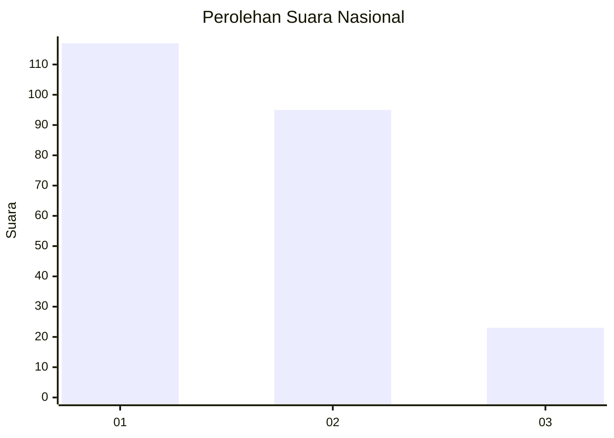
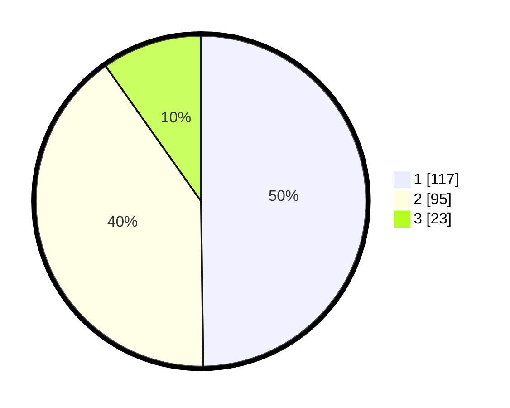

# Hasil

## Grafik

## Tabel

| No.    | Nama Paslon    | Suara | Suara (raw) | Persentase |
|:------ |:-------------- | -----:| -----------:| ----------:|
| 100025 | ANIES MUHAIMIN | 117   | [117][p-1]  | 49,79      |
| 100026 | PRABOWO GIBRAN | 95    | [95][p-2]   | 40,43      |
| 100027 | GANJAR MAHFUD  | 23    | [23][p-3]   | 9,79       |

[p-1]: https://github.com/gigit-pemilu/pemilu-2024/blob/main/pilpres/hitung-suara/sub/31-dki-jakarta/sub/73-jakarta-barat/sub/08-kembangan/sub/1001-kembangan-utara/sub/033-tps/sub/paslon-1.txt
[p-2]: https://github.com/gigit-pemilu/pemilu-2024/blob/main/pilpres/hitung-suara/sub/31-dki-jakarta/sub/73-jakarta-barat/sub/08-kembangan/sub/1001-kembangan-utara/sub/033-tps/sub/paslon-2.txt
[p-3]: https://github.com/gigit-pemilu/pemilu-2024/blob/main/pilpres/hitung-suara/sub/31-dki-jakarta/sub/73-jakarta-barat/sub/08-kembangan/sub/1001-kembangan-utara/sub/033-tps/sub/paslon-3.txt

## Foto C Plano

https://sirekap-obj-formc.kpu.go.id/8538/pemilu/ppwp/31/73/08/10/01/3173081001033-20240215-000700--f8a76998-796c-4e8d-ba96-31537b2f1690.jpg

https://sirekap-obj-formc.kpu.go.id/8538/pemilu/ppwp/31/73/08/10/01/3173081001033-20240215-001056--37acf899-7c17-4712-9500-b4fc57ef3040.jpg

https://sirekap-obj-formc.kpu.go.id/8538/pemilu/ppwp/31/73/08/10/01/3173081001033-20240215-000854--68888776-fa82-4eb8-b85c-5dd1d817bce7.jpg

## Metadata

| Key        | Value               |
| ---------- | ------------------- |
| Time Stamp | 2024-02-17 16:00:02 |

