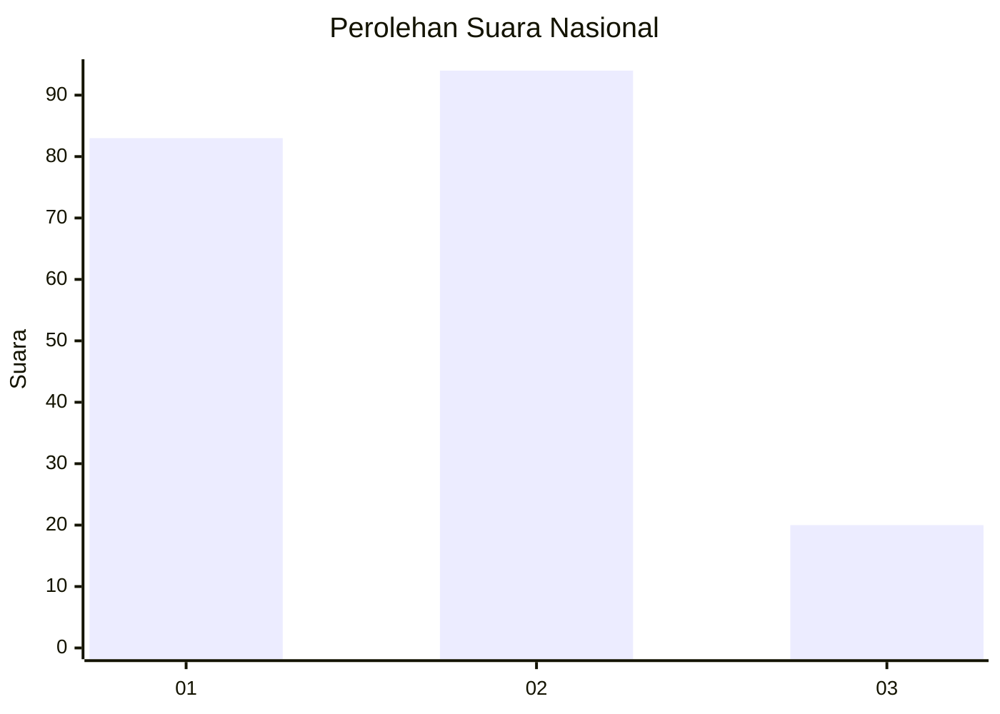
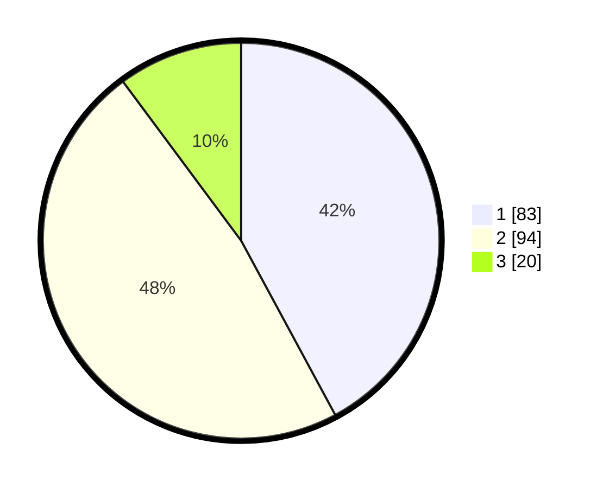

# Hasil

## Grafik

## Tabel

| No.    | Nama Paslon    | Suara | Suara (raw) | Persentase |
|:------ |:-------------- | -----:| -----------:| ----------:|
| 100025 | ANIES MUHAIMIN | 83    | [83][p-1]   | 42,13      |
| 100026 | PRABOWO GIBRAN | 94    | [94][p-2]   | 47,72      |
| 100027 | GANJAR MAHFUD  | 20    | [20][p-3]   | 10,15      |

[p-1]: https://github.com/gigit-pemilu/pemilu-2024/blob/main/pilpres/hitung-suara/sub/31-dki-jakarta/sub/73-jakarta-barat/sub/08-kembangan/sub/1001-kembangan-utara/sub/049-tps/sub/paslon-1.txt
[p-2]: https://github.com/gigit-pemilu/pemilu-2024/blob/main/pilpres/hitung-suara/sub/31-dki-jakarta/sub/73-jakarta-barat/sub/08-kembangan/sub/1001-kembangan-utara/sub/049-tps/sub/paslon-2.txt
[p-3]: https://github.com/gigit-pemilu/pemilu-2024/blob/main/pilpres/hitung-suara/sub/31-dki-jakarta/sub/73-jakarta-barat/sub/08-kembangan/sub/1001-kembangan-utara/sub/049-tps/sub/paslon-3.txt

## Foto C Plano

https://sirekap-obj-formc.kpu.go.id/bc43/pemilu/ppwp/31/73/08/10/01/3173081001049-20240214-235905--314c93b6-08eb-437f-b2dd-3956913b0e40.jpg

https://sirekap-obj-formc.kpu.go.id/bc43/pemilu/ppwp/31/73/08/10/01/3173081001049-20240214-234707--f0fe9e86-d14c-4b68-b819-482faab74729.jpg

https://sirekap-obj-formc.kpu.go.id/bc43/pemilu/ppwp/31/73/08/10/01/3173081001049-20240215-001003--ad20abe0-4849-4833-b51c-6fb58125464e.jpg

## Metadata

| Key        | Value               |
| ---------- | ------------------- |
| Time Stamp | 2024-02-19 06:16:00 |

