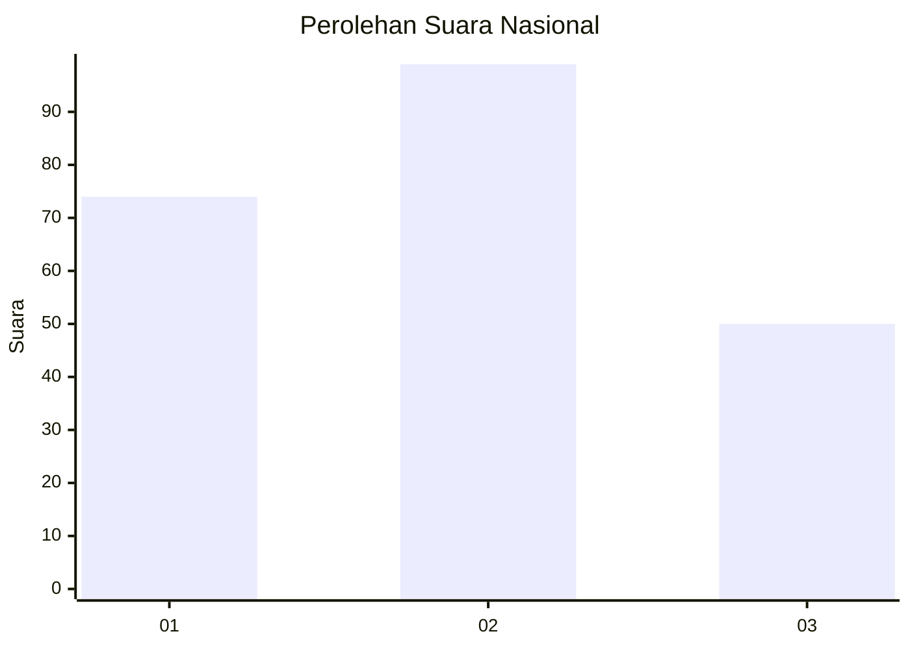
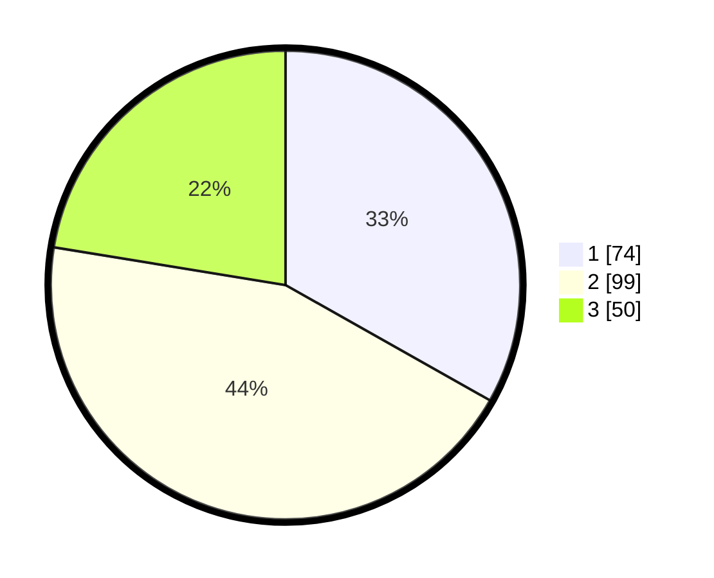

# Hasil

## Grafik

## Tabel

| No.    | Nama Paslon    | Suara | Suara (raw) | Persentase |
|:------ |:-------------- | -----:| -----------:| ----------:|
| 100025 | ANIES MUHAIMIN | 74    | [74][p-1]   | 33,18      |
| 100026 | PRABOWO GIBRAN | 99    | [99][p-2]   | 44,39      |
| 100027 | GANJAR MAHFUD  | 50    | [50][p-3]   | 22,42      |

[p-1]: https://github.com/gigit-pemilu/pemilu-2024/blob/main/pilpres/hitung-suara/sub/31-dki-jakarta/sub/73-jakarta-barat/sub/08-kembangan/sub/1001-kembangan-utara/sub/051-tps/sub/paslon-1.txt
[p-2]: https://github.com/gigit-pemilu/pemilu-2024/blob/main/pilpres/hitung-suara/sub/31-dki-jakarta/sub/73-jakarta-barat/sub/08-kembangan/sub/1001-kembangan-utara/sub/051-tps/sub/paslon-2.txt
[p-3]: https://github.com/gigit-pemilu/pemilu-2024/blob/main/pilpres/hitung-suara/sub/31-dki-jakarta/sub/73-jakarta-barat/sub/08-kembangan/sub/1001-kembangan-utara/sub/051-tps/sub/paslon-3.txt

## Foto C Plano

https://sirekap-obj-formc.kpu.go.id/10ee/pemilu/ppwp/31/73/08/10/01/3173081001051-20240214-235020--eb724eb1-64d0-4b8e-a29c-cc279d7b4e24.jpg

https://sirekap-obj-formc.kpu.go.id/10ee/pemilu/ppwp/31/73/08/10/01/3173081001051-20240214-234811--366a96e7-3404-443d-be39-b883a9874bd5.jpg

https://sirekap-obj-formc.kpu.go.id/10ee/pemilu/ppwp/31/73/08/10/01/3173081001051-20240214-235212--9bafee1f-25a6-4de3-9de6-97edf82a9b86.jpg

## Metadata

| Key        | Value               |
| ---------- | ------------------- |
| Time Stamp | 2024-02-17 16:00:02 |

