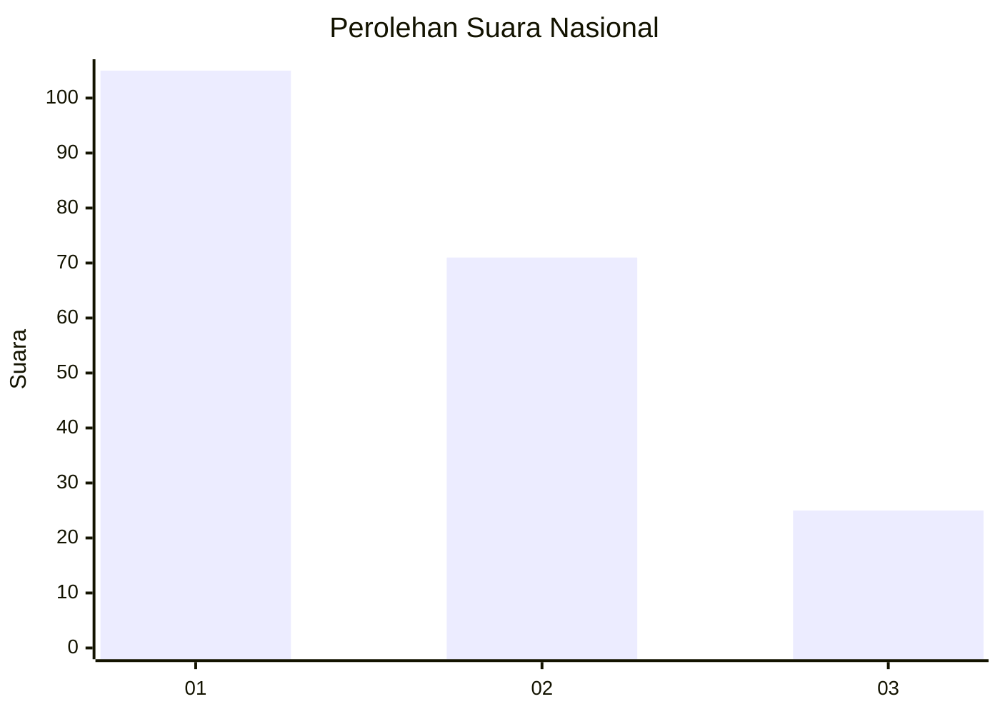
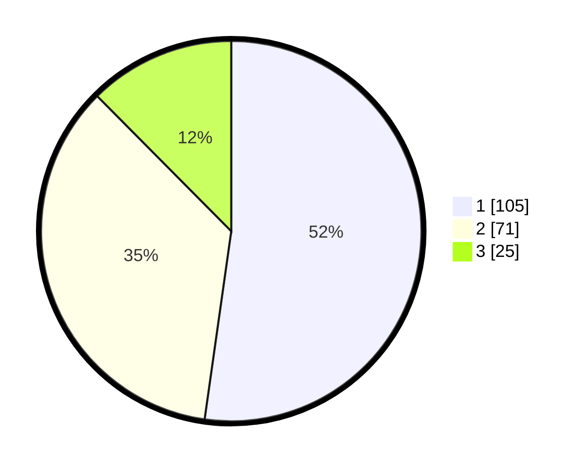

# Hasil

## Grafik

## Tabel

| No.    | Nama Paslon    | Suara | Suara (raw) | Persentase |
|:------ |:-------------- | -----:| -----------:| ----------:|
| 100025 | ANIES MUHAIMIN | 105   | [105][p-1]  | 52,24      |
| 100026 | PRABOWO GIBRAN | 71    | [71][p-2]   | 35,32      |
| 100027 | GANJAR MAHFUD  | 25    | [25][p-3]   | 12,44      |

[p-1]: https://github.com/gigit-pemilu/pemilu-2024/blob/main/pilpres/hitung-suara/sub/31-dki-jakarta/sub/73-jakarta-barat/sub/08-kembangan/sub/1001-kembangan-utara/sub/055-tps/sub/paslon-1.txt
[p-2]: https://github.com/gigit-pemilu/pemilu-2024/blob/main/pilpres/hitung-suara/sub/31-dki-jakarta/sub/73-jakarta-barat/sub/08-kembangan/sub/1001-kembangan-utara/sub/055-tps/sub/paslon-2.txt
[p-3]: https://github.com/gigit-pemilu/pemilu-2024/blob/main/pilpres/hitung-suara/sub/31-dki-jakarta/sub/73-jakarta-barat/sub/08-kembangan/sub/1001-kembangan-utara/sub/055-tps/sub/paslon-3.txt

## Foto C Plano

https://sirekap-obj-formc.kpu.go.id/651d/pemilu/ppwp/31/73/08/10/01/3173081001055-20240214-223603--6bc0afe7-ef74-41e3-bf8c-94192014495c.jpg

https://sirekap-obj-formc.kpu.go.id/651d/pemilu/ppwp/31/73/08/10/01/3173081001055-20240214-223755--a5aaaed1-b75c-4641-8b55-6ef1d718112e.jpg

https://sirekap-obj-formc.kpu.go.id/651d/pemilu/ppwp/31/73/08/10/01/3173081001055-20240214-223837--e8f42c21-a2e7-455c-a853-79cc5e2cd0d7.jpg

## Metadata

| Key        | Value               |
| ---------- | ------------------- |
| Time Stamp | 2024-02-16 00:00:26 |

