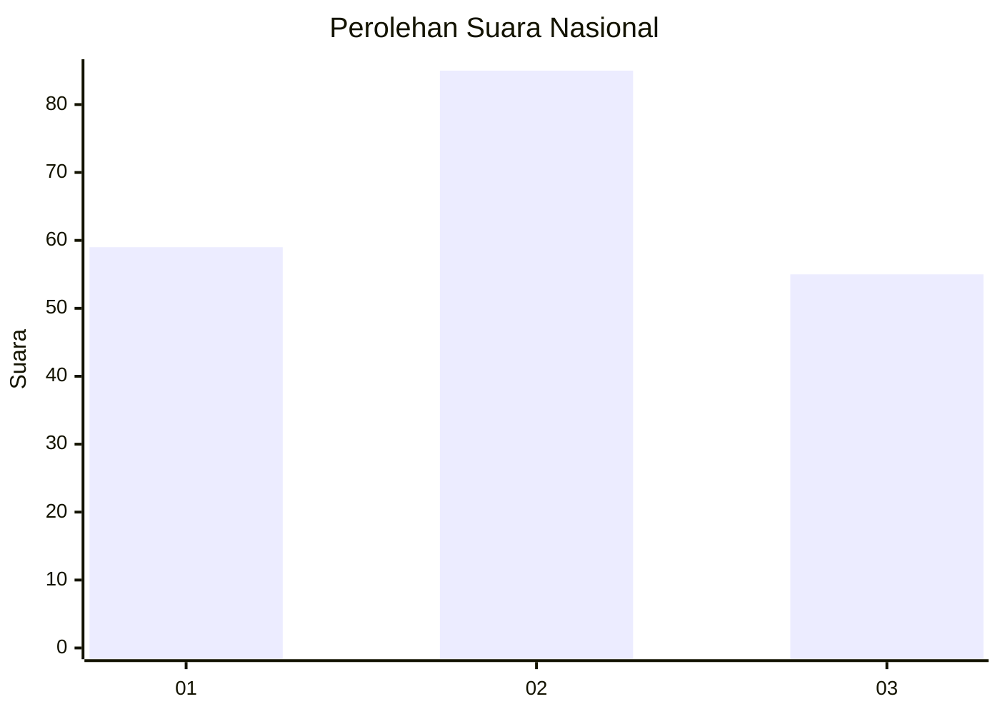
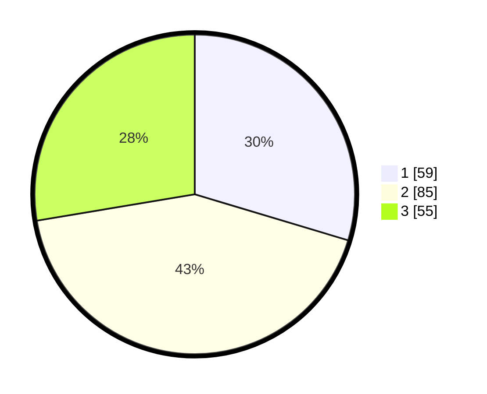

# Hasil

## Grafik

## Tabel

| No.    | Nama Paslon    | Suara | Suara (raw) | Persentase |
|:------ |:-------------- | -----:| -----------:| ----------:|
| 100025 | ANIES MUHAIMIN | 59    | [59][p-1]   | 29,65      |
| 100026 | PRABOWO GIBRAN | 85    | [85][p-2]   | 42,71      |
| 100027 | GANJAR MAHFUD  | 55    | [55][p-3]   | 27,64      |

[p-1]: https://github.com/gigit-pemilu/pemilu-2024/blob/main/pilpres/hitung-suara/sub/31-dki-jakarta/sub/73-jakarta-barat/sub/08-kembangan/sub/1001-kembangan-utara/sub/056-tps/sub/paslon-1.txt
[p-2]: https://github.com/gigit-pemilu/pemilu-2024/blob/main/pilpres/hitung-suara/sub/31-dki-jakarta/sub/73-jakarta-barat/sub/08-kembangan/sub/1001-kembangan-utara/sub/056-tps/sub/paslon-2.txt
[p-3]: https://github.com/gigit-pemilu/pemilu-2024/blob/main/pilpres/hitung-suara/sub/31-dki-jakarta/sub/73-jakarta-barat/sub/08-kembangan/sub/1001-kembangan-utara/sub/056-tps/sub/paslon-3.txt

## Foto C Plano

https://sirekap-obj-formc.kpu.go.id/5d77/pemilu/ppwp/31/73/08/10/01/3173081001056-20240214-233622--020bd718-1834-449c-bfeb-138b94e34dc8.jpg

https://sirekap-obj-formc.kpu.go.id/5d77/pemilu/ppwp/31/73/08/10/01/3173081001056-20240214-234033--2cb06684-d3de-4874-b3ba-9218533ad44c.jpg

https://sirekap-obj-formc.kpu.go.id/5d77/pemilu/ppwp/31/73/08/10/01/3173081001056-20240214-233724--fa257fec-094d-40bc-9ae1-a80292d9d186.jpg

## Metadata

| Key        | Value               |
| ---------- | ------------------- |
| Time Stamp | 2024-02-19 06:16:00 |

