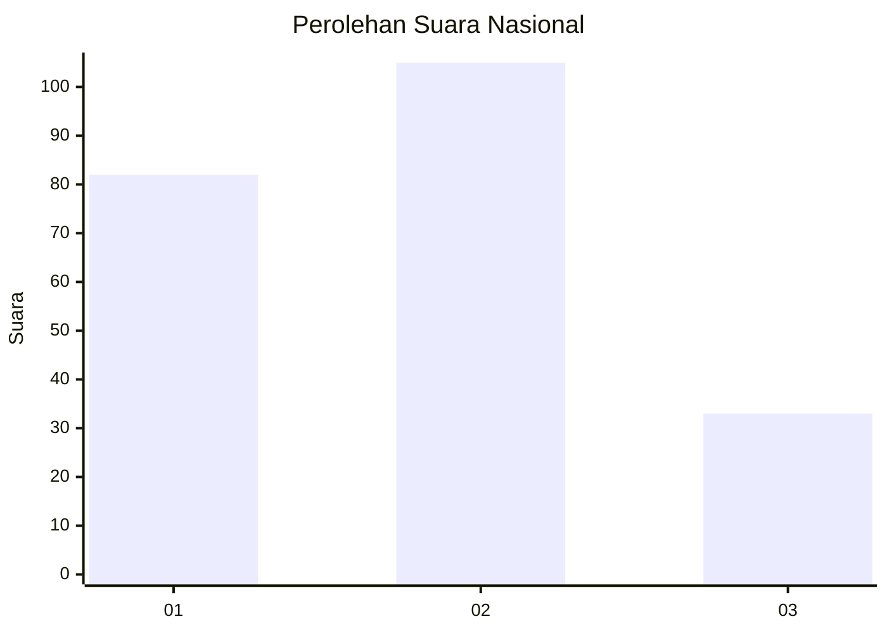
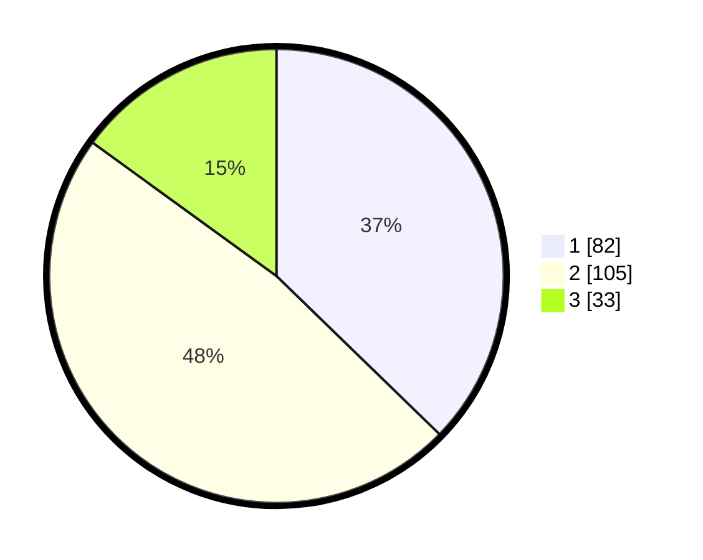

# Hasil

## Grafik

## Tabel

| No.    | Nama Paslon    | Suara | Suara (raw) | Persentase |
|:------ |:-------------- | -----:| -----------:| ----------:|
| 100025 | ANIES MUHAIMIN | 82    | [82][p-1]   | 37,27      |
| 100026 | PRABOWO GIBRAN | 105   | [105][p-2]  | 47,73      |
| 100027 | GANJAR MAHFUD  | 33    | [33][p-3]   | 15,00      |

[p-1]: https://github.com/gigit-pemilu/pemilu-2024/blob/main/pilpres/hitung-suara/sub/31-dki-jakarta/sub/73-jakarta-barat/sub/08-kembangan/sub/1001-kembangan-utara/sub/061-tps/sub/paslon-1.txt
[p-2]: https://github.com/gigit-pemilu/pemilu-2024/blob/main/pilpres/hitung-suara/sub/31-dki-jakarta/sub/73-jakarta-barat/sub/08-kembangan/sub/1001-kembangan-utara/sub/061-tps/sub/paslon-2.txt
[p-3]: https://github.com/gigit-pemilu/pemilu-2024/blob/main/pilpres/hitung-suara/sub/31-dki-jakarta/sub/73-jakarta-barat/sub/08-kembangan/sub/1001-kembangan-utara/sub/061-tps/sub/paslon-3.txt

## Foto C Plano

https://sirekap-obj-formc.kpu.go.id/c707/pemilu/ppwp/31/73/08/10/01/3173081001061-20240214-211449--848fcfa7-c943-499b-a235-5190011cde5f.jpg

https://sirekap-obj-formc.kpu.go.id/c707/pemilu/ppwp/31/73/08/10/01/3173081001061-20240214-211637--8bb009de-ff3a-41cf-aef0-7a9cfa62c1c6.jpg

https://sirekap-obj-formc.kpu.go.id/c707/pemilu/ppwp/31/73/08/10/01/3173081001061-20240214-211810--6ee88ddd-b228-47cf-bb45-41a97629540f.jpg

## Metadata

| Key        | Value               |
| ---------- | ------------------- |
| Time Stamp | 2024-02-19 06:16:00 |

