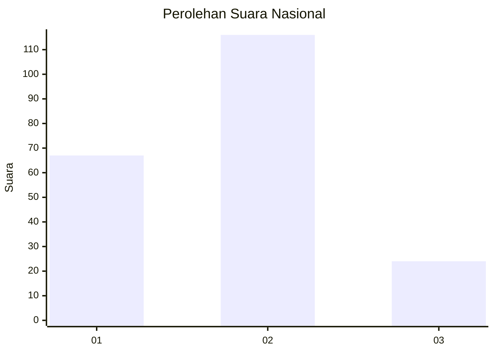
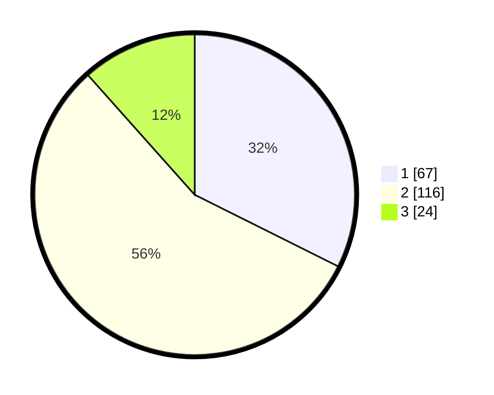

# Hasil

## Grafik

## Tabel

| No.    | Nama Paslon    | Suara | Suara (raw) | Persentase |
|:------ |:-------------- | -----:| -----------:| ----------:|
| 100025 | ANIES MUHAIMIN | 67    | [67][p-1]   | 32,37      |
| 100026 | PRABOWO GIBRAN | 116   | [116][p-2]  | 56,04      |
| 100027 | GANJAR MAHFUD  | 24    | [24][p-3]   | 11,59      |

[p-1]: https://github.com/gigit-pemilu/pemilu-2024/blob/main/pilpres/hitung-suara/sub/31-dki-jakarta/sub/73-jakarta-barat/sub/08-kembangan/sub/1001-kembangan-utara/sub/074-tps/sub/paslon-1.txt
[p-2]: https://github.com/gigit-pemilu/pemilu-2024/blob/main/pilpres/hitung-suara/sub/31-dki-jakarta/sub/73-jakarta-barat/sub/08-kembangan/sub/1001-kembangan-utara/sub/074-tps/sub/paslon-2.txt
[p-3]: https://github.com/gigit-pemilu/pemilu-2024/blob/main/pilpres/hitung-suara/sub/31-dki-jakarta/sub/73-jakarta-barat/sub/08-kembangan/sub/1001-kembangan-utara/sub/074-tps/sub/paslon-3.txt

## Foto C Plano

https://sirekap-obj-formc.kpu.go.id/de25/pemilu/ppwp/31/73/08/10/01/3173081001074-20240214-203047--4b8e0208-55fb-4a79-8e34-aeda010b1542.jpg

https://sirekap-obj-formc.kpu.go.id/de25/pemilu/ppwp/31/73/08/10/01/3173081001074-20240214-203228--7599b842-a958-4b82-8e15-64da806b613c.jpg

https://sirekap-obj-formc.kpu.go.id/de25/pemilu/ppwp/31/73/08/10/01/3173081001074-20240214-203803--16356037-a390-4055-b1ab-453ab0d74ad4.jpg

## Metadata

| Key        | Value               |
| ---------- | ------------------- |
| Time Stamp | 2024-02-21 18:00:00 |

