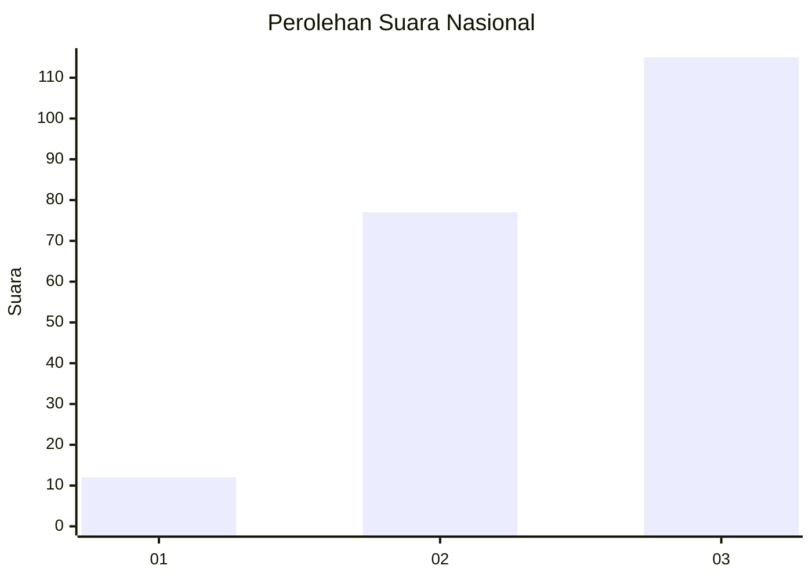
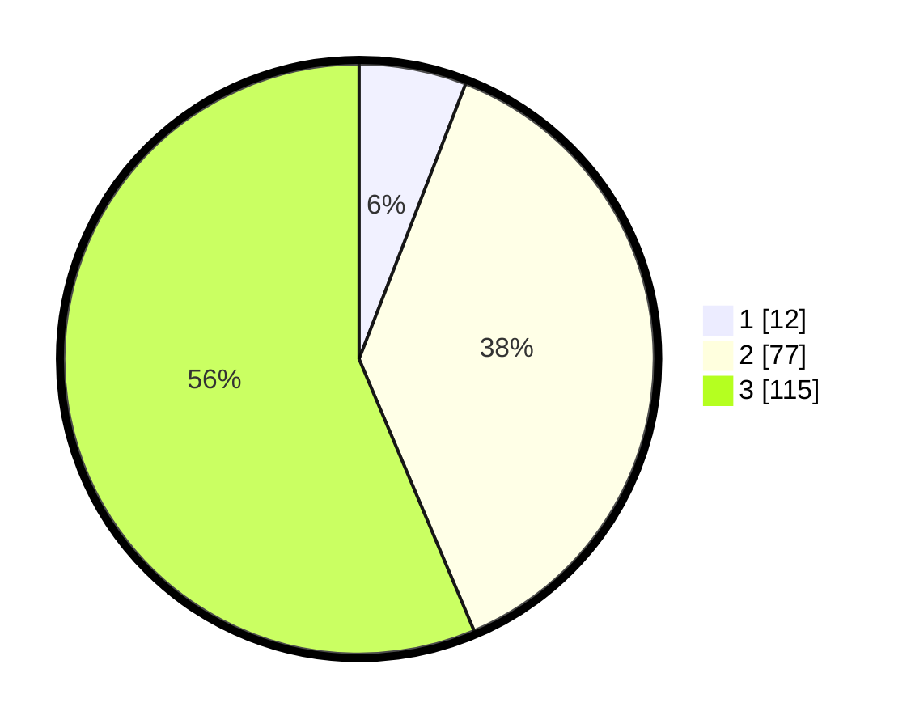

# Hasil

## Grafik

## Tabel

| No.    | Nama Paslon    | Suara | Suara (raw) | Persentase |
|:------ |:-------------- | -----:| -----------:| ----------:|
| 100025 | ANIES MUHAIMIN | 12    | [12][p-1]   | 5,88       |
| 100026 | PRABOWO GIBRAN | 77    | [77][p-2]   | 37,75      |
| 100027 | GANJAR MAHFUD  | 115   | [115][p-3]  | 56,37      |

[p-1]: https://github.com/gigit-pemilu/pemilu-2024/blob/main/pilpres/hitung-suara/sub/31-dki-jakarta/sub/73-jakarta-barat/sub/08-kembangan/sub/1001-kembangan-utara/sub/081-tps/sub/paslon-1.txt
[p-2]: https://github.com/gigit-pemilu/pemilu-2024/blob/main/pilpres/hitung-suara/sub/31-dki-jakarta/sub/73-jakarta-barat/sub/08-kembangan/sub/1001-kembangan-utara/sub/081-tps/sub/paslon-2.txt
[p-3]: https://github.com/gigit-pemilu/pemilu-2024/blob/main/pilpres/hitung-suara/sub/31-dki-jakarta/sub/73-jakarta-barat/sub/08-kembangan/sub/1001-kembangan-utara/sub/081-tps/sub/paslon-3.txt

## Foto C Plano

https://sirekap-obj-formc.kpu.go.id/0712/pemilu/ppwp/31/73/08/10/01/3173081001081-20240214-155352--6d7f8f94-e545-441f-916f-3a42a1e3c57a.jpg

https://sirekap-obj-formc.kpu.go.id/0712/pemilu/ppwp/31/73/08/10/01/3173081001081-20240214-155420--4679bede-23eb-49f5-9bd3-e579884ba8a3.jpg

https://sirekap-obj-formc.kpu.go.id/0712/pemilu/ppwp/31/73/08/10/01/3173081001081-20240214-155440--e321ec05-dfb7-417e-9495-08736fe2e606.jpg

## Metadata

| Key        | Value               |
| ---------- | ------------------- |
| Time Stamp | 2024-02-16 00:00:26 |

