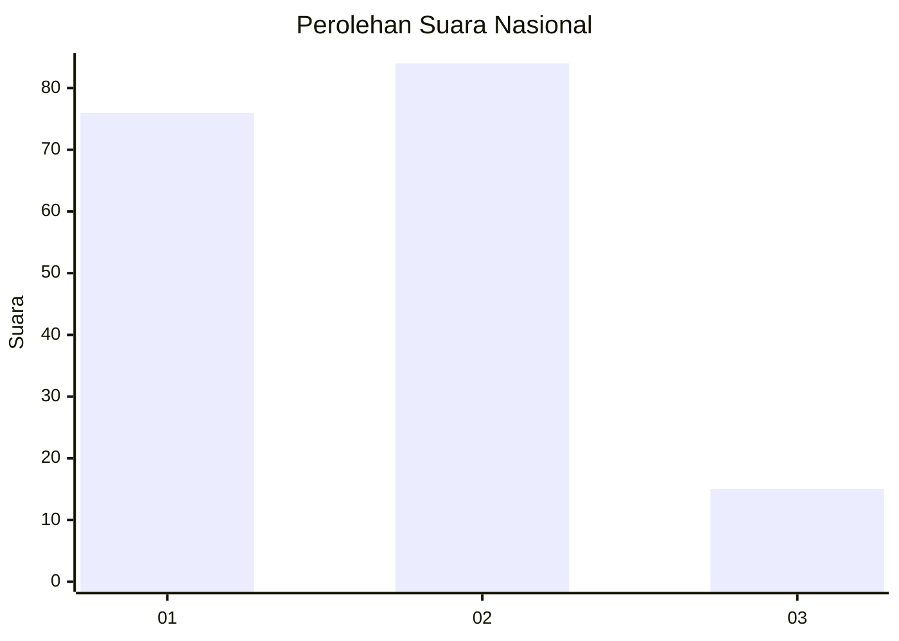
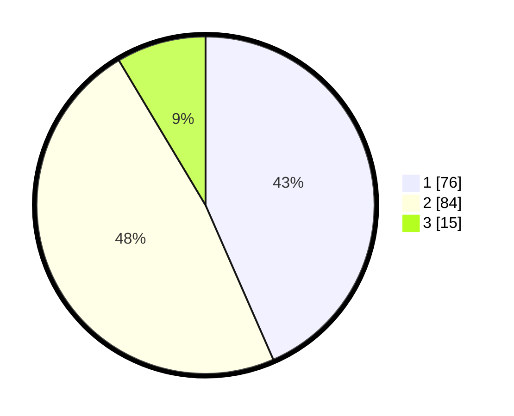

# Hasil

## Grafik

## Tabel

| No.    | Nama Paslon    | Suara | Suara (raw) | Persentase |
|:------ |:-------------- | -----:| -----------:| ----------:|
| 100025 | ANIES MUHAIMIN | 76    | [76][p-1]   | 43,43      |
| 100026 | PRABOWO GIBRAN | 84    | [84][p-2]   | 48,00      |
| 100027 | GANJAR MAHFUD  | 15    | [15][p-3]   | 8,57       |

[p-1]: https://github.com/gigit-pemilu/pemilu-2024/blob/main/pilpres/hitung-suara/sub/31-dki-jakarta/sub/73-jakarta-barat/sub/08-kembangan/sub/1001-kembangan-utara/sub/101-tps/sub/paslon-1.txt
[p-2]: https://github.com/gigit-pemilu/pemilu-2024/blob/main/pilpres/hitung-suara/sub/31-dki-jakarta/sub/73-jakarta-barat/sub/08-kembangan/sub/1001-kembangan-utara/sub/101-tps/sub/paslon-2.txt
[p-3]: https://github.com/gigit-pemilu/pemilu-2024/blob/main/pilpres/hitung-suara/sub/31-dki-jakarta/sub/73-jakarta-barat/sub/08-kembangan/sub/1001-kembangan-utara/sub/101-tps/sub/paslon-3.txt

## Foto C Plano

https://sirekap-obj-formc.kpu.go.id/cc83/pemilu/ppwp/31/73/08/10/01/3173081001101-20240214-221629--8a9fd456-ac8d-494d-b9f3-948b5b40b4dc.jpg

https://sirekap-obj-formc.kpu.go.id/cc83/pemilu/ppwp/31/73/08/10/01/3173081001101-20240215-002944--2e554bef-6073-4347-9239-a9af71dc7516.jpg

https://sirekap-obj-formc.kpu.go.id/cc83/pemilu/ppwp/31/73/08/10/01/3173081001101-20240214-221822--3c84a415-bfbe-4c43-94d8-af4ac5dce776.jpg

## Metadata

| Key        | Value               |
| ---------- | ------------------- |
| Time Stamp | 2024-02-19 06:16:00 |

