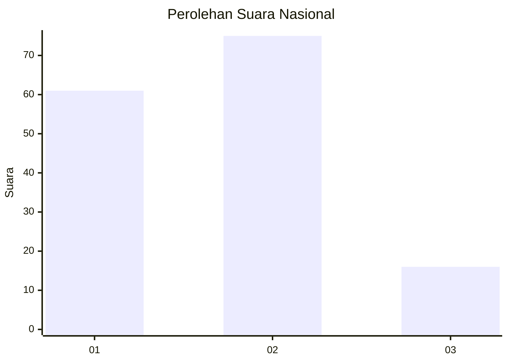
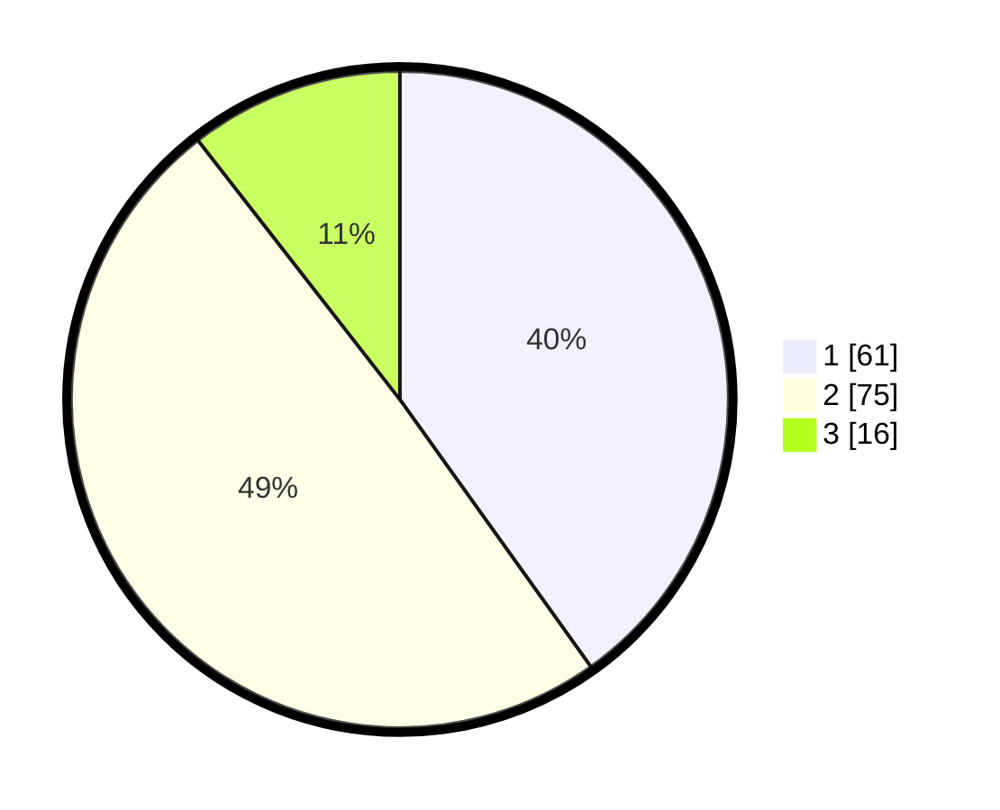

# Hasil

## Grafik

## Tabel

| No.    | Nama Paslon    | Suara | Suara (raw) | Persentase |
|:------ |:-------------- | -----:| -----------:| ----------:|
| 100025 | ANIES MUHAIMIN | 61    | [61][p-1]   | 40,13      |
| 100026 | PRABOWO GIBRAN | 75    | [75][p-2]   | 49,34      |
| 100027 | GANJAR MAHFUD  | 16    | [16][p-3]   | 10,53      |

[p-1]: https://github.com/gigit-pemilu/pemilu-2024/blob/main/pilpres/hitung-suara/sub/31-dki-jakarta/sub/73-jakarta-barat/sub/08-kembangan/sub/1001-kembangan-utara/sub/106-tps/sub/paslon-1.txt
[p-2]: https://github.com/gigit-pemilu/pemilu-2024/blob/main/pilpres/hitung-suara/sub/31-dki-jakarta/sub/73-jakarta-barat/sub/08-kembangan/sub/1001-kembangan-utara/sub/106-tps/sub/paslon-2.txt
[p-3]: https://github.com/gigit-pemilu/pemilu-2024/blob/main/pilpres/hitung-suara/sub/31-dki-jakarta/sub/73-jakarta-barat/sub/08-kembangan/sub/1001-kembangan-utara/sub/106-tps/sub/paslon-3.txt

## Foto C Plano

https://sirekap-obj-formc.kpu.go.id/cdd1/pemilu/ppwp/31/73/08/10/01/3173081001106-20240214-215837--c8833546-2c53-4b46-8a08-447f5709a4fd.jpg

https://sirekap-obj-formc.kpu.go.id/cdd1/pemilu/ppwp/31/73/08/10/01/3173081001106-20240214-220107--fc6f4b92-6f58-4e09-a202-a35770d0f371.jpg

https://sirekap-obj-formc.kpu.go.id/cdd1/pemilu/ppwp/31/73/08/10/01/3173081001106-20240214-220338--380f3126-414c-4953-a721-40af29128f7e.jpg

## Metadata

| Key        | Value               |
| ---------- | ------------------- |
| Time Stamp | 2024-02-19 06:16:00 |

