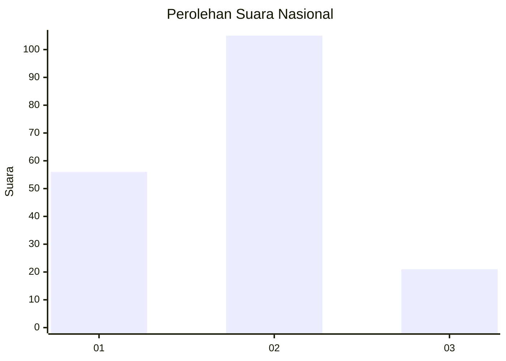
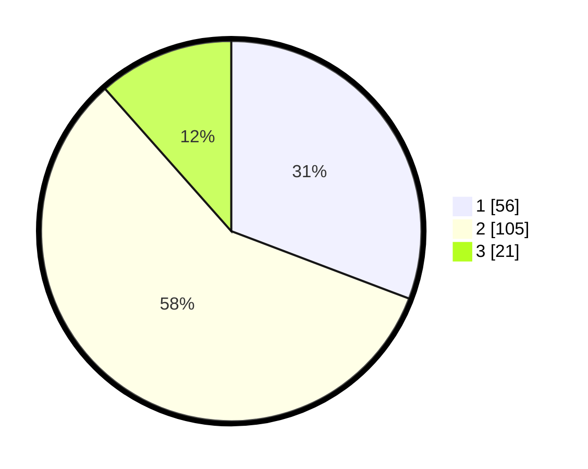

# Hasil

## Grafik

## Tabel

| No.    | Nama Paslon    | Suara | Suara (raw) | Persentase |
|:------ |:-------------- | -----:| -----------:| ----------:|
| 100025 | ANIES MUHAIMIN | 56    | [56][p-1]   | 30,77      |
| 100026 | PRABOWO GIBRAN | 105   | [105][p-2]  | 57,69      |
| 100027 | GANJAR MAHFUD  | 21    | [21][p-3]   | 11,54      |

[p-1]: https://github.com/gigit-pemilu/pemilu-2024/blob/main/pilpres/hitung-suara/sub/31-dki-jakarta/sub/73-jakarta-barat/sub/08-kembangan/sub/1001-kembangan-utara/sub/107-tps/sub/paslon-1.txt
[p-2]: https://github.com/gigit-pemilu/pemilu-2024/blob/main/pilpres/hitung-suara/sub/31-dki-jakarta/sub/73-jakarta-barat/sub/08-kembangan/sub/1001-kembangan-utara/sub/107-tps/sub/paslon-2.txt
[p-3]: https://github.com/gigit-pemilu/pemilu-2024/blob/main/pilpres/hitung-suara/sub/31-dki-jakarta/sub/73-jakarta-barat/sub/08-kembangan/sub/1001-kembangan-utara/sub/107-tps/sub/paslon-3.txt

## Foto C Plano

https://sirekap-obj-formc.kpu.go.id/eff7/pemilu/ppwp/31/73/08/10/01/3173081001107-20240214-213806--d856b48c-5fb4-4a44-aa30-920d2f7c8bae.jpg

https://sirekap-obj-formc.kpu.go.id/eff7/pemilu/ppwp/31/73/08/10/01/3173081001107-20240214-214041--2a678708-5b0b-4cc9-9924-2f983f55f2cc.jpg

https://sirekap-obj-formc.kpu.go.id/eff7/pemilu/ppwp/31/73/08/10/01/3173081001107-20240214-214202--5de9a1a6-c9e3-44e5-a2e2-6cf1eba5e60b.jpg

## Metadata

| Key        | Value               |
| ---------- | ------------------- |
| Time Stamp | 2024-02-16 00:00:26 |

