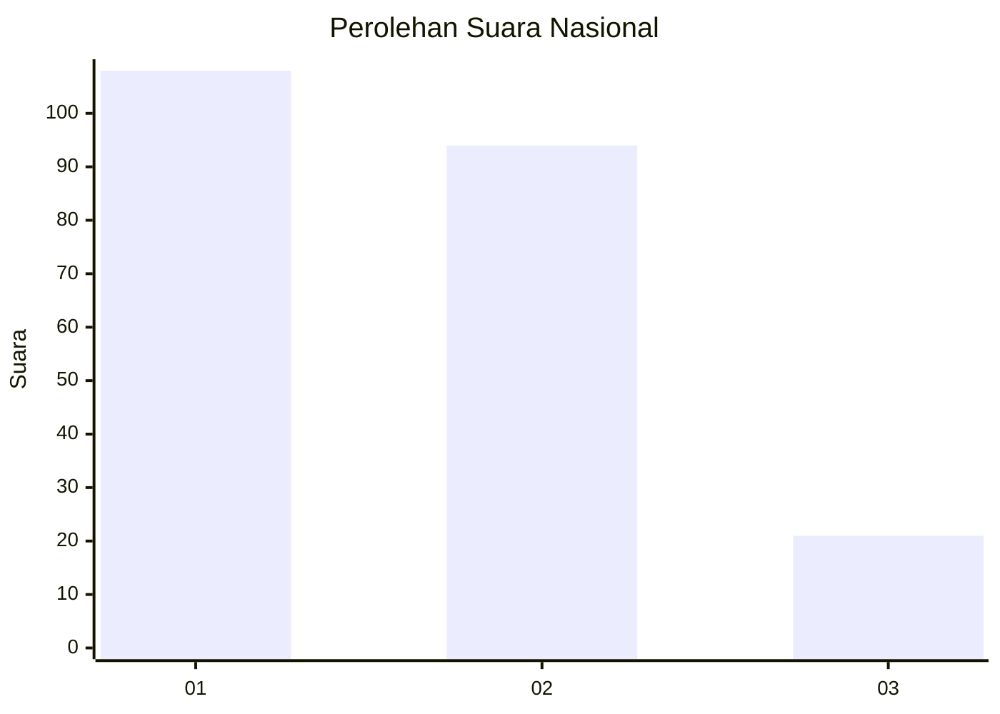
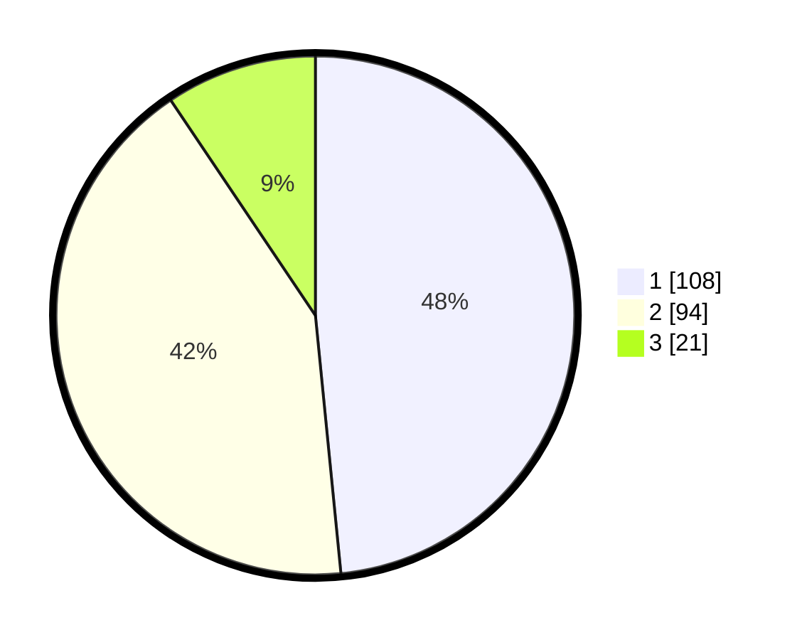

# Hasil

## Grafik

## Tabel

| No.    | Nama Paslon    | Suara | Suara (raw) | Persentase |
|:------ |:-------------- | -----:| -----------:| ----------:|
| 100025 | ANIES MUHAIMIN | 108   | [108][p-1]  | 48,43      |
| 100026 | PRABOWO GIBRAN | 94    | [94][p-2]   | 42,15      |
| 100027 | GANJAR MAHFUD  | 21    | [21][p-3]   | 9,42       |

[p-1]: https://github.com/gigit-pemilu/pemilu-2024/blob/main/pilpres/hitung-suara/sub/31-dki-jakarta/sub/73-jakarta-barat/sub/08-kembangan/sub/1001-kembangan-utara/sub/134-tps/sub/paslon-1.txt
[p-2]: https://github.com/gigit-pemilu/pemilu-2024/blob/main/pilpres/hitung-suara/sub/31-dki-jakarta/sub/73-jakarta-barat/sub/08-kembangan/sub/1001-kembangan-utara/sub/134-tps/sub/paslon-2.txt
[p-3]: https://github.com/gigit-pemilu/pemilu-2024/blob/main/pilpres/hitung-suara/sub/31-dki-jakarta/sub/73-jakarta-barat/sub/08-kembangan/sub/1001-kembangan-utara/sub/134-tps/sub/paslon-3.txt

## Foto C Plano

https://sirekap-obj-formc.kpu.go.id/498e/pemilu/ppwp/31/73/08/10/01/3173081001134-20240214-224639--3e738bd4-f65d-4e15-9b1d-7c954288b17f.jpg

https://sirekap-obj-formc.kpu.go.id/498e/pemilu/ppwp/31/73/08/10/01/3173081001134-20240214-224810--775d6182-7e91-4400-9c36-973599a3f34a.jpg

https://sirekap-obj-formc.kpu.go.id/498e/pemilu/ppwp/31/73/08/10/01/3173081001134-20240214-224908--e2cf3d01-e50d-46ec-89c2-109312e753e0.jpg

## Metadata

| Key        | Value               |
| ---------- | ------------------- |
| Time Stamp | 2024-02-19 06:16:00 |

