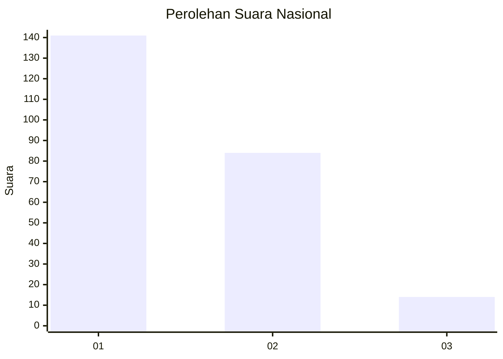
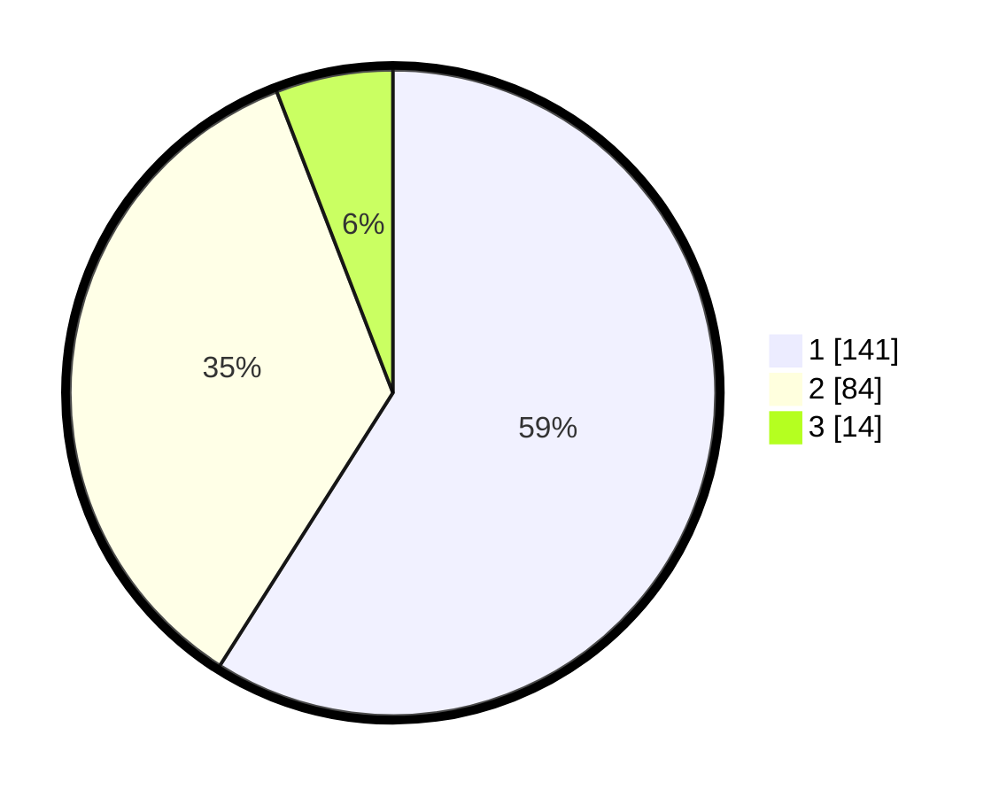

# Hasil

## Grafik

## Tabel

| No.    | Nama Paslon    | Suara | Suara (raw) | Persentase |
|:------ |:-------------- | -----:| -----------:| ----------:|
| 100025 | ANIES MUHAIMIN | 141   | [141][p-1]  | 59,00      |
| 100026 | PRABOWO GIBRAN | 84    | [84][p-2]   | 35,15      |
| 100027 | GANJAR MAHFUD  | 14    | [14][p-3]   | 5,86       |

[p-1]: https://github.com/gigit-pemilu/pemilu-2024/blob/main/pilpres/hitung-suara/sub/31-dki-jakarta/sub/73-jakarta-barat/sub/08-kembangan/sub/1001-kembangan-utara/sub/139-tps/sub/paslon-1.txt
[p-2]: https://github.com/gigit-pemilu/pemilu-2024/blob/main/pilpres/hitung-suara/sub/31-dki-jakarta/sub/73-jakarta-barat/sub/08-kembangan/sub/1001-kembangan-utara/sub/139-tps/sub/paslon-2.txt
[p-3]: https://github.com/gigit-pemilu/pemilu-2024/blob/main/pilpres/hitung-suara/sub/31-dki-jakarta/sub/73-jakarta-barat/sub/08-kembangan/sub/1001-kembangan-utara/sub/139-tps/sub/paslon-3.txt

## Foto C Plano

https://sirekap-obj-formc.kpu.go.id/9a15/pemilu/ppwp/31/73/08/10/01/3173081001139-20240215-021342--26a89b16-de6c-4c63-8a82-a2bfc1664c60.jpg

https://sirekap-obj-formc.kpu.go.id/9a15/pemilu/ppwp/31/73/08/10/01/3173081001139-20240214-233611--daf24c71-ade7-4de4-a147-d51e8e9bae2e.jpg

https://sirekap-obj-formc.kpu.go.id/9a15/pemilu/ppwp/31/73/08/10/01/3173081001139-20240215-021543--7bbe5077-a269-4ba5-a90b-840609c31271.jpg

## Metadata

| Key        | Value               |
| ---------- | ------------------- |
| Time Stamp | 2024-02-19 06:16:00 |

