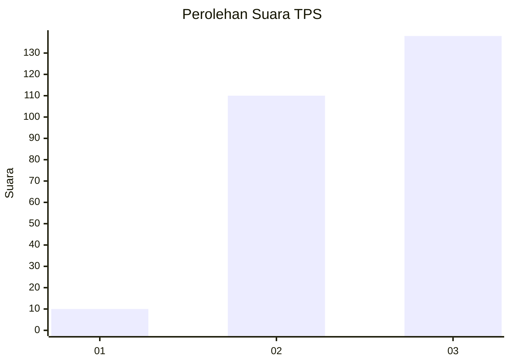
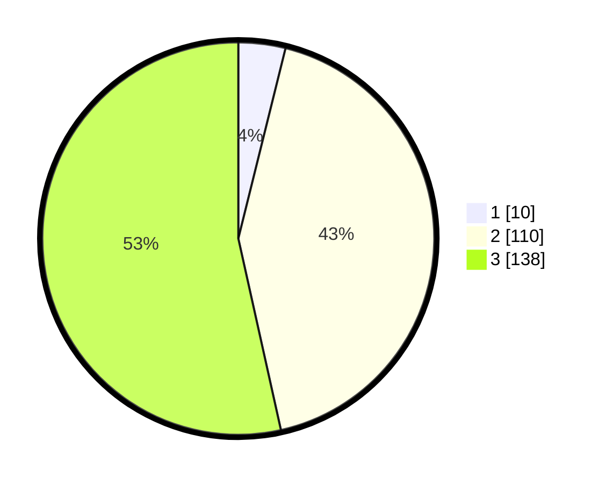

# Hasil

## Grafik

## Tabel

| No. | Nama Paslon    | Suara | Suara (raw) | Persentase |
|:--- |:-------------- | -----:| -----------:| ----------:|
| 1   | ANIES MUHAIMIN | 10    | [10][p-1]   | 3,88       |
| 2   | PRABOWO GIBRAN | 110   | [110][p-2]  | 42,64      |
| 3   | GANJAR MAHFUD  | 138   | [138][p-3]  | 53,49      |

[p-1]: https://github.com/gigit-pemilu/pemilu-2024-31-dki-jakarta/blob/main/pilpres/hitung-suara/sub/31-dki-jakarta/sub/73-jakarta-barat/sub/08-kembangan/sub/1001-kembangan-utara/sub/145-tps/sub/paslon-1.txt
[p-2]: https://github.com/gigit-pemilu/pemilu-2024-31-dki-jakarta/blob/main/pilpres/hitung-suara/sub/31-dki-jakarta/sub/73-jakarta-barat/sub/08-kembangan/sub/1001-kembangan-utara/sub/145-tps/sub/paslon-2.txt
[p-3]: https://github.com/gigit-pemilu/pemilu-2024-31-dki-jakarta/blob/main/pilpres/hitung-suara/sub/31-dki-jakarta/sub/73-jakarta-barat/sub/08-kembangan/sub/1001-kembangan-utara/sub/145-tps/sub/paslon-3.txt

## Foto C Plano

https://sirekap-obj-formc.kpu.go.id/dd23/pemilu/ppwp/31/73/08/10/01/3173081001145-20240214-195302--ef189445-d71a-4ef1-9972-4e988b164a03.jpg

https://sirekap-obj-formc.kpu.go.id/dd23/pemilu/ppwp/31/73/08/10/01/3173081001145-20240214-191336--ad0253cf-da91-49d3-9f08-fa5ebb5ff98d.jpg

https://sirekap-obj-formc.kpu.go.id/dd23/pemilu/ppwp/31/73/08/10/01/3173081001145-20240214-191341--67d8081a-538f-4f47-bbdf-b9edd3226e39.jpg

## Metadata

| Key        | Value               |
| ---------- | ------------------- |
| Time Stamp | 2024-02-19 06:16:00 |

