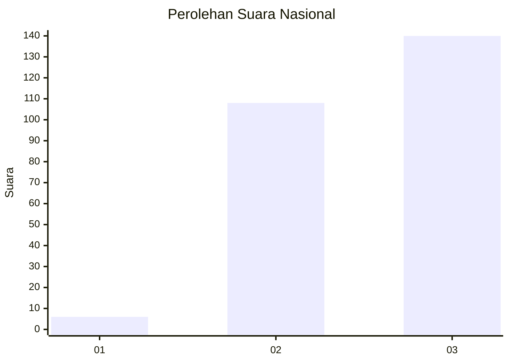
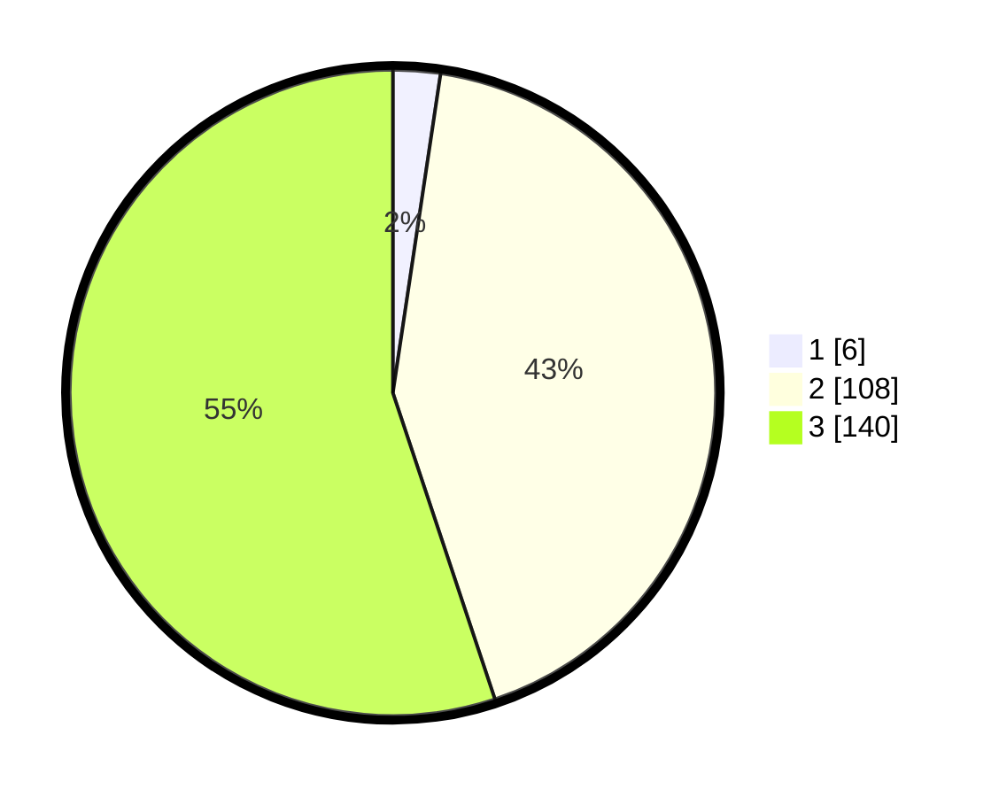

# Hasil

## Grafik

## Tabel

| No.    | Nama Paslon    | Suara | Suara (raw) | Persentase |
|:------ |:-------------- | -----:| -----------:| ----------:|
| 100025 | ANIES MUHAIMIN | 6     | [6][p-1]    | 2,36       |
| 100026 | PRABOWO GIBRAN | 108   | [108][p-2]  | 42,52      |
| 100027 | GANJAR MAHFUD  | 140   | [140][p-3]  | 55,12      |

[p-1]: https://github.com/gigit-pemilu/pemilu-2024/blob/main/pilpres/hitung-suara/sub/31-dki-jakarta/sub/73-jakarta-barat/sub/08-kembangan/sub/1001-kembangan-utara/sub/156-tps/sub/paslon-1.txt
[p-2]: https://github.com/gigit-pemilu/pemilu-2024/blob/main/pilpres/hitung-suara/sub/31-dki-jakarta/sub/73-jakarta-barat/sub/08-kembangan/sub/1001-kembangan-utara/sub/156-tps/sub/paslon-2.txt
[p-3]: https://github.com/gigit-pemilu/pemilu-2024/blob/main/pilpres/hitung-suara/sub/31-dki-jakarta/sub/73-jakarta-barat/sub/08-kembangan/sub/1001-kembangan-utara/sub/156-tps/sub/paslon-3.txt

## Foto C Plano

https://sirekap-obj-formc.kpu.go.id/5fc6/pemilu/ppwp/31/73/08/10/01/3173081001156-20240214-201825--9b3f4074-9711-435f-9599-2a16e35ecec9.jpg

https://sirekap-obj-formc.kpu.go.id/5fc6/pemilu/ppwp/31/73/08/10/01/3173081001156-20240214-202024--19ed2115-b99b-4d1c-bdb4-973461fdbcda.jpg

https://sirekap-obj-formc.kpu.go.id/5fc6/pemilu/ppwp/31/73/08/10/01/3173081001156-20240214-201933--e9c23b31-7a3a-47c9-b9cb-344e92f7b48e.jpg

## Metadata

| Key        | Value               |
| ---------- | ------------------- |
| Time Stamp | 2024-02-19 06:16:00 |

