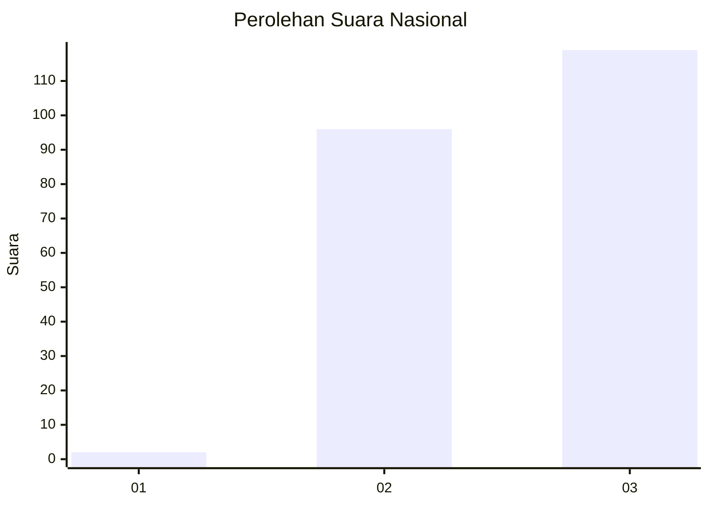
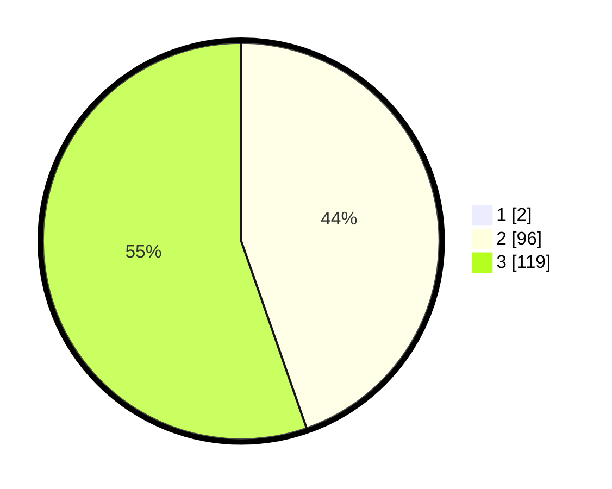

# Hasil

## Grafik

## Tabel

| No.    | Nama Paslon    | Suara | Suara (raw) | Persentase |
|:------ |:-------------- | -----:| -----------:| ----------:|
| 100025 | ANIES MUHAIMIN | 2     | [2][p-1]    | 0,92       |
| 100026 | PRABOWO GIBRAN | 96    | [96][p-2]   | 44,24      |
| 100027 | GANJAR MAHFUD  | 119   | [119][p-3]  | 54,84      |

[p-1]: https://github.com/gigit-pemilu/pemilu-2024/blob/main/pilpres/hitung-suara/sub/31-dki-jakarta/sub/73-jakarta-barat/sub/08-kembangan/sub/1001-kembangan-utara/sub/185-tps/sub/paslon-1.txt
[p-2]: https://github.com/gigit-pemilu/pemilu-2024/blob/main/pilpres/hitung-suara/sub/31-dki-jakarta/sub/73-jakarta-barat/sub/08-kembangan/sub/1001-kembangan-utara/sub/185-tps/sub/paslon-2.txt
[p-3]: https://github.com/gigit-pemilu/pemilu-2024/blob/main/pilpres/hitung-suara/sub/31-dki-jakarta/sub/73-jakarta-barat/sub/08-kembangan/sub/1001-kembangan-utara/sub/185-tps/sub/paslon-3.txt

## Foto C Plano

https://sirekap-obj-formc.kpu.go.id/052e/pemilu/ppwp/31/73/08/10/01/3173081001185-20240214-214655--208a0a1e-c918-45d8-a1d2-25cb0adc36bc.jpg

https://sirekap-obj-formc.kpu.go.id/052e/pemilu/ppwp/31/73/08/10/01/3173081001185-20240214-214733--10fc5623-fddb-4dd0-9d6d-e6b6ad0022b3.jpg

https://sirekap-obj-formc.kpu.go.id/052e/pemilu/ppwp/31/73/08/10/01/3173081001185-20240214-214911--85f17613-d5ae-41f9-b66e-cfe113acd2e5.jpg

## Metadata

| Key        | Value               |
| ---------- | ------------------- |
| Time Stamp | 2024-02-16 00:00:26 |

