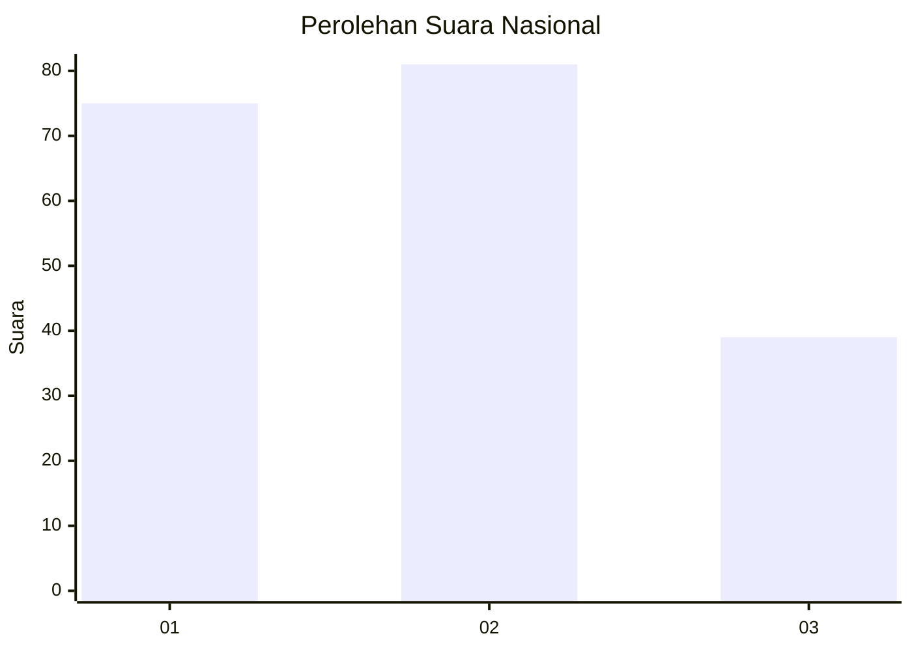
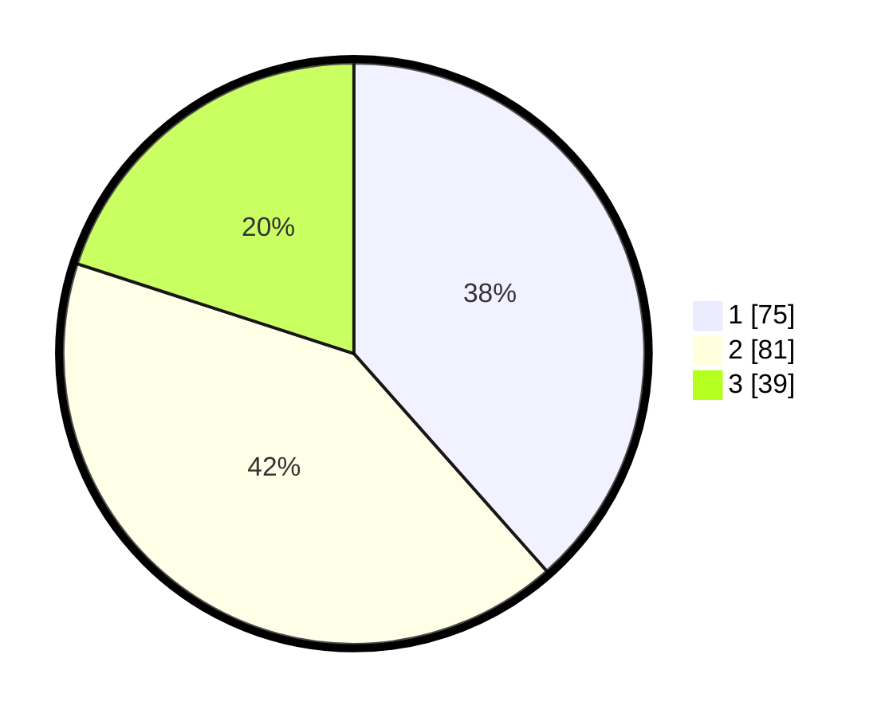

# Hasil

## Grafik

## Tabel

| No.    | Nama Paslon    | Suara | Suara (raw) | Persentase |
|:------ |:-------------- | -----:| -----------:| ----------:|
| 100025 | ANIES MUHAIMIN | 75    | [75][p-1]   | 38,46      |
| 100026 | PRABOWO GIBRAN | 81    | [81][p-2]   | 41,54      |
| 100027 | GANJAR MAHFUD  | 39    | [39][p-3]   | 20,00      |

[p-1]: https://github.com/gigit-pemilu/pemilu-2024/blob/main/pilpres/hitung-suara/sub/31-dki-jakarta/sub/73-jakarta-barat/sub/08-kembangan/sub/1002-meruya-utara/sub/002-tps/sub/paslon-1.txt
[p-2]: https://github.com/gigit-pemilu/pemilu-2024/blob/main/pilpres/hitung-suara/sub/31-dki-jakarta/sub/73-jakarta-barat/sub/08-kembangan/sub/1002-meruya-utara/sub/002-tps/sub/paslon-2.txt
[p-3]: https://github.com/gigit-pemilu/pemilu-2024/blob/main/pilpres/hitung-suara/sub/31-dki-jakarta/sub/73-jakarta-barat/sub/08-kembangan/sub/1002-meruya-utara/sub/002-tps/sub/paslon-3.txt

## Foto C Plano

https://sirekap-obj-formc.kpu.go.id/4fcc/pemilu/ppwp/31/73/08/10/02/3173081002002-20240214-212717--469b3233-6ed1-46c1-8eee-42797fed6c25.jpg

https://sirekap-obj-formc.kpu.go.id/4fcc/pemilu/ppwp/31/73/08/10/02/3173081002002-20240214-225803--f8a4ae90-ed99-4bec-8d0d-898e6ce9ba4f.jpg

https://sirekap-obj-formc.kpu.go.id/4fcc/pemilu/ppwp/31/73/08/10/02/3173081002002-20240214-213438--16086c8b-cea1-4717-9dcc-11a0535541c5.jpg

## Metadata

| Key        | Value               |
| ---------- | ------------------- |
| Time Stamp | 2024-02-21 18:00:00 |

