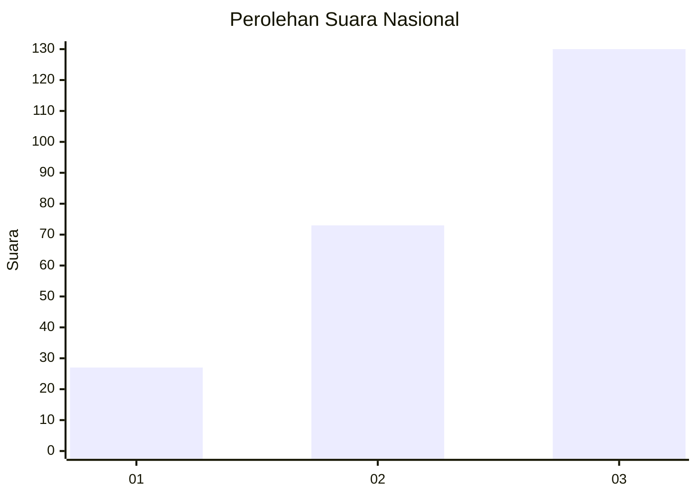
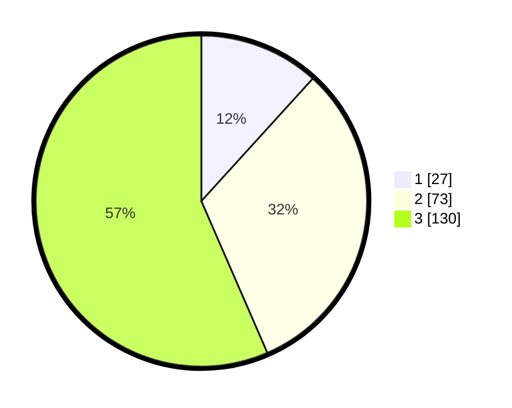

# Hasil

## Grafik

## Tabel

| No.    | Nama Paslon    | Suara | Suara (raw) | Persentase |
|:------ |:-------------- | -----:| -----------:| ----------:|
| 100025 | ANIES MUHAIMIN | 27    | [27][p-1]   | 11,74      |
| 100026 | PRABOWO GIBRAN | 73    | [73][p-2]   | 31,74      |
| 100027 | GANJAR MAHFUD  | 130   | [130][p-3]  | 56,52      |

[p-1]: https://github.com/gigit-pemilu/pemilu-2024/blob/main/pilpres/hitung-suara/sub/31-dki-jakarta/sub/73-jakarta-barat/sub/08-kembangan/sub/1002-meruya-utara/sub/011-tps/sub/paslon-1.txt
[p-2]: https://github.com/gigit-pemilu/pemilu-2024/blob/main/pilpres/hitung-suara/sub/31-dki-jakarta/sub/73-jakarta-barat/sub/08-kembangan/sub/1002-meruya-utara/sub/011-tps/sub/paslon-2.txt
[p-3]: https://github.com/gigit-pemilu/pemilu-2024/blob/main/pilpres/hitung-suara/sub/31-dki-jakarta/sub/73-jakarta-barat/sub/08-kembangan/sub/1002-meruya-utara/sub/011-tps/sub/paslon-3.txt

## Foto C Plano

https://sirekap-obj-formc.kpu.go.id/2029/pemilu/ppwp/31/73/08/10/02/3173081002011-20240214-215815--4b43a4db-cf60-4253-9135-e2f9f1c3fae8.jpg

https://sirekap-obj-formc.kpu.go.id/2029/pemilu/ppwp/31/73/08/10/02/3173081002011-20240214-220000--5e1537b3-cd44-449b-9b7f-527ffb755c7f.jpg

https://sirekap-obj-formc.kpu.go.id/2029/pemilu/ppwp/31/73/08/10/02/3173081002011-20240214-220206--67ec0580-5f2b-4f36-abf7-456925b6630e.jpg

## Metadata

| Key        | Value               |
| ---------- | ------------------- |
| Time Stamp | 2024-02-17 16:00:02 |

