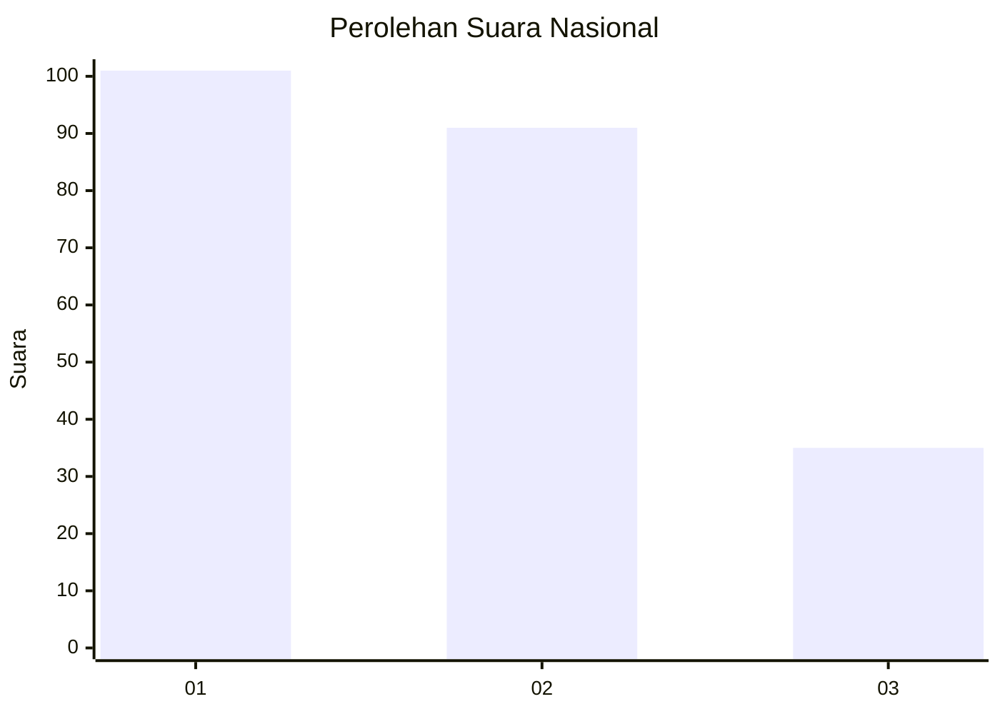
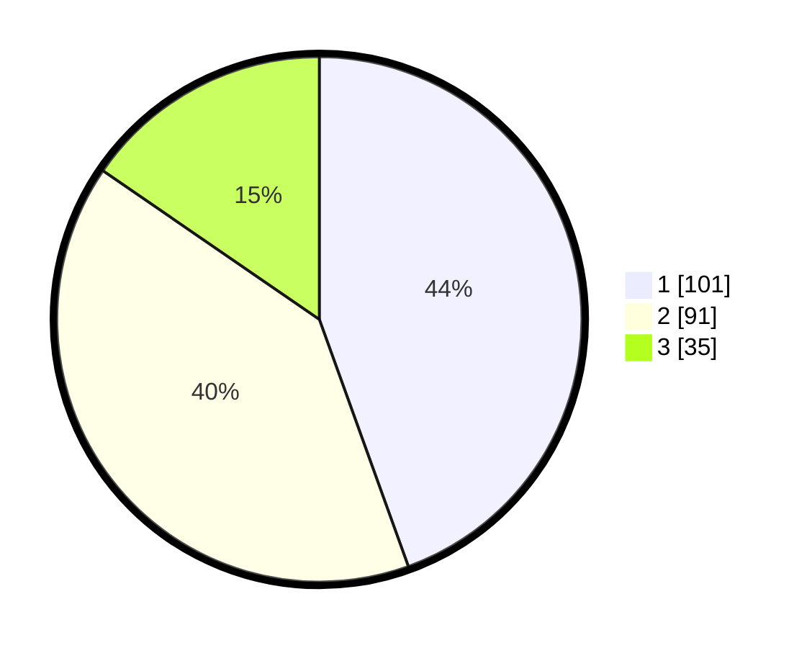

# Hasil

## Grafik

## Tabel

| No.    | Nama Paslon    | Suara | Suara (raw) | Persentase |
|:------ |:-------------- | -----:| -----------:| ----------:|
| 100025 | ANIES MUHAIMIN | 101   | [101][p-1]  | 44,49      |
| 100026 | PRABOWO GIBRAN | 91    | [91][p-2]   | 40,09      |
| 100027 | GANJAR MAHFUD  | 35    | [35][p-3]   | 15,42      |

[p-1]: https://github.com/gigit-pemilu/pemilu-2024/blob/main/pilpres/hitung-suara/sub/31-dki-jakarta/sub/73-jakarta-barat/sub/08-kembangan/sub/1002-meruya-utara/sub/028-tps/sub/paslon-1.txt
[p-2]: https://github.com/gigit-pemilu/pemilu-2024/blob/main/pilpres/hitung-suara/sub/31-dki-jakarta/sub/73-jakarta-barat/sub/08-kembangan/sub/1002-meruya-utara/sub/028-tps/sub/paslon-2.txt
[p-3]: https://github.com/gigit-pemilu/pemilu-2024/blob/main/pilpres/hitung-suara/sub/31-dki-jakarta/sub/73-jakarta-barat/sub/08-kembangan/sub/1002-meruya-utara/sub/028-tps/sub/paslon-3.txt

## Foto C Plano

https://sirekap-obj-formc.kpu.go.id/52f0/pemilu/ppwp/31/73/08/10/02/3173081002028-20240214-210219--086ccec5-90f5-4c05-bf6a-b45b4c9337fd.jpg

https://sirekap-obj-formc.kpu.go.id/52f0/pemilu/ppwp/31/73/08/10/02/3173081002028-20240214-210806--eff1bc89-efc9-4fd5-8b75-558c5a92dcbe.jpg

https://sirekap-obj-formc.kpu.go.id/52f0/pemilu/ppwp/31/73/08/10/02/3173081002028-20240214-210709--425102f6-b533-4aec-9ce2-a4718f66ccd3.jpg

## Metadata

| Key        | Value               |
| ---------- | ------------------- |
| Time Stamp | 2024-02-19 06:16:00 |

