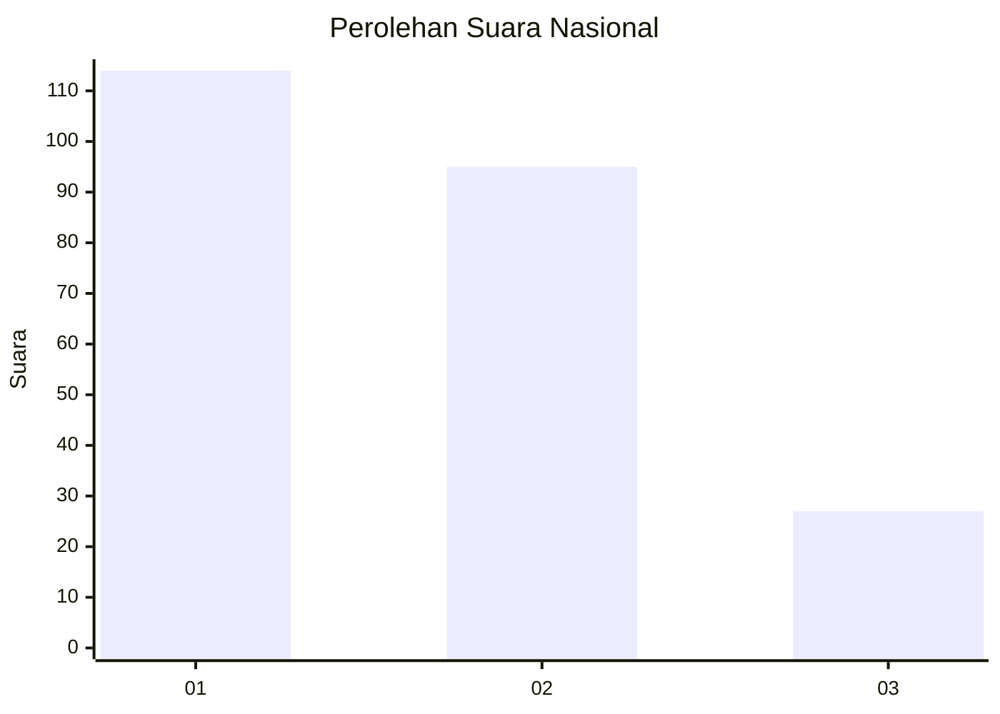
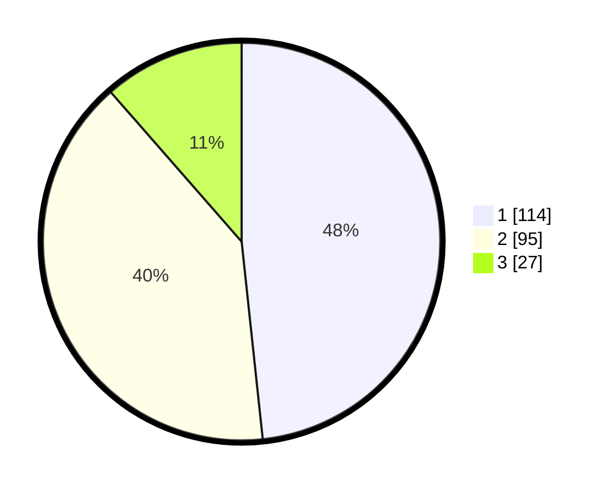

# Hasil

## Grafik

## Tabel

| No.    | Nama Paslon    | Suara | Suara (raw) | Persentase |
|:------ |:-------------- | -----:| -----------:| ----------:|
| 100025 | ANIES MUHAIMIN | 114   | [114][p-1]  | 48,31      |
| 100026 | PRABOWO GIBRAN | 95    | [95][p-2]   | 40,25      |
| 100027 | GANJAR MAHFUD  | 27    | [27][p-3]   | 11,44      |

[p-1]: https://github.com/gigit-pemilu/pemilu-2024/blob/main/pilpres/hitung-suara/sub/31-dki-jakarta/sub/73-jakarta-barat/sub/08-kembangan/sub/1002-meruya-utara/sub/032-tps/sub/paslon-1.txt
[p-2]: https://github.com/gigit-pemilu/pemilu-2024/blob/main/pilpres/hitung-suara/sub/31-dki-jakarta/sub/73-jakarta-barat/sub/08-kembangan/sub/1002-meruya-utara/sub/032-tps/sub/paslon-2.txt
[p-3]: https://github.com/gigit-pemilu/pemilu-2024/blob/main/pilpres/hitung-suara/sub/31-dki-jakarta/sub/73-jakarta-barat/sub/08-kembangan/sub/1002-meruya-utara/sub/032-tps/sub/paslon-3.txt

## Foto C Plano

https://sirekap-obj-formc.kpu.go.id/256b/pemilu/ppwp/31/73/08/10/02/3173081002032-20240214-191630--941a11c7-f5ba-4237-b368-0bc46638b98b.jpg

https://sirekap-obj-formc.kpu.go.id/256b/pemilu/ppwp/31/73/08/10/02/3173081002032-20240214-193110--7ce68895-927f-4e15-841d-009781ef65a3.jpg

https://sirekap-obj-formc.kpu.go.id/256b/pemilu/ppwp/31/73/08/10/02/3173081002032-20240214-193229--bedf3a21-c26d-4c36-9dce-f0bb8f923d57.jpg

## Metadata

| Key        | Value               |
| ---------- | ------------------- |
| Time Stamp | 2024-02-15 00:41:44 |

