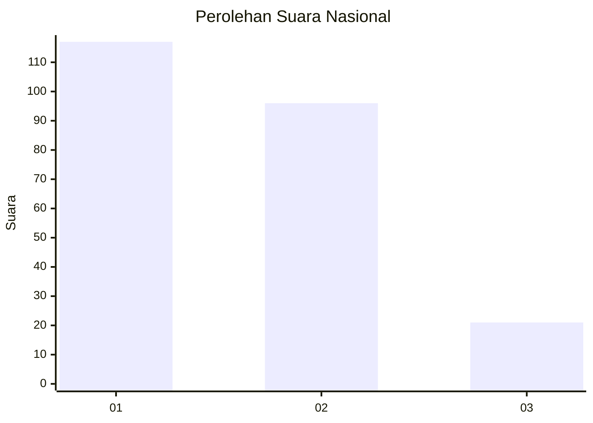
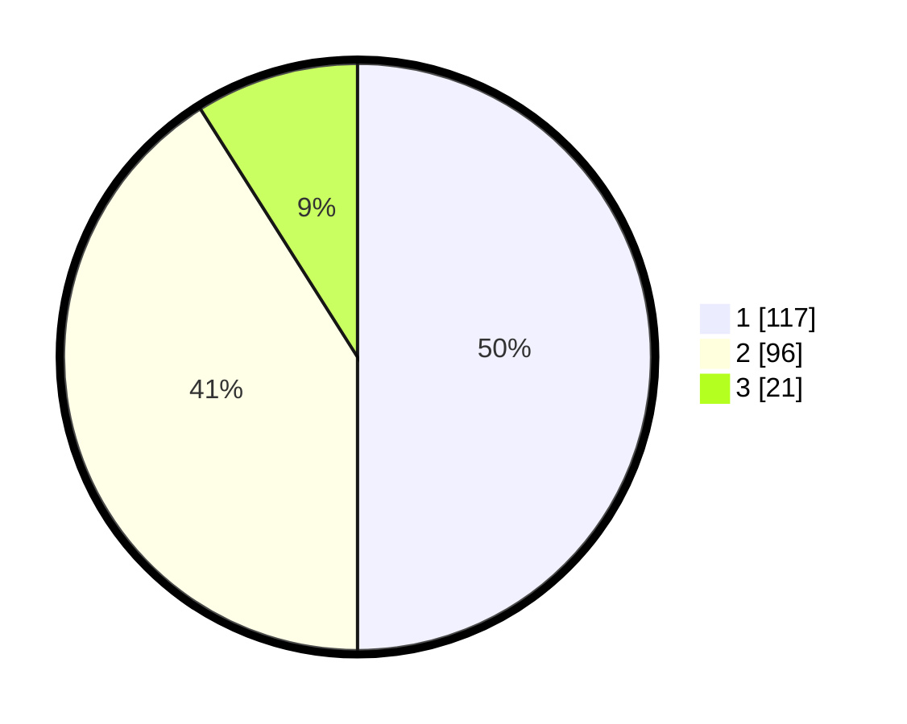

# Hasil

## Grafik

## Tabel

| No.    | Nama Paslon    | Suara | Suara (raw) | Persentase |
|:------ |:-------------- | -----:| -----------:| ----------:|
| 100025 | ANIES MUHAIMIN | 117   | [117][p-1]  | 50,00      |
| 100026 | PRABOWO GIBRAN | 96    | [96][p-2]   | 41,03      |
| 100027 | GANJAR MAHFUD  | 21    | [21][p-3]   | 8,97       |

[p-1]: https://github.com/gigit-pemilu/pemilu-2024/blob/main/pilpres/hitung-suara/sub/31-dki-jakarta/sub/73-jakarta-barat/sub/08-kembangan/sub/1002-meruya-utara/sub/044-tps/sub/paslon-1.txt
[p-2]: https://github.com/gigit-pemilu/pemilu-2024/blob/main/pilpres/hitung-suara/sub/31-dki-jakarta/sub/73-jakarta-barat/sub/08-kembangan/sub/1002-meruya-utara/sub/044-tps/sub/paslon-2.txt
[p-3]: https://github.com/gigit-pemilu/pemilu-2024/blob/main/pilpres/hitung-suara/sub/31-dki-jakarta/sub/73-jakarta-barat/sub/08-kembangan/sub/1002-meruya-utara/sub/044-tps/sub/paslon-3.txt

## Foto C Plano

https://sirekap-obj-formc.kpu.go.id/94dd/pemilu/ppwp/31/73/08/10/02/3173081002044-20240214-220754--3267862e-3322-4af7-b088-ca370e8dda12.jpg

https://sirekap-obj-formc.kpu.go.id/94dd/pemilu/ppwp/31/73/08/10/02/3173081002044-20240214-220704--fdd150ab-b4c2-4ec4-9dde-88260d484d61.jpg

https://sirekap-obj-formc.kpu.go.id/94dd/pemilu/ppwp/31/73/08/10/02/3173081002044-20240214-220743--2242581a-9847-4556-abec-4d21d0ca293e.jpg

## Metadata

| Key        | Value               |
| ---------- | ------------------- |
| Time Stamp | 2024-02-19 06:16:00 |

