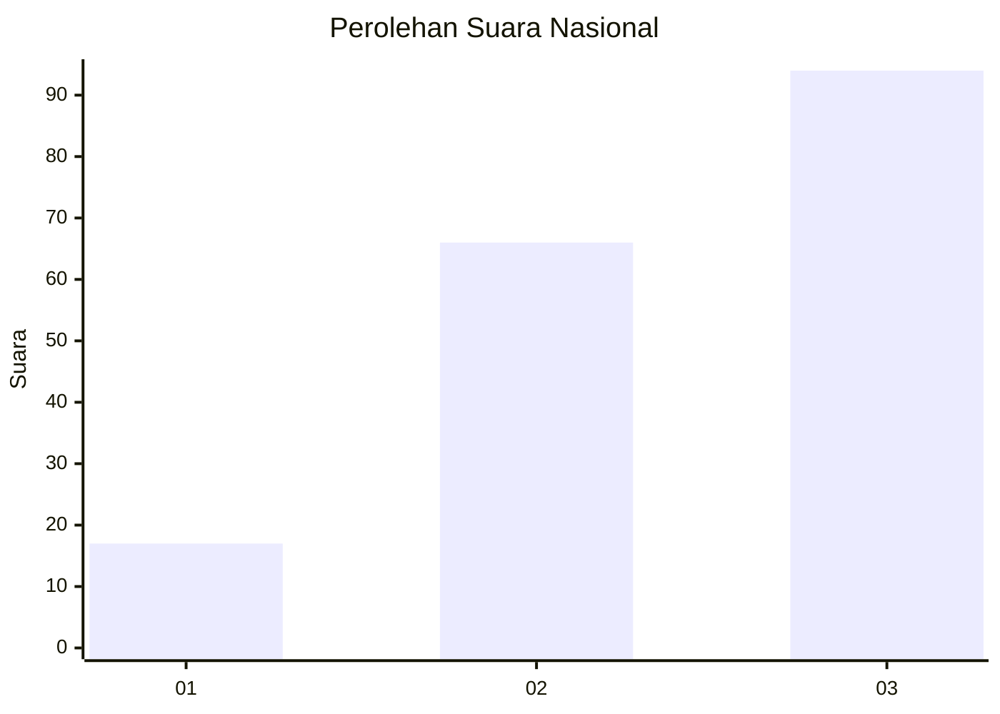
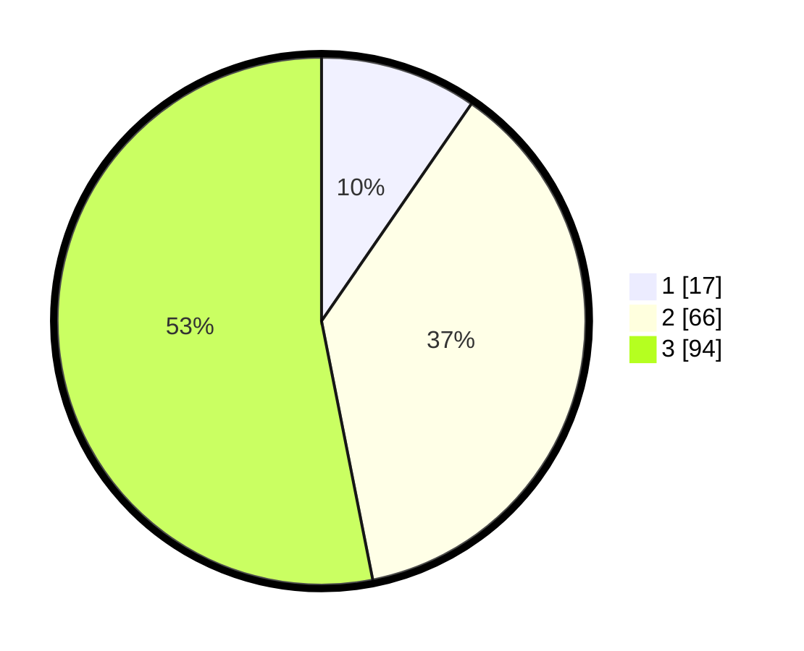

# Hasil

## Grafik

## Tabel

| No.    | Nama Paslon    | Suara | Suara (raw) | Persentase |
|:------ |:-------------- | -----:| -----------:| ----------:|
| 100025 | ANIES MUHAIMIN | 17    | [17][p-1]   | 9,60       |
| 100026 | PRABOWO GIBRAN | 66    | [66][p-2]   | 37,29      |
| 100027 | GANJAR MAHFUD  | 94    | [94][p-3]   | 53,11      |

[p-1]: https://github.com/gigit-pemilu/pemilu-2024/blob/main/pilpres/hitung-suara/sub/31-dki-jakarta/sub/73-jakarta-barat/sub/08-kembangan/sub/1002-meruya-utara/sub/045-tps/sub/paslon-1.txt
[p-2]: https://github.com/gigit-pemilu/pemilu-2024/blob/main/pilpres/hitung-suara/sub/31-dki-jakarta/sub/73-jakarta-barat/sub/08-kembangan/sub/1002-meruya-utara/sub/045-tps/sub/paslon-2.txt
[p-3]: https://github.com/gigit-pemilu/pemilu-2024/blob/main/pilpres/hitung-suara/sub/31-dki-jakarta/sub/73-jakarta-barat/sub/08-kembangan/sub/1002-meruya-utara/sub/045-tps/sub/paslon-3.txt

## Foto C Plano

https://sirekap-obj-formc.kpu.go.id/9ac2/pemilu/ppwp/31/73/08/10/02/3173081002045-20240214-230533--a93744cb-692d-4c39-8a51-7ced9393725f.jpg

https://sirekap-obj-formc.kpu.go.id/9ac2/pemilu/ppwp/31/73/08/10/02/3173081002045-20240214-230836--3e948add-7fe5-47f0-ac10-b29b6109c54f.jpg

https://sirekap-obj-formc.kpu.go.id/9ac2/pemilu/ppwp/31/73/08/10/02/3173081002045-20240214-231318--9a8af9dd-8245-457d-a1a6-54949e546936.jpg

## Metadata

| Key        | Value               |
| ---------- | ------------------- |
| Time Stamp | 2024-02-19 06:16:00 |

