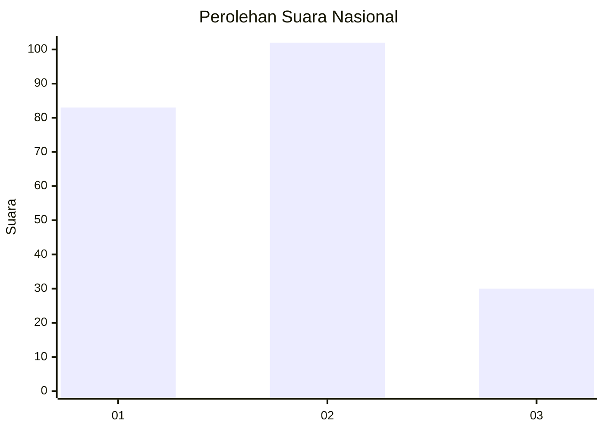
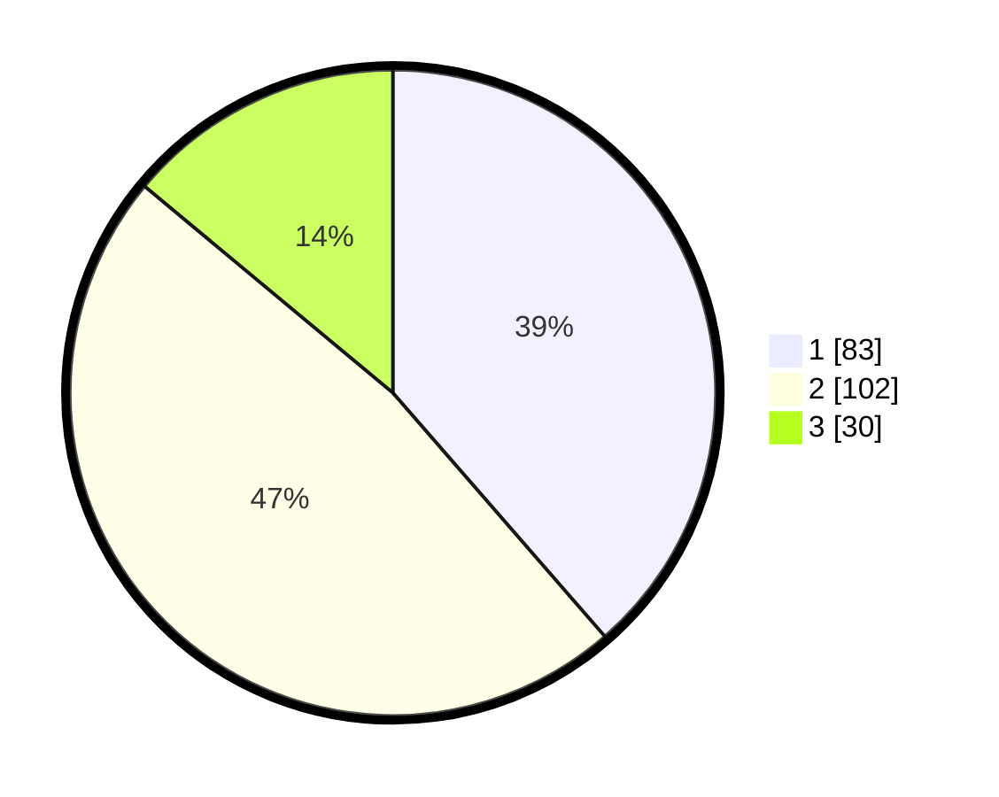

# Hasil

## Grafik

## Tabel

| No.    | Nama Paslon    | Suara | Suara (raw) | Persentase |
|:------ |:-------------- | -----:| -----------:| ----------:|
| 100025 | ANIES MUHAIMIN | 83    | [83][p-1]   | 38,60      |
| 100026 | PRABOWO GIBRAN | 102   | [102][p-2]  | 47,44      |
| 100027 | GANJAR MAHFUD  | 30    | [30][p-3]   | 13,95      |

[p-1]: https://github.com/gigit-pemilu/pemilu-2024/blob/main/pilpres/hitung-suara/sub/31-dki-jakarta/sub/73-jakarta-barat/sub/08-kembangan/sub/1002-meruya-utara/sub/048-tps/sub/paslon-1.txt
[p-2]: https://github.com/gigit-pemilu/pemilu-2024/blob/main/pilpres/hitung-suara/sub/31-dki-jakarta/sub/73-jakarta-barat/sub/08-kembangan/sub/1002-meruya-utara/sub/048-tps/sub/paslon-2.txt
[p-3]: https://github.com/gigit-pemilu/pemilu-2024/blob/main/pilpres/hitung-suara/sub/31-dki-jakarta/sub/73-jakarta-barat/sub/08-kembangan/sub/1002-meruya-utara/sub/048-tps/sub/paslon-3.txt

## Foto C Plano

https://sirekap-obj-formc.kpu.go.id/fbb9/pemilu/ppwp/31/73/08/10/02/3173081002048-20240214-192446--594a548d-666b-4085-8fb3-050a989e16d0.jpg

https://sirekap-obj-formc.kpu.go.id/fbb9/pemilu/ppwp/31/73/08/10/02/3173081002048-20240214-194056--9a8b0a43-5bb5-4d5c-8bf1-899a6aa772f8.jpg

https://sirekap-obj-formc.kpu.go.id/fbb9/pemilu/ppwp/31/73/08/10/02/3173081002048-20240214-195153--08238afd-9241-412a-b9e7-59b842be69b3.jpg

## Metadata

| Key        | Value               |
| ---------- | ------------------- |
| Time Stamp | 2024-02-19 06:16:00 |

