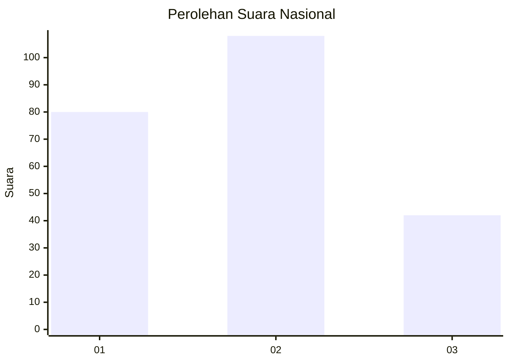
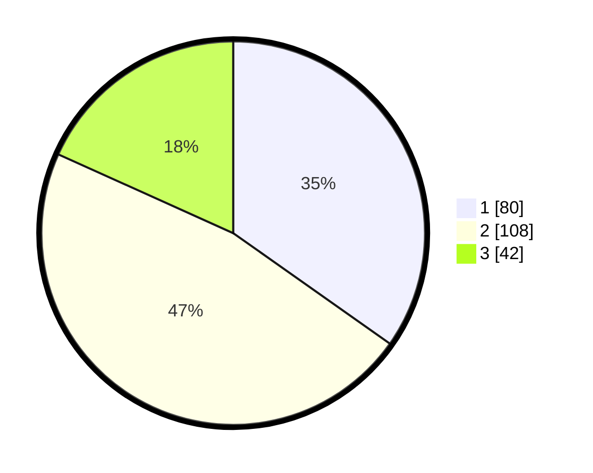

# Hasil

## Grafik

## Tabel

| No.    | Nama Paslon    | Suara | Suara (raw) | Persentase |
|:------ |:-------------- | -----:| -----------:| ----------:|
| 100025 | ANIES MUHAIMIN | 80    | [80][p-1]   | 34,78      |
| 100026 | PRABOWO GIBRAN | 108   | [108][p-2]  | 46,96      |
| 100027 | GANJAR MAHFUD  | 42    | [42][p-3]   | 18,26      |

[p-1]: https://github.com/gigit-pemilu/pemilu-2024/blob/main/pilpres/hitung-suara/sub/31-dki-jakarta/sub/73-jakarta-barat/sub/08-kembangan/sub/1002-meruya-utara/sub/052-tps/sub/paslon-1.txt
[p-2]: https://github.com/gigit-pemilu/pemilu-2024/blob/main/pilpres/hitung-suara/sub/31-dki-jakarta/sub/73-jakarta-barat/sub/08-kembangan/sub/1002-meruya-utara/sub/052-tps/sub/paslon-2.txt
[p-3]: https://github.com/gigit-pemilu/pemilu-2024/blob/main/pilpres/hitung-suara/sub/31-dki-jakarta/sub/73-jakarta-barat/sub/08-kembangan/sub/1002-meruya-utara/sub/052-tps/sub/paslon-3.txt

## Foto C Plano

https://sirekap-obj-formc.kpu.go.id/3551/pemilu/ppwp/31/73/08/10/02/3173081002052-20240214-230223--7819cd9d-64e6-47d1-b94f-874a6a3f061b.jpg

https://sirekap-obj-formc.kpu.go.id/3551/pemilu/ppwp/31/73/08/10/02/3173081002052-20240214-230021--8b0ba66b-b4ee-4dc2-aebf-80d231a7bedb.jpg

https://sirekap-obj-formc.kpu.go.id/3551/pemilu/ppwp/31/73/08/10/02/3173081002052-20240214-225002--d6fc27c6-3258-41c9-a5d5-d2118522051d.jpg

## Metadata

| Key        | Value               |
| ---------- | ------------------- |
| Time Stamp | 2024-02-19 06:16:00 |

