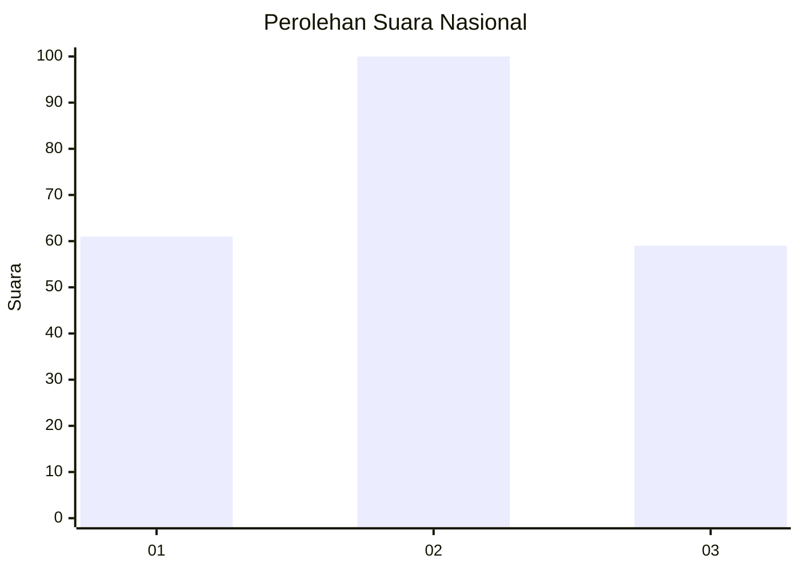
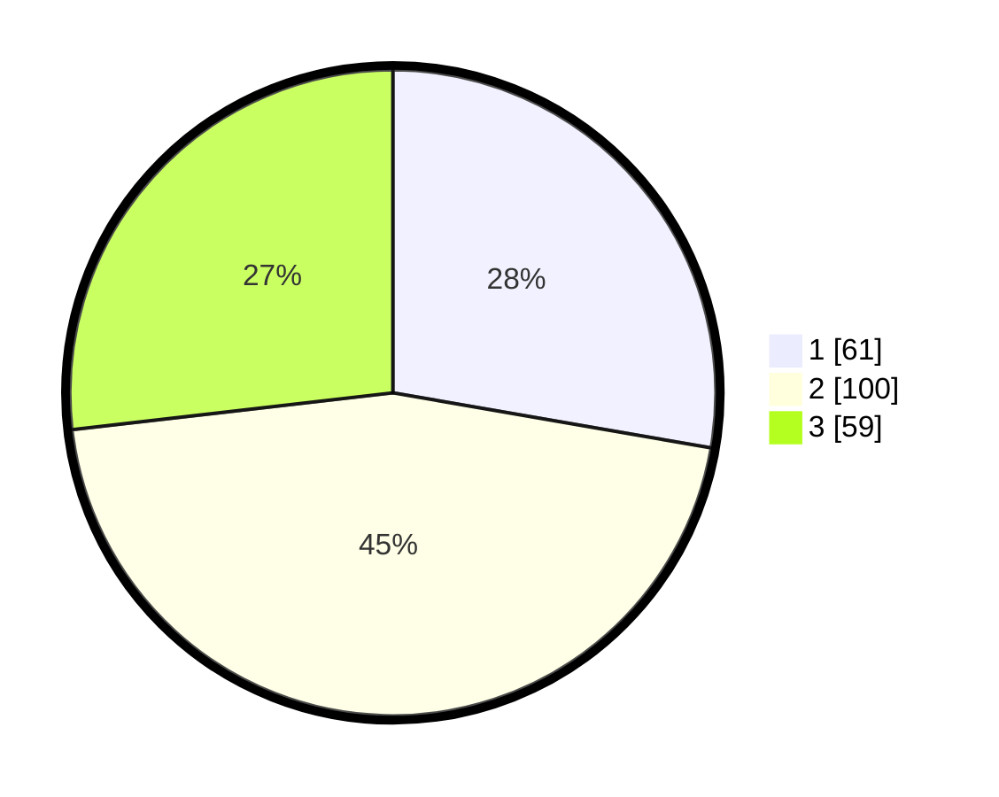

# Hasil

## Grafik

## Tabel

| No.    | Nama Paslon    | Suara | Suara (raw) | Persentase |
|:------ |:-------------- | -----:| -----------:| ----------:|
| 100025 | ANIES MUHAIMIN | 61    | [61][p-1]   | 27,73      |
| 100026 | PRABOWO GIBRAN | 100   | [100][p-2]  | 45,45      |
| 100027 | GANJAR MAHFUD  | 59    | [59][p-3]   | 26,82      |

[p-1]: https://github.com/gigit-pemilu/pemilu-2024/blob/main/pilpres/hitung-suara/sub/31-dki-jakarta/sub/73-jakarta-barat/sub/08-kembangan/sub/1002-meruya-utara/sub/087-tps/sub/paslon-1.txt
[p-2]: https://github.com/gigit-pemilu/pemilu-2024/blob/main/pilpres/hitung-suara/sub/31-dki-jakarta/sub/73-jakarta-barat/sub/08-kembangan/sub/1002-meruya-utara/sub/087-tps/sub/paslon-2.txt
[p-3]: https://github.com/gigit-pemilu/pemilu-2024/blob/main/pilpres/hitung-suara/sub/31-dki-jakarta/sub/73-jakarta-barat/sub/08-kembangan/sub/1002-meruya-utara/sub/087-tps/sub/paslon-3.txt

## Foto C Plano

https://sirekap-obj-formc.kpu.go.id/bbcd/pemilu/ppwp/31/73/08/10/02/3173081002087-20240214-155300--3a063c91-b0b7-400f-9c17-844a080e921e.jpg

https://sirekap-obj-formc.kpu.go.id/bbcd/pemilu/ppwp/31/73/08/10/02/3173081002087-20240214-155449--fd3b488c-3a27-485e-a079-5d21be93d9e2.jpg

https://sirekap-obj-formc.kpu.go.id/bbcd/pemilu/ppwp/31/73/08/10/02/3173081002087-20240215-030402--ec9d1b24-4b06-4825-a043-baa63ce0c5d1.jpg

## Metadata

| Key        | Value               |
| ---------- | ------------------- |
| Time Stamp | 2024-02-15 03:06:03 |

