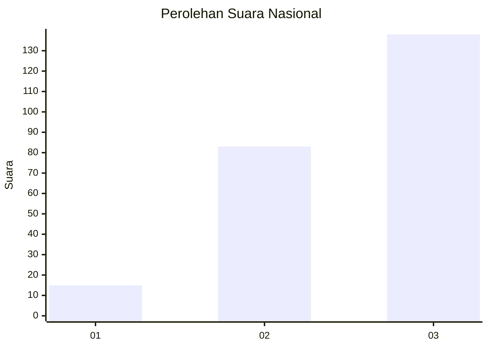
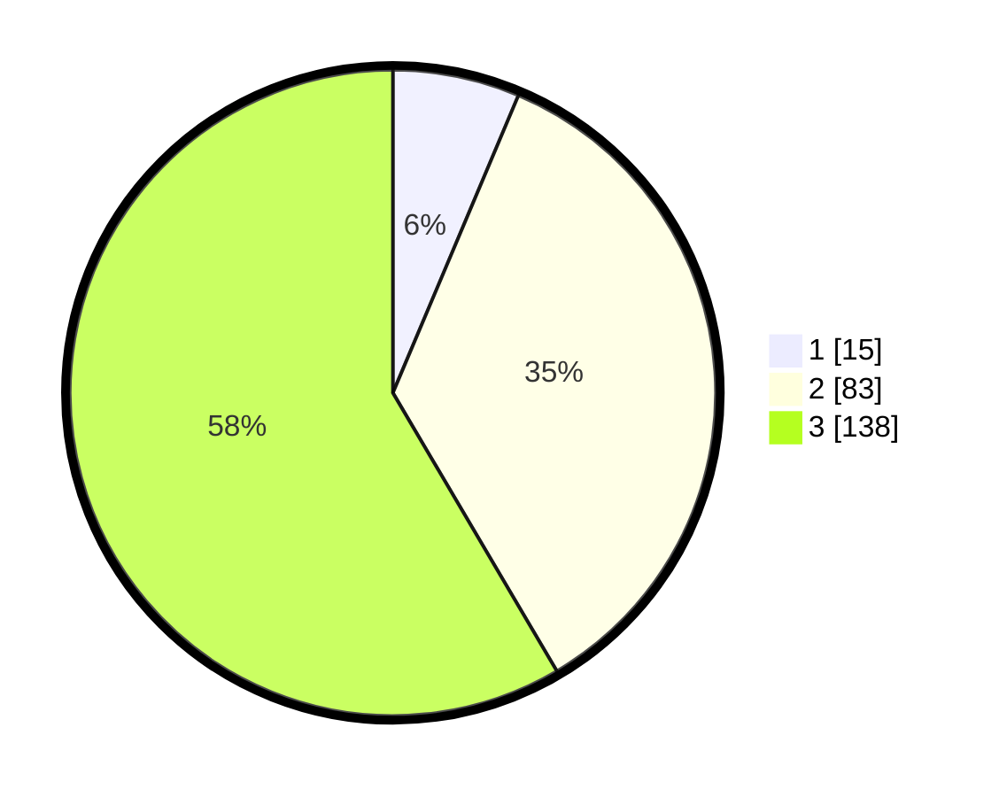

# Hasil

## Grafik

## Tabel

| No. | Nama Paslon    | Suara | Suara (raw) | Persentase |
|:--- |:-------------- | -----:| -----------:| ----------:|
| 1   | ANIES MUHAIMIN | 15    | [15][p-1]   | 6,36       |
| 2   | PRABOWO GIBRAN | 83    | [83][p-2]   | 35,17      |
| 3   | GANJAR MAHFUD  | 138   | [138][p-3]  | 58,47      |

[p-1]: https://github.com/gigit-pemilu/pemilu-2024/blob/main/pilpres/hitung-suara/sub/31-dki-jakarta/sub/73-jakarta-barat/sub/08-kembangan/sub/1002-meruya-utara/sub/095-tps/sub/paslon-1.txt
[p-2]: https://github.com/gigit-pemilu/pemilu-2024/blob/main/pilpres/hitung-suara/sub/31-dki-jakarta/sub/73-jakarta-barat/sub/08-kembangan/sub/1002-meruya-utara/sub/095-tps/sub/paslon-2.txt
[p-3]: https://github.com/gigit-pemilu/pemilu-2024/blob/main/pilpres/hitung-suara/sub/31-dki-jakarta/sub/73-jakarta-barat/sub/08-kembangan/sub/1002-meruya-utara/sub/095-tps/sub/paslon-3.txt

## Foto C Plano

https://sirekap-obj-formc.kpu.go.id/263a/pemilu/ppwp/31/73/08/10/02/3173081002095-20240214-200438--83c82ff9-20f9-46ae-beeb-2543ccd705db.jpg

https://sirekap-obj-formc.kpu.go.id/263a/pemilu/ppwp/31/73/08/10/02/3173081002095-20240214-193306--7025a3a0-317f-4626-9da6-36679e42e67c.jpg

https://sirekap-obj-formc.kpu.go.id/263a/pemilu/ppwp/31/73/08/10/02/3173081002095-20240214-212434--9d8dad92-3cf1-4e42-b7f9-91a3b3c39b5b.jpg

## Metadata

| Key        | Value               |
| ---------- | ------------------- |
| Time Stamp | 2024-02-15 21:01:18 |

## DATA PEMILIH TETAP

Jumlah pemilih dalam DPT: **233**.
 * L: **128**.
 * P: **645**.

## DATA PENGGUNA HAK PILIH

Jumlah pengguna hak pilih dalam DPT: **335**.
 * L: **305**.
 * P: **132**.

Jumlah pengguna hak pilih dalam DPTb: **883**.
 * L: **808**.
 * P: **881**.

Jumlah pengguna hak pilih dalam DPK: **802**.
 * L: **488**.
 * P: **886**.

Jumlah pengguna hak pilih: **238**.
 * L: **725**.
 * P: **133**.

## JUMLAH SUARA SAH DAN TIDAK SAH

JUMLAH SELURUH SUARA SAH: **236**.

JUMLAH SUARA TIDAK SAH: **2**.

JUMLAH SELURUH SUARA SAH DAN SUARA TIDAK SAH: **238**.

