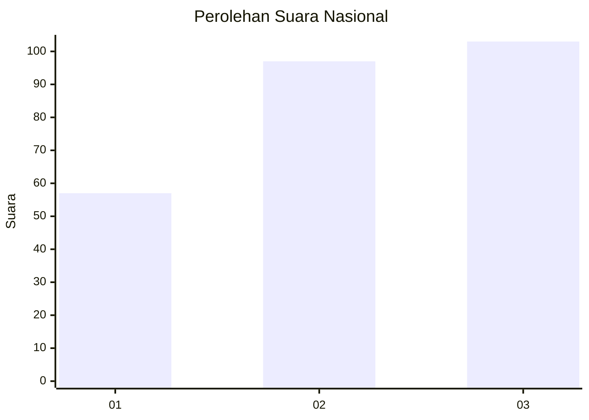
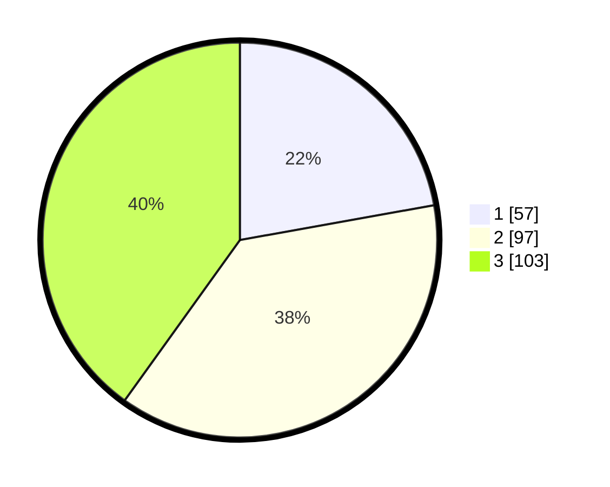

# Hasil

## Grafik

## Tabel

| No.    | Nama Paslon    | Suara | Suara (raw) | Persentase |
|:------ |:-------------- | -----:| -----------:| ----------:|
| 100025 | ANIES MUHAIMIN | 57    | [57][p-1]   | 22,18      |
| 100026 | PRABOWO GIBRAN | 97    | [97][p-2]   | 37,74      |
| 100027 | GANJAR MAHFUD  | 103   | [103][p-3]  | 40,08      |

[p-1]: https://github.com/gigit-pemilu/pemilu-2024/blob/main/pilpres/hitung-suara/sub/31-dki-jakarta/sub/73-jakarta-barat/sub/08-kembangan/sub/1002-meruya-utara/sub/108-tps/sub/paslon-1.txt
[p-2]: https://github.com/gigit-pemilu/pemilu-2024/blob/main/pilpres/hitung-suara/sub/31-dki-jakarta/sub/73-jakarta-barat/sub/08-kembangan/sub/1002-meruya-utara/sub/108-tps/sub/paslon-2.txt
[p-3]: https://github.com/gigit-pemilu/pemilu-2024/blob/main/pilpres/hitung-suara/sub/31-dki-jakarta/sub/73-jakarta-barat/sub/08-kembangan/sub/1002-meruya-utara/sub/108-tps/sub/paslon-3.txt

## Foto C Plano

https://sirekap-obj-formc.kpu.go.id/d89e/pemilu/ppwp/31/73/08/10/02/3173081002108-20240215-134524--c40696cf-f2da-42e2-9316-85118157b70f.jpg

https://sirekap-obj-formc.kpu.go.id/d89e/pemilu/ppwp/31/73/08/10/02/3173081002108-20240215-004139--39d7c631-dba5-4ce8-bf8c-a0331d078a2a.jpg

https://sirekap-obj-formc.kpu.go.id/d89e/pemilu/ppwp/31/73/08/10/02/3173081002108-20240215-134804--01911619-9a08-4352-a3ae-f5e958a382c2.jpg

## Metadata

| Key        | Value               |
| ---------- | ------------------- |
| Time Stamp | 2024-02-15 15:00:29 |

