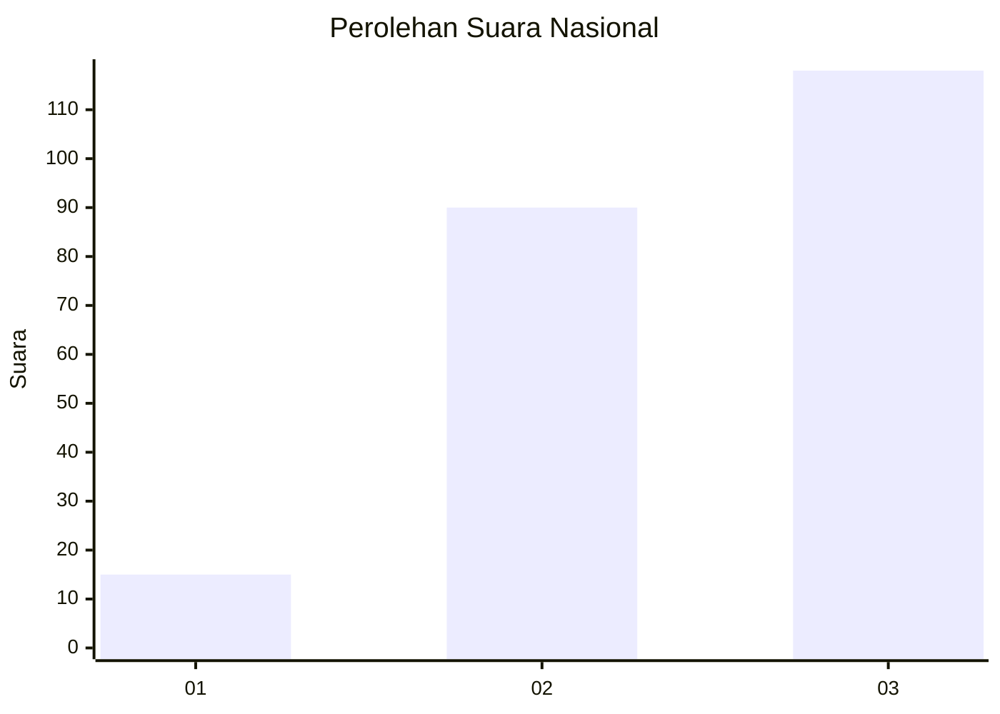
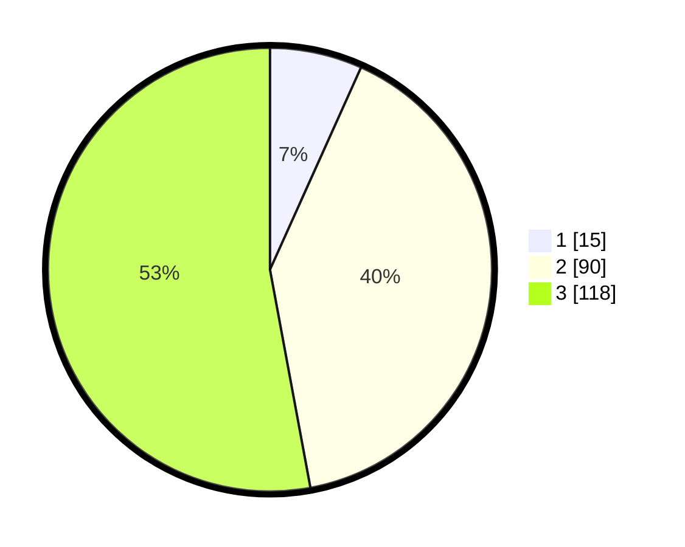

# Hasil

## Grafik

## Tabel

| No.    | Nama Paslon    | Suara | Suara (raw) | Persentase |
|:------ |:-------------- | -----:| -----------:| ----------:|
| 100025 | ANIES MUHAIMIN | 15    | [15][p-1]   | 6,73       |
| 100026 | PRABOWO GIBRAN | 90    | [90][p-2]   | 40,36      |
| 100027 | GANJAR MAHFUD  | 118   | [118][p-3]  | 52,91      |

[p-1]: https://github.com/gigit-pemilu/pemilu-2024/blob/main/pilpres/hitung-suara/sub/31-dki-jakarta/sub/73-jakarta-barat/sub/08-kembangan/sub/1002-meruya-utara/sub/111-tps/sub/paslon-1.txt
[p-2]: https://github.com/gigit-pemilu/pemilu-2024/blob/main/pilpres/hitung-suara/sub/31-dki-jakarta/sub/73-jakarta-barat/sub/08-kembangan/sub/1002-meruya-utara/sub/111-tps/sub/paslon-2.txt
[p-3]: https://github.com/gigit-pemilu/pemilu-2024/blob/main/pilpres/hitung-suara/sub/31-dki-jakarta/sub/73-jakarta-barat/sub/08-kembangan/sub/1002-meruya-utara/sub/111-tps/sub/paslon-3.txt

## Foto C Plano

https://sirekap-obj-formc.kpu.go.id/406c/pemilu/ppwp/31/73/08/10/02/3173081002111-20240214-162249--2412ed4d-2546-458f-8709-ba5225ad6580.jpg

https://sirekap-obj-formc.kpu.go.id/406c/pemilu/ppwp/31/73/08/10/02/3173081002111-20240215-201607--8c085c70-5f0c-4232-9d3c-0540cfea9505.jpg

https://sirekap-obj-formc.kpu.go.id/406c/pemilu/ppwp/31/73/08/10/02/3173081002111-20240215-201611--ce19922a-2275-487a-8341-b290f104473e.jpg

## Metadata

| Key        | Value               |
| ---------- | ------------------- |
| Time Stamp | 2024-02-21 18:00:00 |

