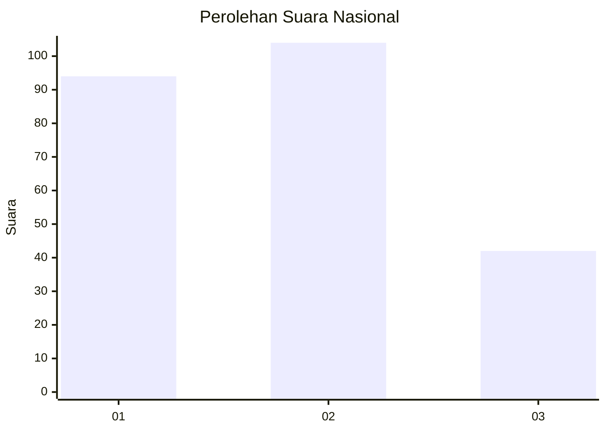
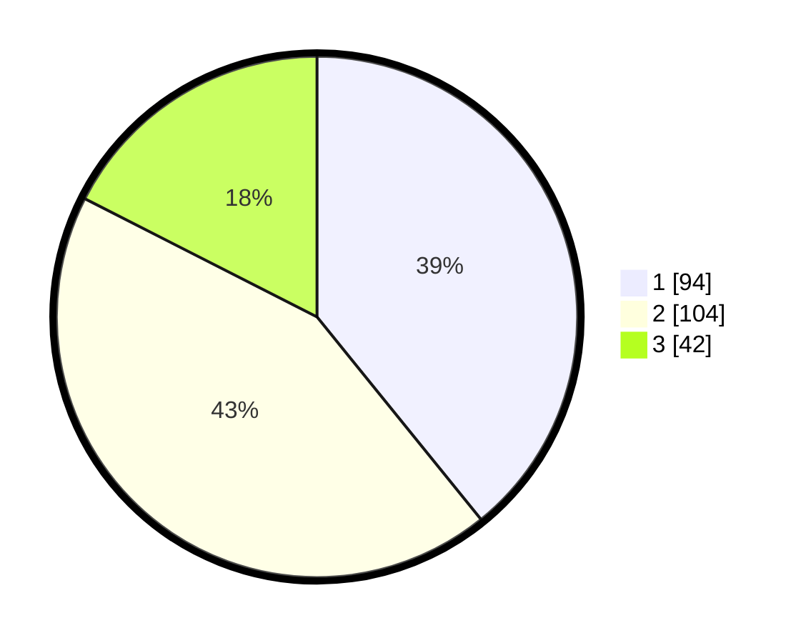

# Hasil

## Grafik

## Tabel

| No.    | Nama Paslon    | Suara | Suara (raw) | Persentase |
|:------ |:-------------- | -----:| -----------:| ----------:|
| 100025 | ANIES MUHAIMIN | 94    | [94][p-1]   | 39,17      |
| 100026 | PRABOWO GIBRAN | 104   | [104][p-2]  | 43,33      |
| 100027 | GANJAR MAHFUD  | 42    | [42][p-3]   | 17,50      |

[p-1]: https://github.com/gigit-pemilu/pemilu-2024/blob/main/pilpres/hitung-suara/sub/31-dki-jakarta/sub/73-jakarta-barat/sub/08-kembangan/sub/1002-meruya-utara/sub/121-tps/sub/paslon-1.txt
[p-2]: https://github.com/gigit-pemilu/pemilu-2024/blob/main/pilpres/hitung-suara/sub/31-dki-jakarta/sub/73-jakarta-barat/sub/08-kembangan/sub/1002-meruya-utara/sub/121-tps/sub/paslon-2.txt
[p-3]: https://github.com/gigit-pemilu/pemilu-2024/blob/main/pilpres/hitung-suara/sub/31-dki-jakarta/sub/73-jakarta-barat/sub/08-kembangan/sub/1002-meruya-utara/sub/121-tps/sub/paslon-3.txt

## Foto C Plano

https://sirekap-obj-formc.kpu.go.id/2635/pemilu/ppwp/31/73/08/10/02/3173081002121-20240214-212728--e6ddd709-c3a4-464f-ab06-7f994c4b5fdd.jpg

https://sirekap-obj-formc.kpu.go.id/2635/pemilu/ppwp/31/73/08/10/02/3173081002121-20240214-212543--46879385-fe24-4a4b-872d-644e8f4a7c5a.jpg

https://sirekap-obj-formc.kpu.go.id/2635/pemilu/ppwp/31/73/08/10/02/3173081002121-20240214-190705--3a8e25e1-0220-4136-b0c9-d6dd1a9b720f.jpg

## Metadata

| Key        | Value               |
| ---------- | ------------------- |
| Time Stamp | 2024-02-19 21:00:00 |

