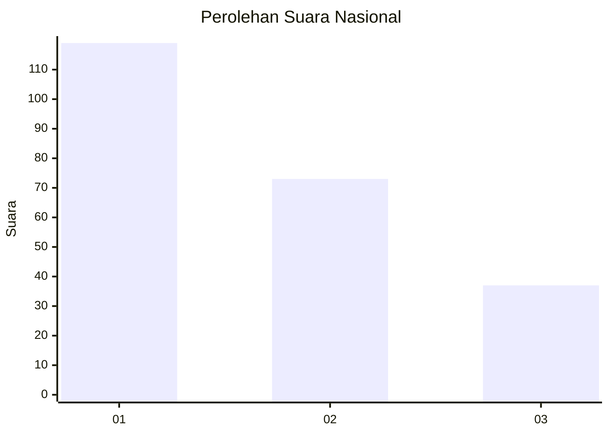
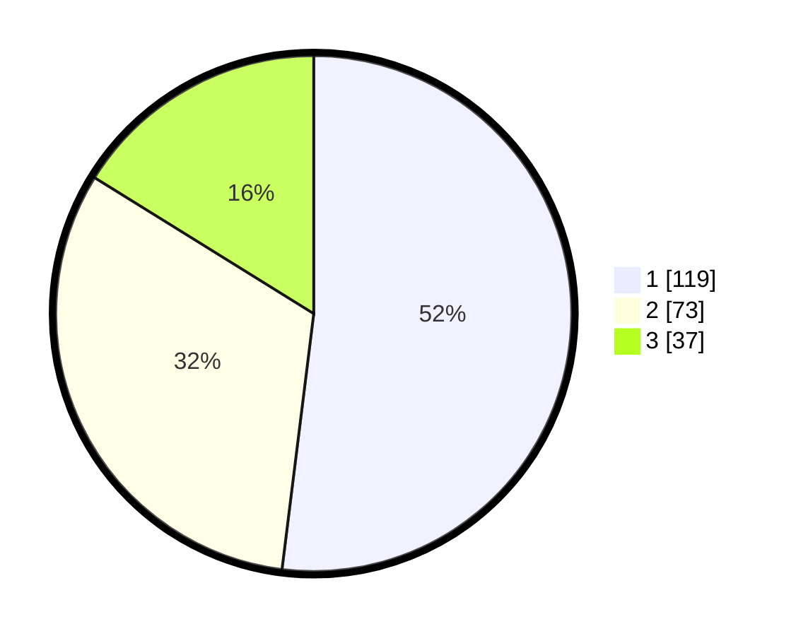

# Hasil

## Grafik

## Tabel

| No.    | Nama Paslon    | Suara | Suara (raw) | Persentase |
|:------ |:-------------- | -----:| -----------:| ----------:|
| 100025 | ANIES MUHAIMIN | 119   | [119][p-1]  | 51,97      |
| 100026 | PRABOWO GIBRAN | 73    | [73][p-2]   | 31,88      |
| 100027 | GANJAR MAHFUD  | 37    | [37][p-3]   | 16,16      |

[p-1]: https://github.com/gigit-pemilu/pemilu-2024/blob/main/pilpres/hitung-suara/sub/31-dki-jakarta/sub/73-jakarta-barat/sub/08-kembangan/sub/1002-meruya-utara/sub/146-tps/sub/paslon-1.txt
[p-2]: https://github.com/gigit-pemilu/pemilu-2024/blob/main/pilpres/hitung-suara/sub/31-dki-jakarta/sub/73-jakarta-barat/sub/08-kembangan/sub/1002-meruya-utara/sub/146-tps/sub/paslon-2.txt
[p-3]: https://github.com/gigit-pemilu/pemilu-2024/blob/main/pilpres/hitung-suara/sub/31-dki-jakarta/sub/73-jakarta-barat/sub/08-kembangan/sub/1002-meruya-utara/sub/146-tps/sub/paslon-3.txt

## Foto C Plano

https://sirekap-obj-formc.kpu.go.id/a515/pemilu/ppwp/31/73/08/10/02/3173081002146-20240215-000307--c418799f-12be-49b9-b887-be4548a32e01.jpg

https://sirekap-obj-formc.kpu.go.id/a515/pemilu/ppwp/31/73/08/10/02/3173081002146-20240215-000445--e8e7ceff-6c1a-4b1c-9466-c5a484a7cb44.jpg

https://sirekap-obj-formc.kpu.go.id/a515/pemilu/ppwp/31/73/08/10/02/3173081002146-20240215-000505--b3470138-a8cc-4ad3-9752-7fae9e9cb02f.jpg

## Metadata

| Key        | Value               |
| ---------- | ------------------- |
| Time Stamp | 2024-02-19 06:16:00 |

