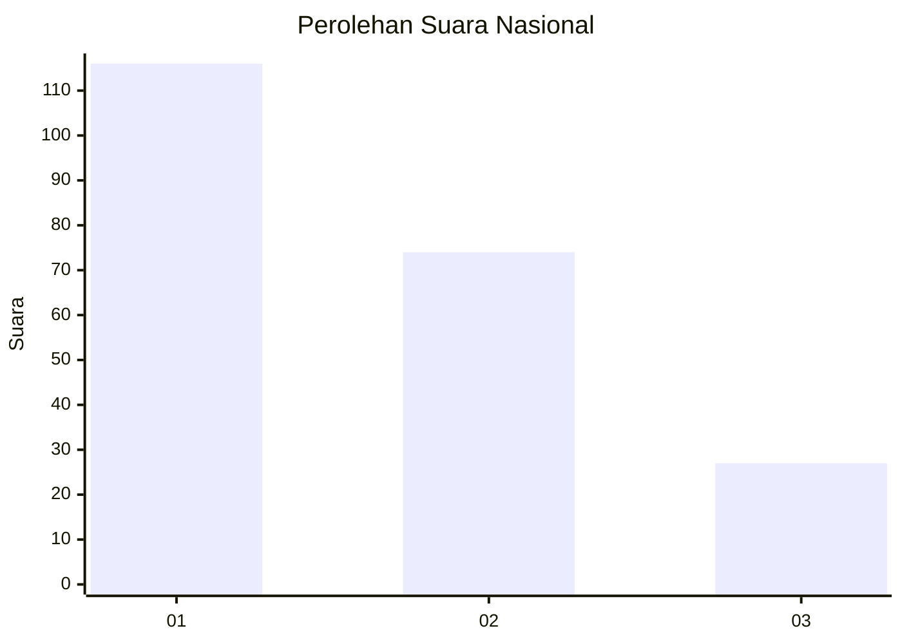
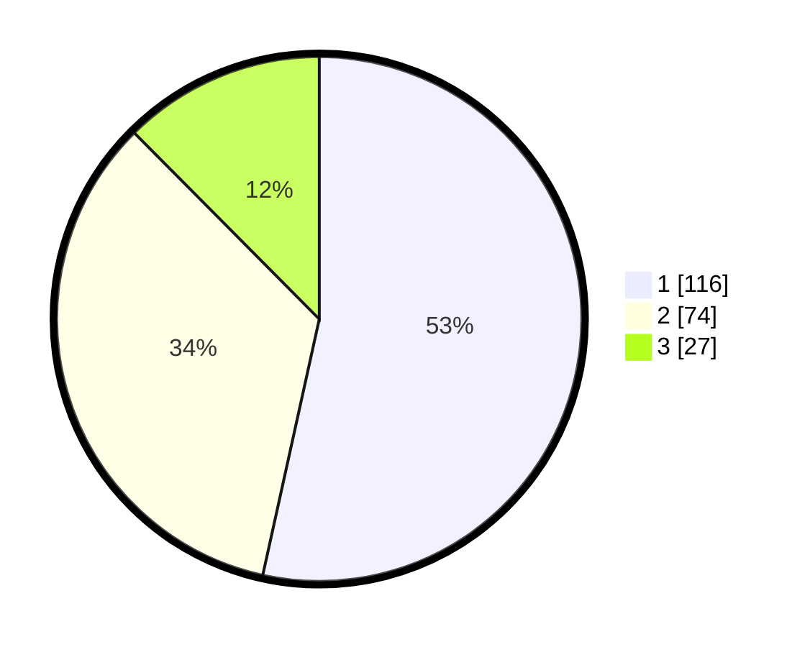

# Hasil

## Grafik

## Tabel

| No.    | Nama Paslon    | Suara | Suara (raw) | Persentase |
|:------ |:-------------- | -----:| -----------:| ----------:|
| 100025 | ANIES MUHAIMIN | 116   | [116][p-1]  | 53,46      |
| 100026 | PRABOWO GIBRAN | 74    | [74][p-2]   | 34,10      |
| 100027 | GANJAR MAHFUD  | 27    | [27][p-3]   | 12,44      |

[p-1]: https://github.com/gigit-pemilu/pemilu-2024/blob/main/pilpres/hitung-suara/sub/31-dki-jakarta/sub/73-jakarta-barat/sub/08-kembangan/sub/1003-meruya-selatan/sub/022-tps/sub/paslon-1.txt
[p-2]: https://github.com/gigit-pemilu/pemilu-2024/blob/main/pilpres/hitung-suara/sub/31-dki-jakarta/sub/73-jakarta-barat/sub/08-kembangan/sub/1003-meruya-selatan/sub/022-tps/sub/paslon-2.txt
[p-3]: https://github.com/gigit-pemilu/pemilu-2024/blob/main/pilpres/hitung-suara/sub/31-dki-jakarta/sub/73-jakarta-barat/sub/08-kembangan/sub/1003-meruya-selatan/sub/022-tps/sub/paslon-3.txt

## Foto C Plano

https://sirekap-obj-formc.kpu.go.id/5a83/pemilu/ppwp/31/73/08/10/03/3173081003022-20240214-215434--c35ac9ee-7d94-44ce-a182-8a6924103b12.jpg

https://sirekap-obj-formc.kpu.go.id/5a83/pemilu/ppwp/31/73/08/10/03/3173081003022-20240214-215608--189b0026-1087-4a50-9f37-b70e514327e0.jpg

https://sirekap-obj-formc.kpu.go.id/5a83/pemilu/ppwp/31/73/08/10/03/3173081003022-20240214-215737--f947c023-b5bc-4183-8e2b-682dd0277377.jpg

## Metadata

| Key        | Value               |
| ---------- | ------------------- |
| Time Stamp | 2024-02-16 00:30:27 |

