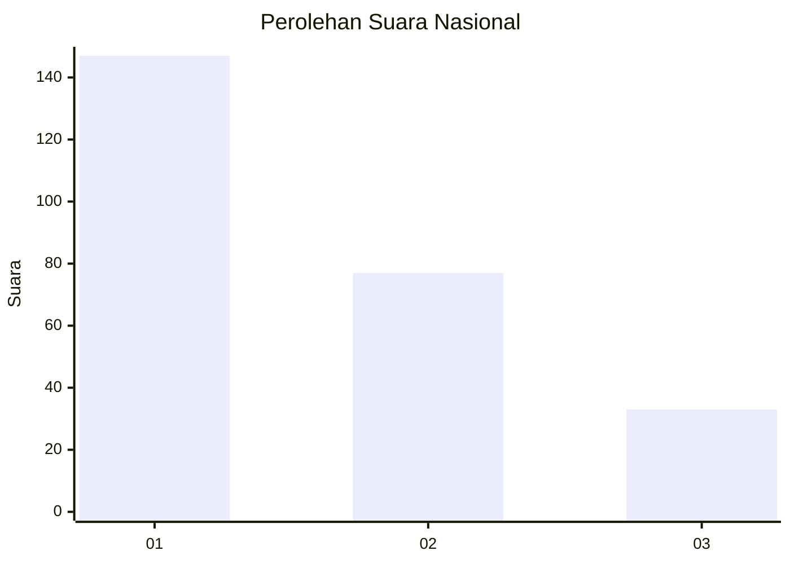
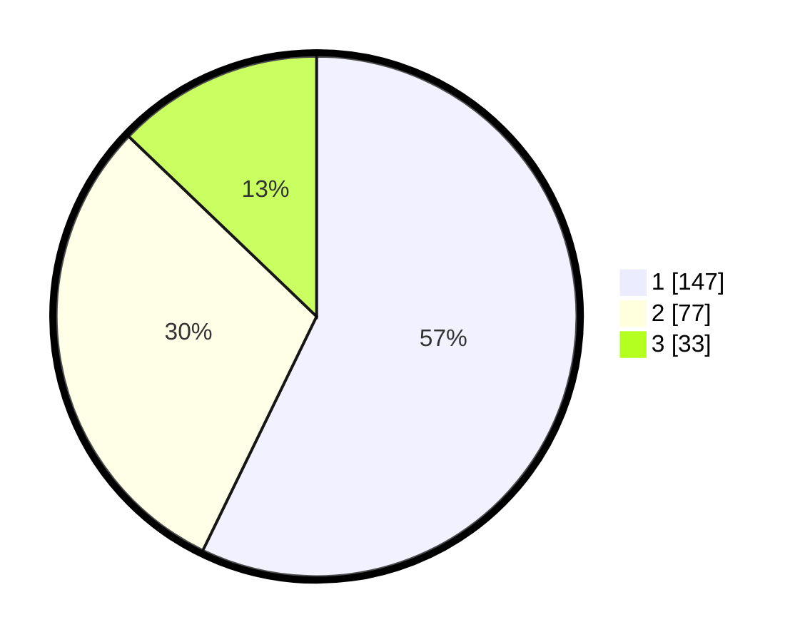

# Hasil

## Grafik

## Tabel

| No.    | Nama Paslon    | Suara | Suara (raw) | Persentase |
|:------ |:-------------- | -----:| -----------:| ----------:|
| 100025 | ANIES MUHAIMIN | 147   | [147][p-1]  | 57,20      |
| 100026 | PRABOWO GIBRAN | 77    | [77][p-2]   | 29,96      |
| 100027 | GANJAR MAHFUD  | 33    | [33][p-3]   | 12,84      |

[p-1]: https://github.com/gigit-pemilu/pemilu-2024/blob/main/pilpres/hitung-suara/sub/31-dki-jakarta/sub/73-jakarta-barat/sub/08-kembangan/sub/1003-meruya-selatan/sub/023-tps/sub/paslon-1.txt
[p-2]: https://github.com/gigit-pemilu/pemilu-2024/blob/main/pilpres/hitung-suara/sub/31-dki-jakarta/sub/73-jakarta-barat/sub/08-kembangan/sub/1003-meruya-selatan/sub/023-tps/sub/paslon-2.txt
[p-3]: https://github.com/gigit-pemilu/pemilu-2024/blob/main/pilpres/hitung-suara/sub/31-dki-jakarta/sub/73-jakarta-barat/sub/08-kembangan/sub/1003-meruya-selatan/sub/023-tps/sub/paslon-3.txt

## Foto C Plano

https://sirekap-obj-formc.kpu.go.id/5bd0/pemilu/ppwp/31/73/08/10/03/3173081003023-20240215-012910--2bacf25a-990c-4ef4-939a-44aaa7864a98.jpg

https://sirekap-obj-formc.kpu.go.id/5bd0/pemilu/ppwp/31/73/08/10/03/3173081003023-20240215-013051--21d39f20-d4bc-4dc6-82cb-309ac7abb01e.jpg

https://sirekap-obj-formc.kpu.go.id/5bd0/pemilu/ppwp/31/73/08/10/03/3173081003023-20240215-013323--03fac325-1eac-4a8f-9d6d-88702662abea.jpg

## Metadata

| Key        | Value               |
| ---------- | ------------------- |
| Time Stamp | 2024-02-20 10:00:00 |

