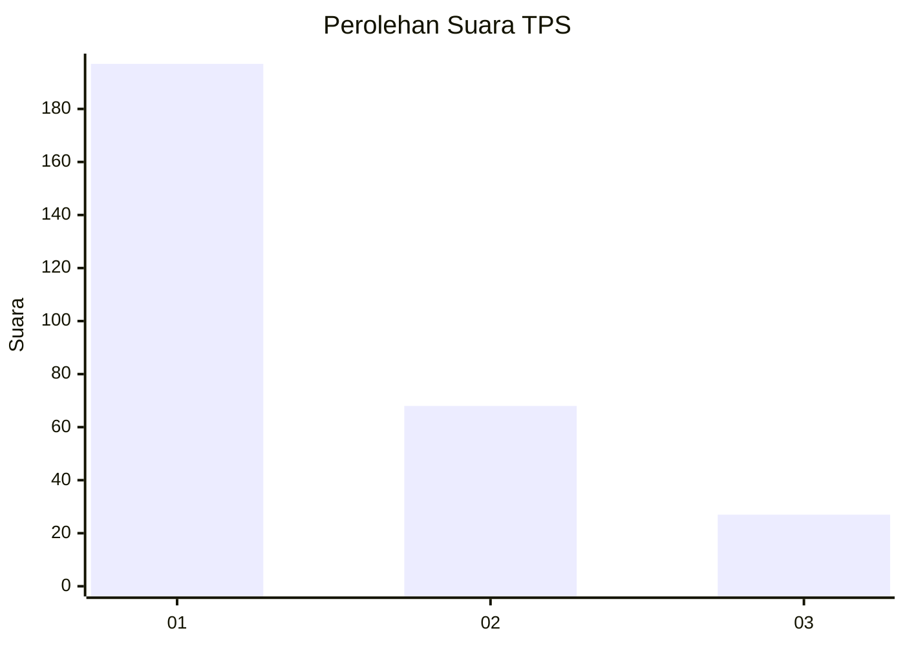
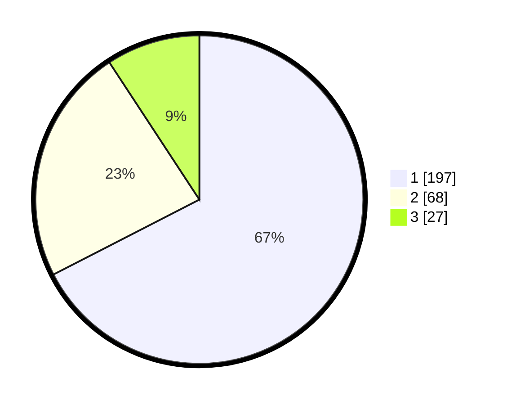

# Hasil

## Grafik

## Tabel

| No. | Nama Paslon    | Suara | Suara (raw) | Persentase |
|:--- |:-------------- | -----:| -----------:| ----------:|
| 1   | ANIES MUHAIMIN | 197   | [197][p-1]  | 67,47      |
| 2   | PRABOWO GIBRAN | 68    | [68][p-2]   | 23,29      |
| 3   | GANJAR MAHFUD  | 27    | [27][p-3]   | 9,25       |

[p-1]: https://github.com/gigit-pemilu/pemilu-2024-31-dki-jakarta/blob/main/pilpres/hitung-suara/sub/31-dki-jakarta/sub/73-jakarta-barat/sub/08-kembangan/sub/1003-meruya-selatan/sub/044-tps/sub/paslon-1.txt
[p-2]: https://github.com/gigit-pemilu/pemilu-2024-31-dki-jakarta/blob/main/pilpres/hitung-suara/sub/31-dki-jakarta/sub/73-jakarta-barat/sub/08-kembangan/sub/1003-meruya-selatan/sub/044-tps/sub/paslon-2.txt
[p-3]: https://github.com/gigit-pemilu/pemilu-2024-31-dki-jakarta/blob/main/pilpres/hitung-suara/sub/31-dki-jakarta/sub/73-jakarta-barat/sub/08-kembangan/sub/1003-meruya-selatan/sub/044-tps/sub/paslon-3.txt

## Foto C Plano

https://sirekap-obj-formc.kpu.go.id/6dd3/pemilu/ppwp/31/73/08/10/03/3173081003044-20240214-214824--c1592eb2-8926-4ce6-9dc9-7ff12eba4b40.jpg

https://sirekap-obj-formc.kpu.go.id/6dd3/pemilu/ppwp/31/73/08/10/03/3173081003044-20240214-214937--64b2a787-5541-42c0-9e11-744def40cc47.jpg

https://sirekap-obj-formc.kpu.go.id/6dd3/pemilu/ppwp/31/73/08/10/03/3173081003044-20240214-210641--9141958b-1a09-4969-9338-2b7b928bee67.jpg

## Metadata

| Key        | Value               |
| ---------- | ------------------- |
| Time Stamp | 2024-02-16 00:30:27 |

