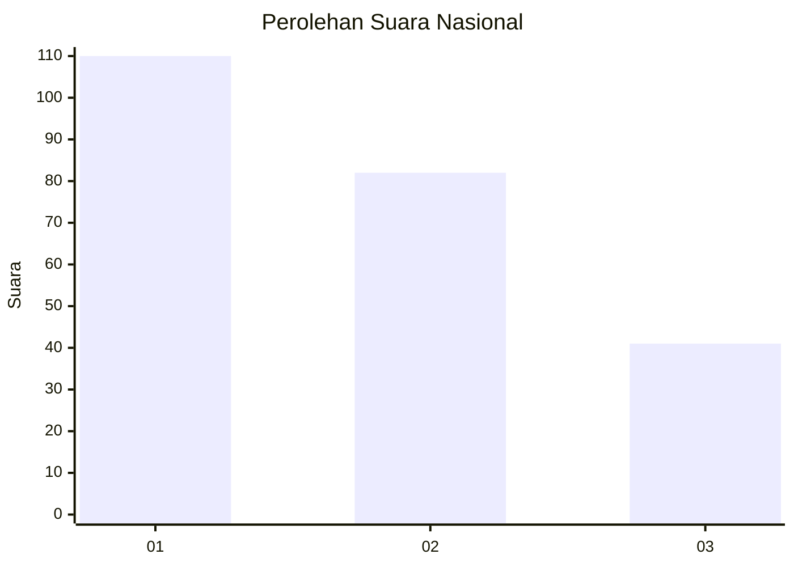
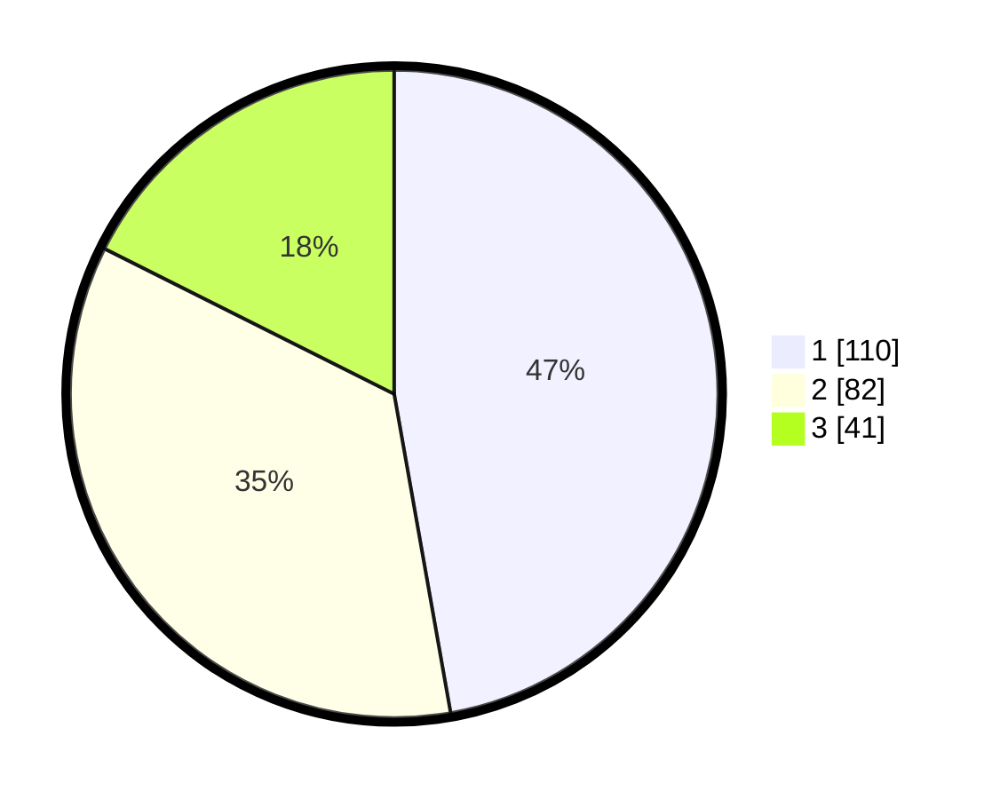

# Hasil

## Grafik

## Tabel

| No.    | Nama Paslon    | Suara | Suara (raw) | Persentase |
|:------ |:-------------- | -----:| -----------:| ----------:|
| 100025 | ANIES MUHAIMIN | 110   | [110][p-1]  | 47,21      |
| 100026 | PRABOWO GIBRAN | 82    | [82][p-2]   | 35,19      |
| 100027 | GANJAR MAHFUD  | 41    | [41][p-3]   | 17,60      |

[p-1]: https://github.com/gigit-pemilu/pemilu-2024/blob/main/pilpres/hitung-suara/sub/31-dki-jakarta/sub/73-jakarta-barat/sub/08-kembangan/sub/1003-meruya-selatan/sub/050-tps/sub/paslon-1.txt
[p-2]: https://github.com/gigit-pemilu/pemilu-2024/blob/main/pilpres/hitung-suara/sub/31-dki-jakarta/sub/73-jakarta-barat/sub/08-kembangan/sub/1003-meruya-selatan/sub/050-tps/sub/paslon-2.txt
[p-3]: https://github.com/gigit-pemilu/pemilu-2024/blob/main/pilpres/hitung-suara/sub/31-dki-jakarta/sub/73-jakarta-barat/sub/08-kembangan/sub/1003-meruya-selatan/sub/050-tps/sub/paslon-3.txt

## Foto C Plano

https://sirekap-obj-formc.kpu.go.id/5e0f/pemilu/ppwp/31/73/08/10/03/3173081003050-20240214-211440--1e9b1144-db63-4787-a0e1-588db00002a4.jpg

https://sirekap-obj-formc.kpu.go.id/5e0f/pemilu/ppwp/31/73/08/10/03/3173081003050-20240214-212131--ca567f8a-81ea-446a-861f-c0cabf846fe9.jpg

https://sirekap-obj-formc.kpu.go.id/5e0f/pemilu/ppwp/31/73/08/10/03/3173081003050-20240214-212208--a50be4bd-a379-4bd5-ba48-b7520de0580c.jpg

## Metadata

| Key        | Value               |
| ---------- | ------------------- |
| Time Stamp | 2024-02-16 00:30:27 |

