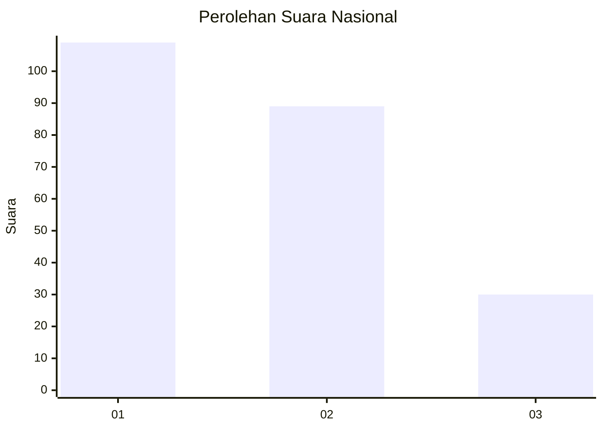
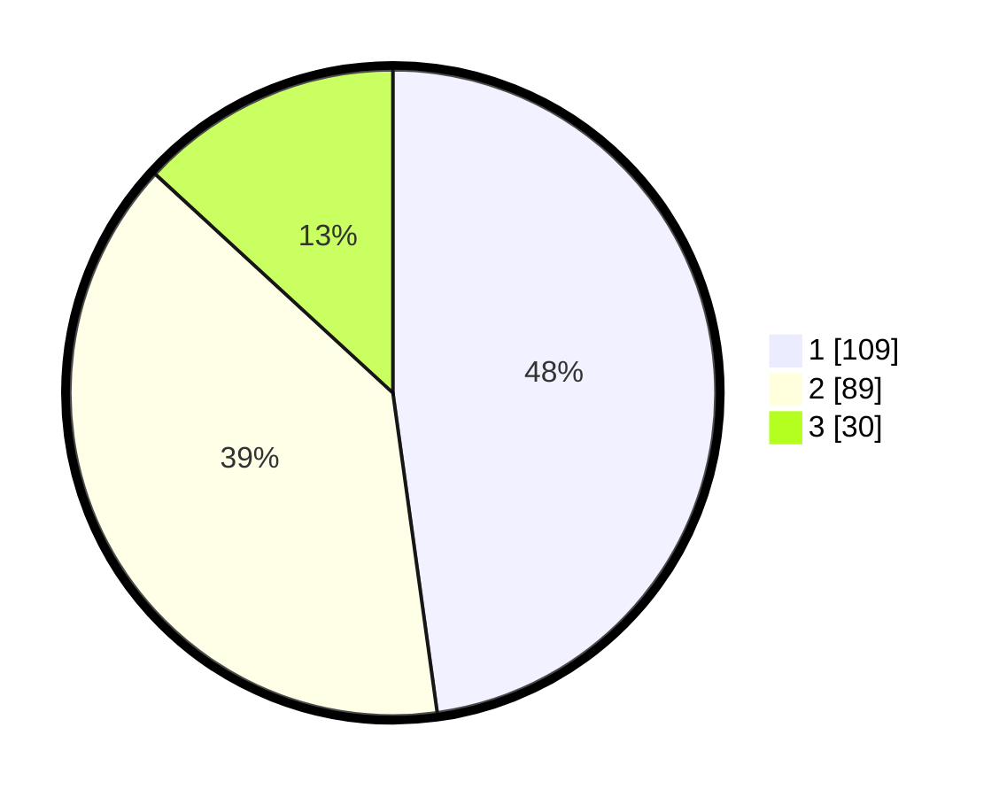

# Hasil

## Grafik

## Tabel

| No.    | Nama Paslon    | Suara | Suara (raw) | Persentase |
|:------ |:-------------- | -----:| -----------:| ----------:|
| 100025 | ANIES MUHAIMIN | 109   | [109][p-1]  | 47,81      |
| 100026 | PRABOWO GIBRAN | 89    | [89][p-2]   | 39,04      |
| 100027 | GANJAR MAHFUD  | 30    | [30][p-3]   | 13,16      |

[p-1]: https://github.com/gigit-pemilu/pemilu-2024/blob/main/pilpres/hitung-suara/sub/31-dki-jakarta/sub/73-jakarta-barat/sub/08-kembangan/sub/1003-meruya-selatan/sub/053-tps/sub/paslon-1.txt
[p-2]: https://github.com/gigit-pemilu/pemilu-2024/blob/main/pilpres/hitung-suara/sub/31-dki-jakarta/sub/73-jakarta-barat/sub/08-kembangan/sub/1003-meruya-selatan/sub/053-tps/sub/paslon-2.txt
[p-3]: https://github.com/gigit-pemilu/pemilu-2024/blob/main/pilpres/hitung-suara/sub/31-dki-jakarta/sub/73-jakarta-barat/sub/08-kembangan/sub/1003-meruya-selatan/sub/053-tps/sub/paslon-3.txt

## Foto C Plano

https://sirekap-obj-formc.kpu.go.id/616c/pemilu/ppwp/31/73/08/10/03/3173081003053-20240215-175509--9edb2037-979a-45e1-ac0f-d1e7647a8839.jpg

https://sirekap-obj-formc.kpu.go.id/616c/pemilu/ppwp/31/73/08/10/03/3173081003053-20240215-175519--1c879f62-ba11-4165-94fa-307c0bcc21c0.jpg

https://sirekap-obj-formc.kpu.go.id/616c/pemilu/ppwp/31/73/08/10/03/3173081003053-20240215-175524--c5366129-e2b1-4c39-878e-6cd6dd4b0c47.jpg

## Metadata

| Key        | Value               |
| ---------- | ------------------- |
| Time Stamp | 2024-02-19 06:16:00 |

