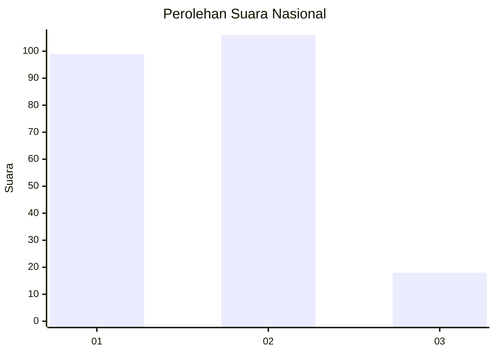
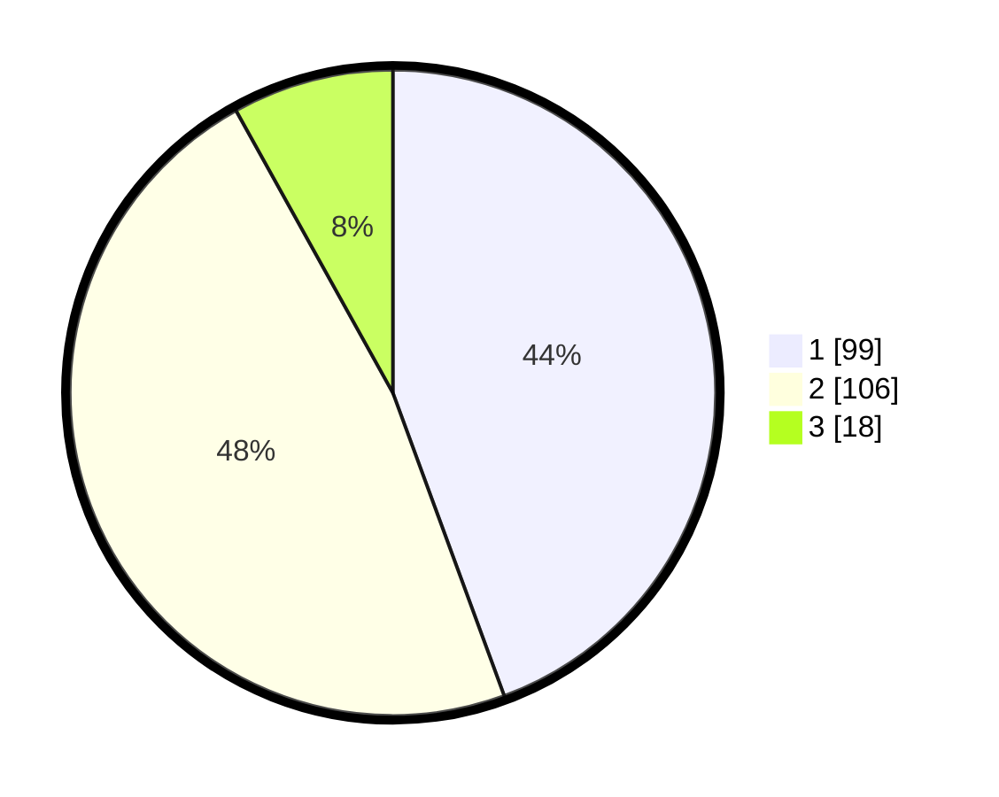

# Hasil

## Grafik

## Tabel

| No.    | Nama Paslon    | Suara | Suara (raw) | Persentase |
|:------ |:-------------- | -----:| -----------:| ----------:|
| 100025 | ANIES MUHAIMIN | 99    | [99][p-1]   | 44,39      |
| 100026 | PRABOWO GIBRAN | 106   | [106][p-2]  | 47,53      |
| 100027 | GANJAR MAHFUD  | 18    | [18][p-3]   | 8,07       |

[p-1]: https://github.com/gigit-pemilu/pemilu-2024/blob/main/pilpres/hitung-suara/sub/31-dki-jakarta/sub/73-jakarta-barat/sub/08-kembangan/sub/1003-meruya-selatan/sub/057-tps/sub/paslon-1.txt
[p-2]: https://github.com/gigit-pemilu/pemilu-2024/blob/main/pilpres/hitung-suara/sub/31-dki-jakarta/sub/73-jakarta-barat/sub/08-kembangan/sub/1003-meruya-selatan/sub/057-tps/sub/paslon-2.txt
[p-3]: https://github.com/gigit-pemilu/pemilu-2024/blob/main/pilpres/hitung-suara/sub/31-dki-jakarta/sub/73-jakarta-barat/sub/08-kembangan/sub/1003-meruya-selatan/sub/057-tps/sub/paslon-3.txt

## Foto C Plano

https://sirekap-obj-formc.kpu.go.id/bd8e/pemilu/ppwp/31/73/08/10/03/3173081003057-20240214-155914--a3819593-c1f9-4253-a89c-9daeb2208f38.jpg

https://sirekap-obj-formc.kpu.go.id/bd8e/pemilu/ppwp/31/73/08/10/03/3173081003057-20240214-155752--9ebd8b07-8596-4adc-9c3b-78c7f2fbe97e.jpg

https://sirekap-obj-formc.kpu.go.id/bd8e/pemilu/ppwp/31/73/08/10/03/3173081003057-20240214-160103--c49c1760-0e4b-42cf-89c2-fc967685fa4f.jpg

## Metadata

| Key        | Value               |
| ---------- | ------------------- |
| Time Stamp | 2024-02-16 00:30:27 |

