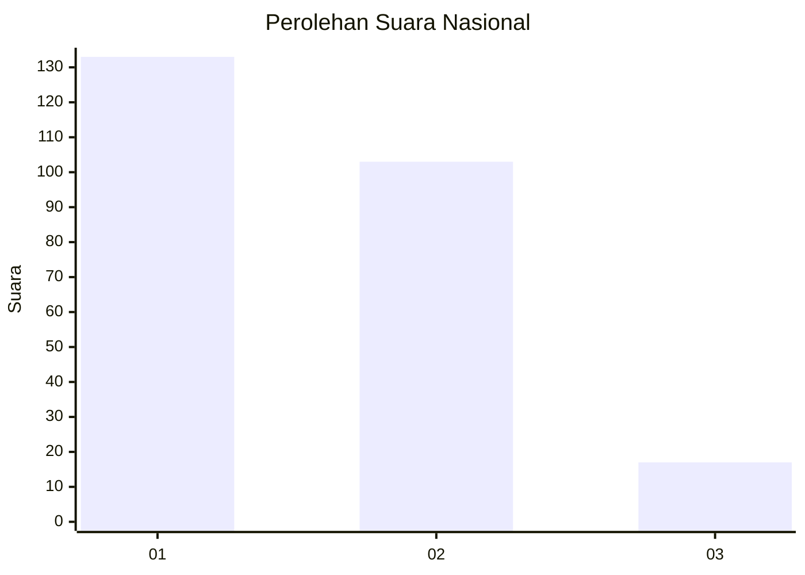
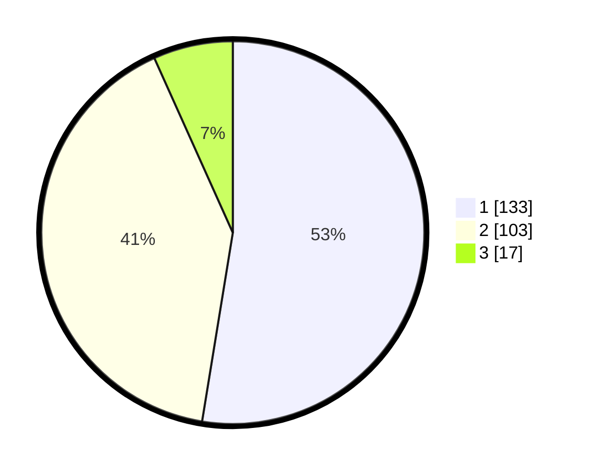

# Hasil

## Grafik

## Tabel

| No.    | Nama Paslon    | Suara | Suara (raw) | Persentase |
|:------ |:-------------- | -----:| -----------:| ----------:|
| 100025 | ANIES MUHAIMIN | 133   | [133][p-1]  | 52,57      |
| 100026 | PRABOWO GIBRAN | 103   | [103][p-2]  | 40,71      |
| 100027 | GANJAR MAHFUD  | 17    | [17][p-3]   | 6,72       |

[p-1]: https://github.com/gigit-pemilu/pemilu-2024/blob/main/pilpres/hitung-suara/sub/31-dki-jakarta/sub/73-jakarta-barat/sub/08-kembangan/sub/1003-meruya-selatan/sub/070-tps/sub/paslon-1.txt
[p-2]: https://github.com/gigit-pemilu/pemilu-2024/blob/main/pilpres/hitung-suara/sub/31-dki-jakarta/sub/73-jakarta-barat/sub/08-kembangan/sub/1003-meruya-selatan/sub/070-tps/sub/paslon-2.txt
[p-3]: https://github.com/gigit-pemilu/pemilu-2024/blob/main/pilpres/hitung-suara/sub/31-dki-jakarta/sub/73-jakarta-barat/sub/08-kembangan/sub/1003-meruya-selatan/sub/070-tps/sub/paslon-3.txt

## Foto C Plano

https://sirekap-obj-formc.kpu.go.id/9e30/pemilu/ppwp/31/73/08/10/03/3173081003070-20240215-073359--08bbe65e-56b4-4970-9a22-77d27af47cd5.jpg

https://sirekap-obj-formc.kpu.go.id/9e30/pemilu/ppwp/31/73/08/10/03/3173081003070-20240214-232551--08c818f6-760a-48d8-a056-538a14f9b602.jpg

https://sirekap-obj-formc.kpu.go.id/9e30/pemilu/ppwp/31/73/08/10/03/3173081003070-20240214-232627--1ba5c54b-48bd-43e0-a00c-1267281dd8f3.jpg

## Metadata

| Key        | Value               |
| ---------- | ------------------- |
| Time Stamp | 2024-02-21 18:00:00 |

