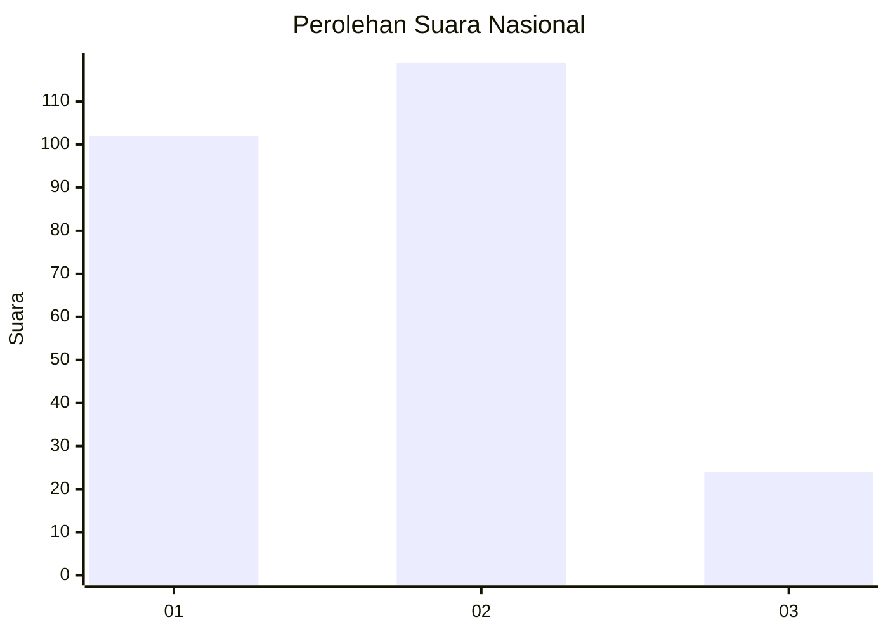
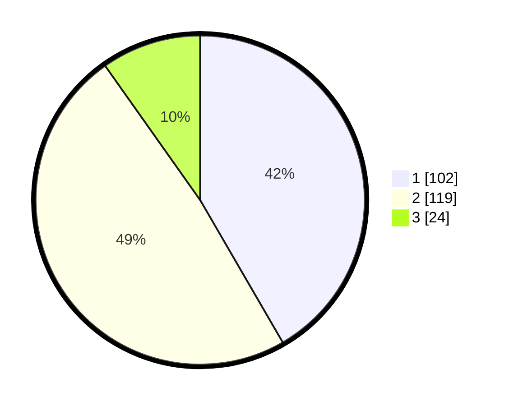

# Hasil

## Grafik

## Tabel

| No.    | Nama Paslon    | Suara | Suara (raw) | Persentase |
|:------ |:-------------- | -----:| -----------:| ----------:|
| 100025 | ANIES MUHAIMIN | 102   | [102][p-1]  | 41,63      |
| 100026 | PRABOWO GIBRAN | 119   | [119][p-2]  | 48,57      |
| 100027 | GANJAR MAHFUD  | 24    | [24][p-3]   | 9,80       |

[p-1]: https://github.com/gigit-pemilu/pemilu-2024/blob/main/pilpres/hitung-suara/sub/31-dki-jakarta/sub/73-jakarta-barat/sub/08-kembangan/sub/1003-meruya-selatan/sub/071-tps/sub/paslon-1.txt
[p-2]: https://github.com/gigit-pemilu/pemilu-2024/blob/main/pilpres/hitung-suara/sub/31-dki-jakarta/sub/73-jakarta-barat/sub/08-kembangan/sub/1003-meruya-selatan/sub/071-tps/sub/paslon-2.txt
[p-3]: https://github.com/gigit-pemilu/pemilu-2024/blob/main/pilpres/hitung-suara/sub/31-dki-jakarta/sub/73-jakarta-barat/sub/08-kembangan/sub/1003-meruya-selatan/sub/071-tps/sub/paslon-3.txt

## Foto C Plano

https://sirekap-obj-formc.kpu.go.id/a490/pemilu/ppwp/31/73/08/10/03/3173081003071-20240215-173115--80553232-c5df-42d2-86ae-f3990eb9d5d5.jpg

https://sirekap-obj-formc.kpu.go.id/a490/pemilu/ppwp/31/73/08/10/03/3173081003071-20240215-173130--b1057307-d75b-49e0-ad2f-79449d6b92dc.jpg

https://sirekap-obj-formc.kpu.go.id/a490/pemilu/ppwp/31/73/08/10/03/3173081003071-20240215-173140--8e954d22-d47f-44f0-9248-8c962e59e73d.jpg

## Metadata

| Key        | Value               |
| ---------- | ------------------- |
| Time Stamp | 2024-02-21 18:00:00 |

