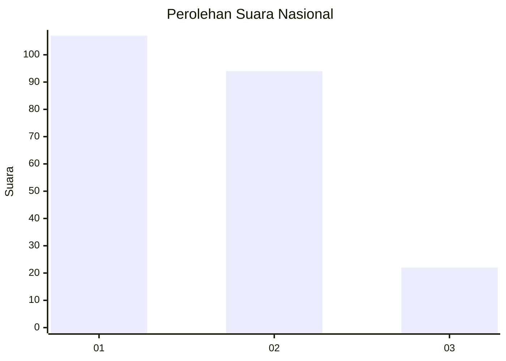
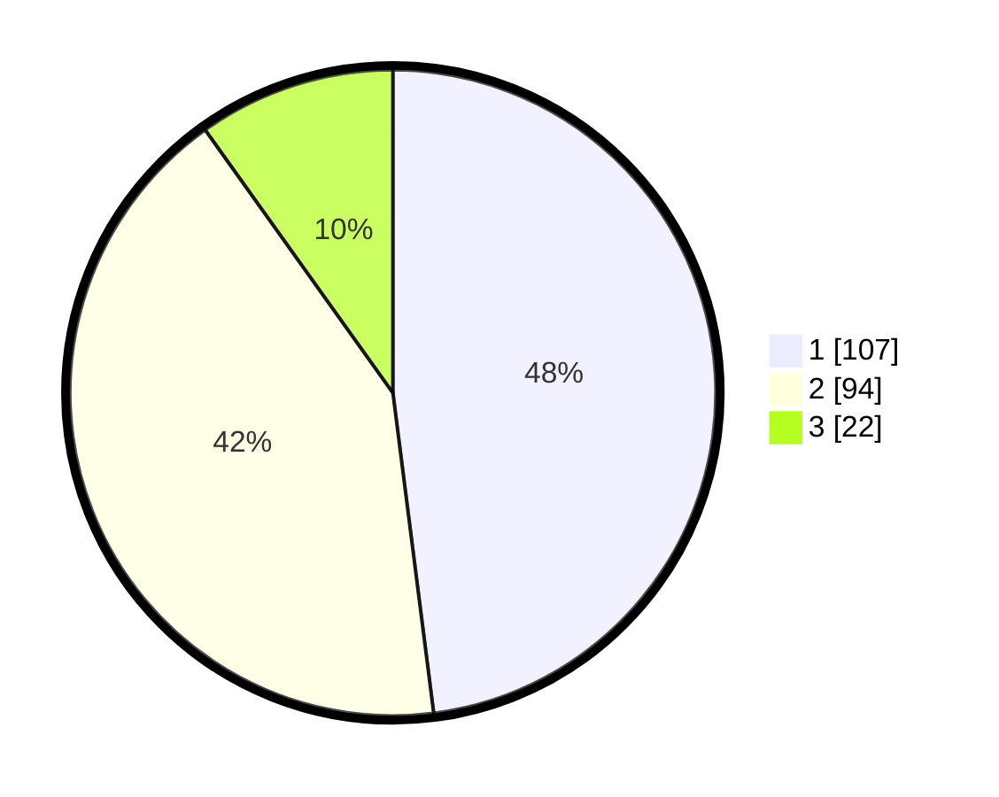

# Hasil

## Grafik

## Tabel

| No.    | Nama Paslon    | Suara | Suara (raw) | Persentase |
|:------ |:-------------- | -----:| -----------:| ----------:|
| 100025 | ANIES MUHAIMIN | 107   | [107][p-1]  | 47,98      |
| 100026 | PRABOWO GIBRAN | 94    | [94][p-2]   | 42,15      |
| 100027 | GANJAR MAHFUD  | 22    | [22][p-3]   | 9,87       |

[p-1]: https://github.com/gigit-pemilu/pemilu-2024/blob/main/pilpres/hitung-suara/sub/31-dki-jakarta/sub/73-jakarta-barat/sub/08-kembangan/sub/1003-meruya-selatan/sub/094-tps/sub/paslon-1.txt
[p-2]: https://github.com/gigit-pemilu/pemilu-2024/blob/main/pilpres/hitung-suara/sub/31-dki-jakarta/sub/73-jakarta-barat/sub/08-kembangan/sub/1003-meruya-selatan/sub/094-tps/sub/paslon-2.txt
[p-3]: https://github.com/gigit-pemilu/pemilu-2024/blob/main/pilpres/hitung-suara/sub/31-dki-jakarta/sub/73-jakarta-barat/sub/08-kembangan/sub/1003-meruya-selatan/sub/094-tps/sub/paslon-3.txt

## Foto C Plano

https://sirekap-obj-formc.kpu.go.id/7a5d/pemilu/ppwp/31/73/08/10/03/3173081003094-20240214-204853--83b394f0-b384-44dc-b917-f56e018e88e9.jpg

https://sirekap-obj-formc.kpu.go.id/7a5d/pemilu/ppwp/31/73/08/10/03/3173081003094-20240214-205405--51ab7b08-83eb-4618-926a-98941d46f8ac.jpg

https://sirekap-obj-formc.kpu.go.id/7a5d/pemilu/ppwp/31/73/08/10/03/3173081003094-20240214-205633--fcce14df-8ee7-4c4b-a858-9ba73e5ae58e.jpg

## Metadata

| Key        | Value               |
| ---------- | ------------------- |
| Time Stamp | 2024-02-16 02:00:27 |

