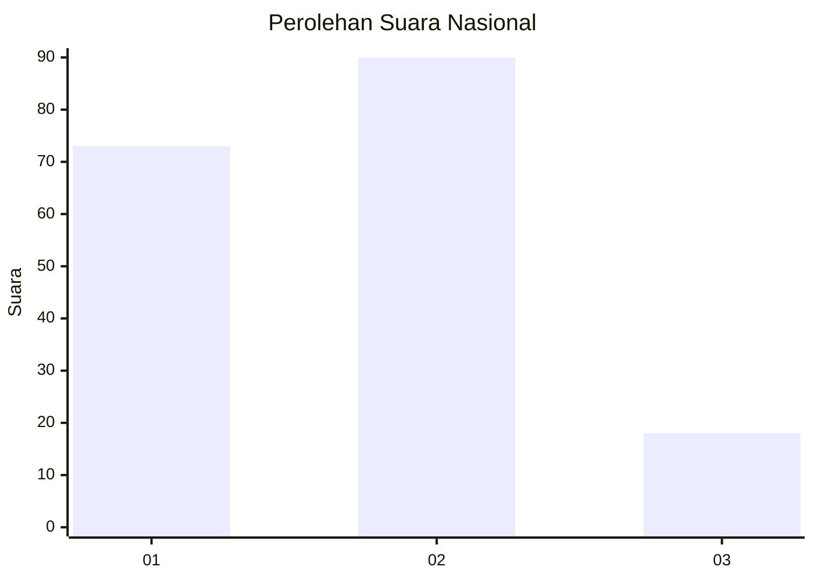
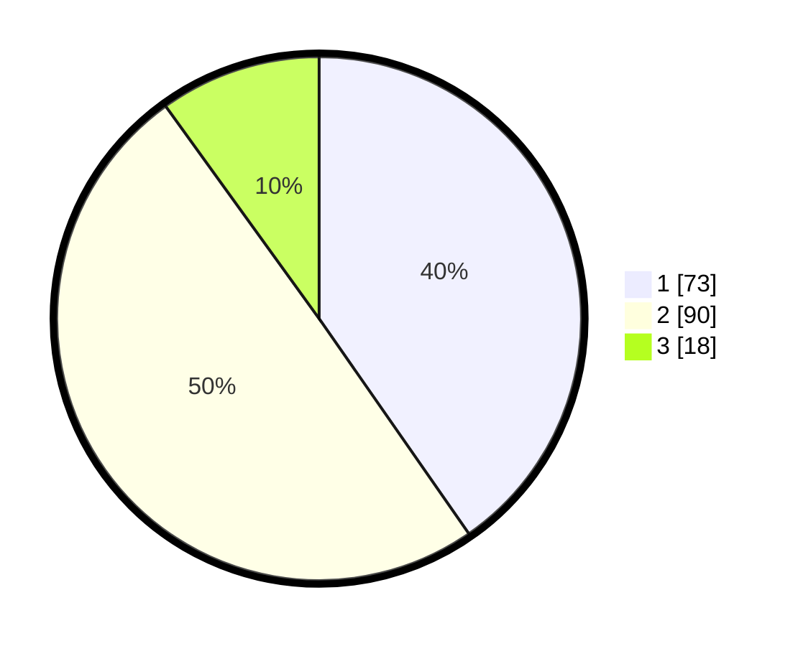

# Hasil

## Grafik

## Tabel

| No.    | Nama Paslon    | Suara | Suara (raw) | Persentase |
|:------ |:-------------- | -----:| -----------:| ----------:|
| 100025 | ANIES MUHAIMIN | 73    | [73][p-1]   | 40,33      |
| 100026 | PRABOWO GIBRAN | 90    | [90][p-2]   | 49,72      |
| 100027 | GANJAR MAHFUD  | 18    | [18][p-3]   | 9,94       |

[p-1]: https://github.com/gigit-pemilu/pemilu-2024/blob/main/pilpres/hitung-suara/sub/31-dki-jakarta/sub/73-jakarta-barat/sub/08-kembangan/sub/1003-meruya-selatan/sub/100-tps/sub/paslon-1.txt
[p-2]: https://github.com/gigit-pemilu/pemilu-2024/blob/main/pilpres/hitung-suara/sub/31-dki-jakarta/sub/73-jakarta-barat/sub/08-kembangan/sub/1003-meruya-selatan/sub/100-tps/sub/paslon-2.txt
[p-3]: https://github.com/gigit-pemilu/pemilu-2024/blob/main/pilpres/hitung-suara/sub/31-dki-jakarta/sub/73-jakarta-barat/sub/08-kembangan/sub/1003-meruya-selatan/sub/100-tps/sub/paslon-3.txt

## Foto C Plano

https://sirekap-obj-formc.kpu.go.id/ee48/pemilu/ppwp/31/73/08/10/03/3173081003100-20240214-193042--2c032e4d-dd9e-4e55-b3e2-1c0a46e04c5b.jpg

https://sirekap-obj-formc.kpu.go.id/ee48/pemilu/ppwp/31/73/08/10/03/3173081003100-20240214-193056--4eafca06-94ac-4049-97bc-111ff52d1a4a.jpg

https://sirekap-obj-formc.kpu.go.id/ee48/pemilu/ppwp/31/73/08/10/03/3173081003100-20240214-193111--e82bf4f4-92c4-4b05-872f-e587cf709ef9.jpg

## Metadata

| Key        | Value               |
| ---------- | ------------------- |
| Time Stamp | 2024-02-16 02:00:27 |

