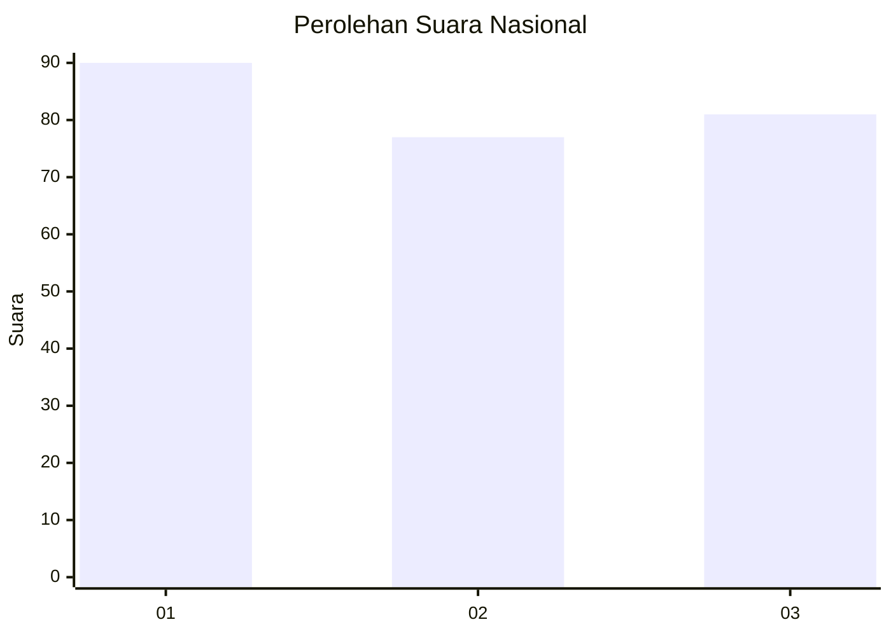
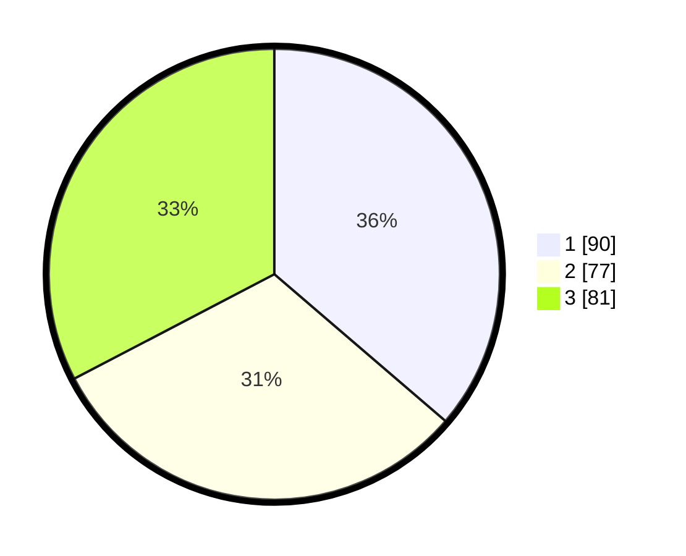

# Hasil

## Grafik

## Tabel

| No.    | Nama Paslon    | Suara | Suara (raw) | Persentase |
|:------ |:-------------- | -----:| -----------:| ----------:|
| 100025 | ANIES MUHAIMIN | 90    | [90][p-1]   | 36,29      |
| 100026 | PRABOWO GIBRAN | 77    | [77][p-2]   | 31,05      |
| 100027 | GANJAR MAHFUD  | 81    | [81][p-3]   | 32,66      |

[p-1]: https://github.com/gigit-pemilu/pemilu-2024/blob/main/pilpres/hitung-suara/sub/31-dki-jakarta/sub/73-jakarta-barat/sub/08-kembangan/sub/1003-meruya-selatan/sub/105-tps/sub/paslon-1.txt
[p-2]: https://github.com/gigit-pemilu/pemilu-2024/blob/main/pilpres/hitung-suara/sub/31-dki-jakarta/sub/73-jakarta-barat/sub/08-kembangan/sub/1003-meruya-selatan/sub/105-tps/sub/paslon-2.txt
[p-3]: https://github.com/gigit-pemilu/pemilu-2024/blob/main/pilpres/hitung-suara/sub/31-dki-jakarta/sub/73-jakarta-barat/sub/08-kembangan/sub/1003-meruya-selatan/sub/105-tps/sub/paslon-3.txt

## Foto C Plano

https://sirekap-obj-formc.kpu.go.id/84b3/pemilu/ppwp/31/73/08/10/03/3173081003105-20240214-204352--a536740e-2ccb-4126-9cd6-9d6893e7a192.jpg

https://sirekap-obj-formc.kpu.go.id/84b3/pemilu/ppwp/31/73/08/10/03/3173081003105-20240214-204410--5dfddc7f-6773-407e-b702-c649dbefd1db.jpg

https://sirekap-obj-formc.kpu.go.id/84b3/pemilu/ppwp/31/73/08/10/03/3173081003105-20240214-204427--a5919d30-3d30-43ba-b7cd-e87b3141a187.jpg

## Metadata

| Key        | Value               |
| ---------- | ------------------- |
| Time Stamp | 2024-02-16 02:30:27 |

