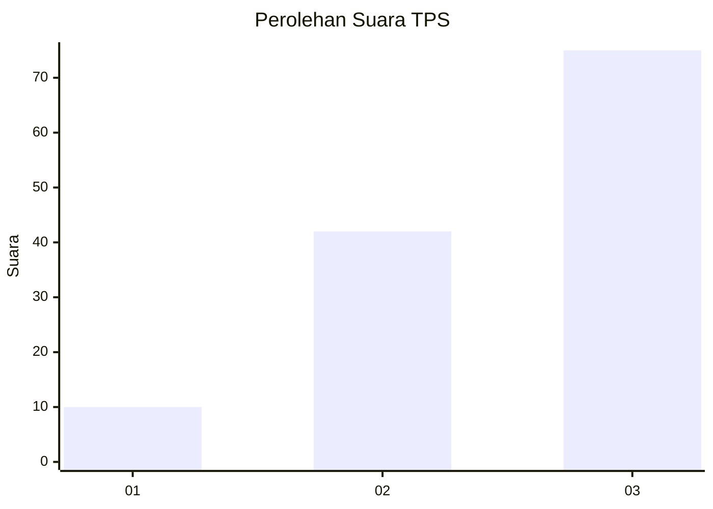
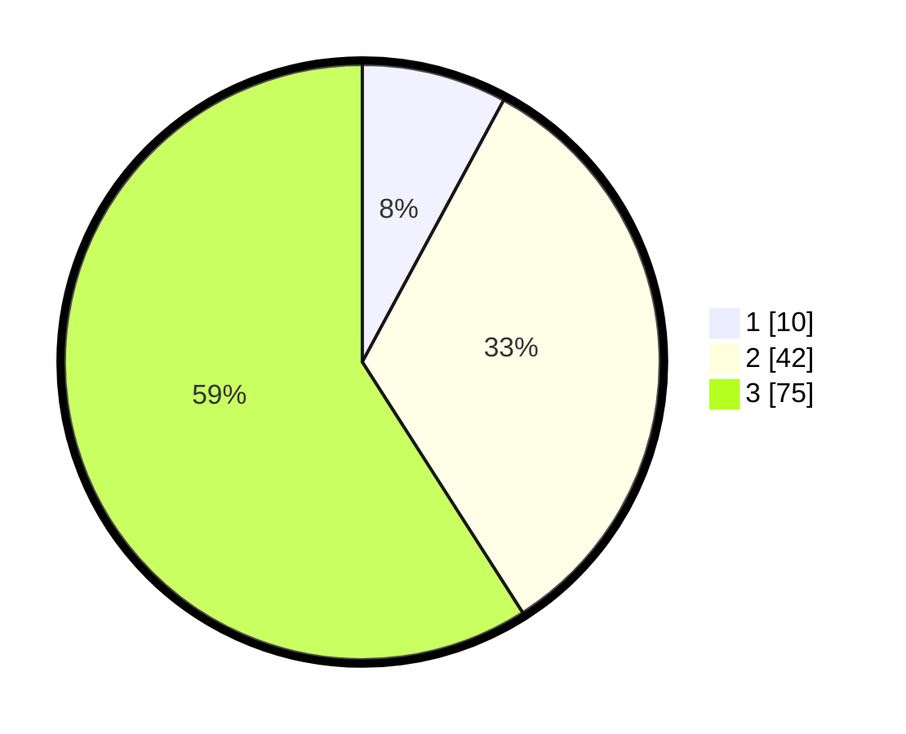

# Hasil

## Grafik

## Tabel

| No. | Nama Paslon    | Suara | Suara (raw) | Persentase |
|:--- |:-------------- | -----:| -----------:| ----------:|
| 1   | ANIES MUHAIMIN | 10    | [10][p-1]   | 7,87       |
| 2   | PRABOWO GIBRAN | 42    | [42][p-2]   | 33,07      |
| 3   | GANJAR MAHFUD  | 75    | [75][p-3]   | 59,06      |

[p-1]: https://github.com/gigit-pemilu/pemilu-2024-31-dki-jakarta/blob/main/pilpres/hitung-suara/sub/31-dki-jakarta/sub/73-jakarta-barat/sub/08-kembangan/sub/1003-meruya-selatan/sub/112-tps/sub/paslon-1.txt
[p-2]: https://github.com/gigit-pemilu/pemilu-2024-31-dki-jakarta/blob/main/pilpres/hitung-suara/sub/31-dki-jakarta/sub/73-jakarta-barat/sub/08-kembangan/sub/1003-meruya-selatan/sub/112-tps/sub/paslon-2.txt
[p-3]: https://github.com/gigit-pemilu/pemilu-2024-31-dki-jakarta/blob/main/pilpres/hitung-suara/sub/31-dki-jakarta/sub/73-jakarta-barat/sub/08-kembangan/sub/1003-meruya-selatan/sub/112-tps/sub/paslon-3.txt

## Foto C Plano

https://sirekap-obj-formc.kpu.go.id/3cba/pemilu/ppwp/31/73/08/10/03/3173081003112-20240214-191356--531bb141-f242-4d5b-b6ed-6d1d9d7e2801.jpg

https://sirekap-obj-formc.kpu.go.id/3cba/pemilu/ppwp/31/73/08/10/03/3173081003112-20240214-192327--e535d5d2-7561-412c-bfb1-cfae7f4347f0.jpg

https://sirekap-obj-formc.kpu.go.id/3cba/pemilu/ppwp/31/73/08/10/03/3173081003112-20240214-192055--8fc60508-1f9d-477d-bfe2-985c193f84a8.jpg

## Metadata

| Key        | Value               |
| ---------- | ------------------- |
| Time Stamp | 2024-02-16 02:30:27 |

