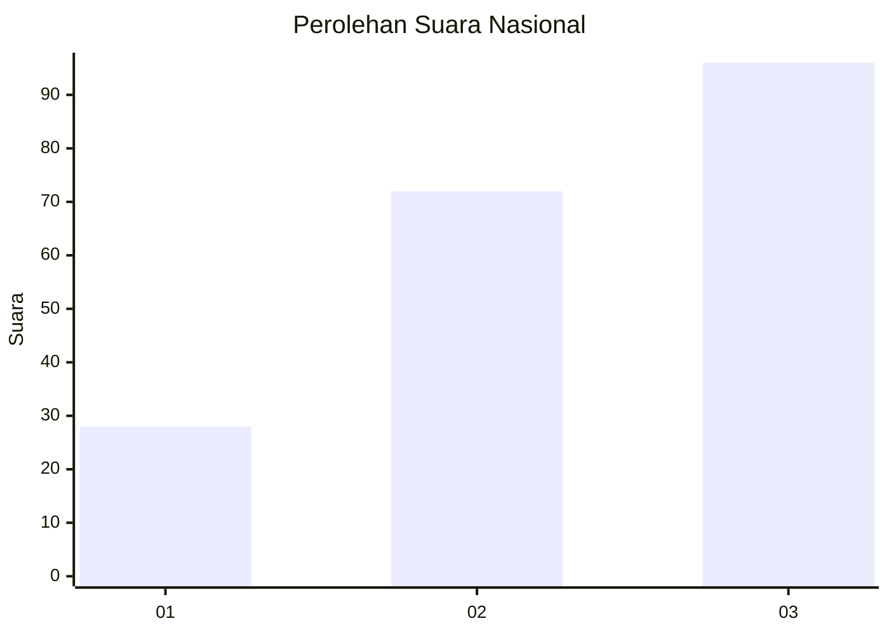
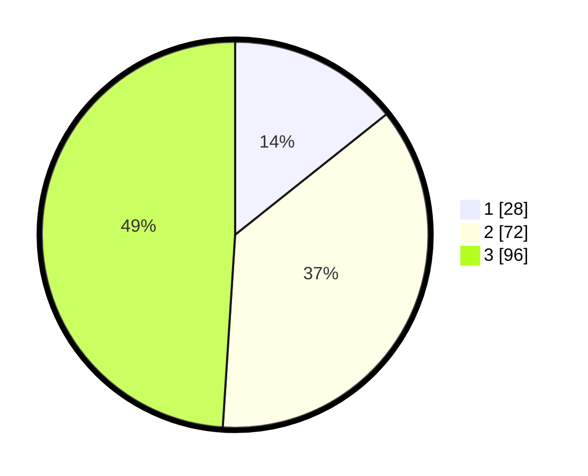

# Hasil

## Grafik

## Tabel

| No.    | Nama Paslon    | Suara | Suara (raw) | Persentase |
|:------ |:-------------- | -----:| -----------:| ----------:|
| 100025 | ANIES MUHAIMIN | 28    | [28][p-1]   | 14,29      |
| 100026 | PRABOWO GIBRAN | 72    | [72][p-2]   | 36,73      |
| 100027 | GANJAR MAHFUD  | 96    | [96][p-3]   | 48,98      |

[p-1]: https://github.com/gigit-pemilu/pemilu-2024/blob/main/pilpres/hitung-suara/sub/31-dki-jakarta/sub/73-jakarta-barat/sub/08-kembangan/sub/1003-meruya-selatan/sub/113-tps/sub/paslon-1.txt
[p-2]: https://github.com/gigit-pemilu/pemilu-2024/blob/main/pilpres/hitung-suara/sub/31-dki-jakarta/sub/73-jakarta-barat/sub/08-kembangan/sub/1003-meruya-selatan/sub/113-tps/sub/paslon-2.txt
[p-3]: https://github.com/gigit-pemilu/pemilu-2024/blob/main/pilpres/hitung-suara/sub/31-dki-jakarta/sub/73-jakarta-barat/sub/08-kembangan/sub/1003-meruya-selatan/sub/113-tps/sub/paslon-3.txt

## Foto C Plano

https://sirekap-obj-formc.kpu.go.id/3a03/pemilu/ppwp/31/73/08/10/03/3173081003113-20240215-073000--5908137e-1b0e-411a-8912-4d101fa74ee7.jpg

https://sirekap-obj-formc.kpu.go.id/3a03/pemilu/ppwp/31/73/08/10/03/3173081003113-20240215-072948--fde7478e-a650-4f83-8ce0-d1a868a68eec.jpg

https://sirekap-obj-formc.kpu.go.id/3a03/pemilu/ppwp/31/73/08/10/03/3173081003113-20240215-070752--1d278907-92d4-4b4e-b2ff-ee682baf2045.jpg

## Metadata

| Key        | Value               |
| ---------- | ------------------- |
| Time Stamp | 2024-02-19 06:16:00 |

