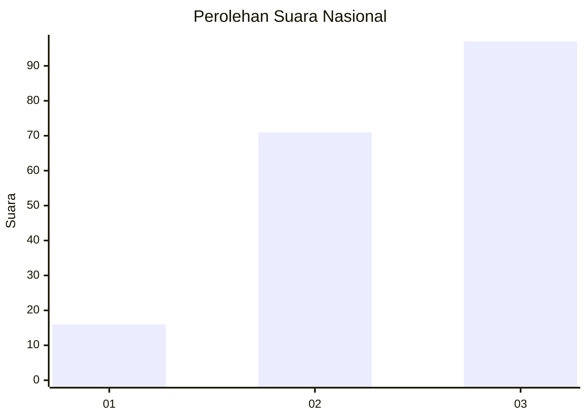
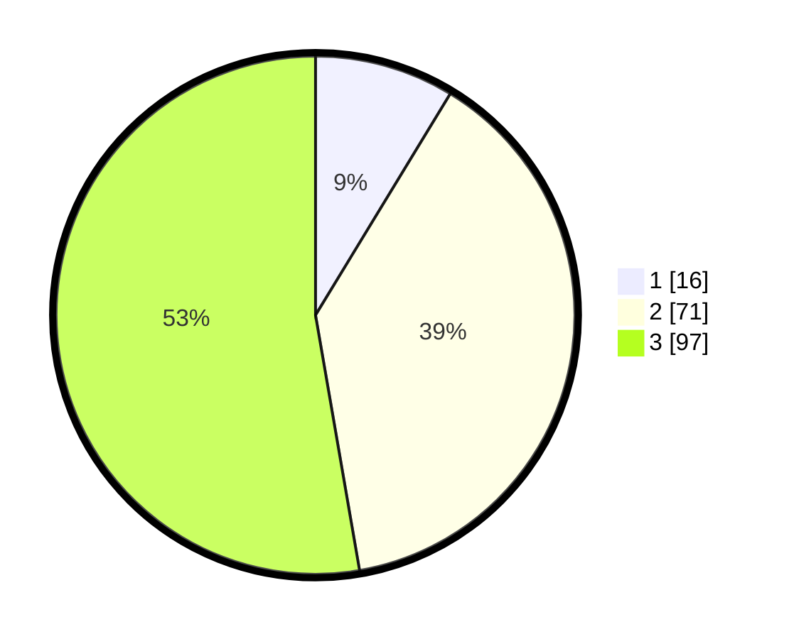

# Hasil

## Grafik

## Tabel

| No.    | Nama Paslon    | Suara | Suara (raw) | Persentase |
|:------ |:-------------- | -----:| -----------:| ----------:|
| 100025 | ANIES MUHAIMIN | 16    | [16][p-1]   | 8,70       |
| 100026 | PRABOWO GIBRAN | 71    | [71][p-2]   | 38,59      |
| 100027 | GANJAR MAHFUD  | 97    | [97][p-3]   | 52,72      |

[p-1]: https://github.com/gigit-pemilu/pemilu-2024/blob/main/pilpres/hitung-suara/sub/31-dki-jakarta/sub/73-jakarta-barat/sub/08-kembangan/sub/1003-meruya-selatan/sub/115-tps/sub/paslon-1.txt
[p-2]: https://github.com/gigit-pemilu/pemilu-2024/blob/main/pilpres/hitung-suara/sub/31-dki-jakarta/sub/73-jakarta-barat/sub/08-kembangan/sub/1003-meruya-selatan/sub/115-tps/sub/paslon-2.txt
[p-3]: https://github.com/gigit-pemilu/pemilu-2024/blob/main/pilpres/hitung-suara/sub/31-dki-jakarta/sub/73-jakarta-barat/sub/08-kembangan/sub/1003-meruya-selatan/sub/115-tps/sub/paslon-3.txt

## Foto C Plano

https://sirekap-obj-formc.kpu.go.id/6b68/pemilu/ppwp/31/73/08/10/03/3173081003115-20240214-221715--d95ade8e-f372-4853-a0ab-e7592a05f155.jpg

https://sirekap-obj-formc.kpu.go.id/6b68/pemilu/ppwp/31/73/08/10/03/3173081003115-20240214-221744--dfffb759-0124-4dab-b425-385df9103bc2.jpg

https://sirekap-obj-formc.kpu.go.id/6b68/pemilu/ppwp/31/73/08/10/03/3173081003115-20240214-221842--7a2517f3-f76e-4aff-a151-a341ee7efc3d.jpg

## Metadata

| Key        | Value               |
| ---------- | ------------------- |
| Time Stamp | 2024-02-19 06:16:00 |

