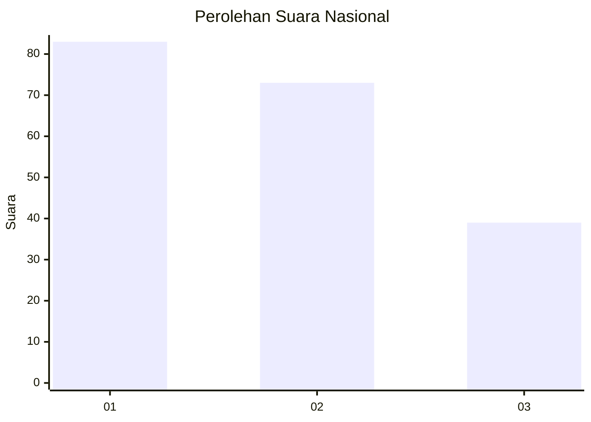
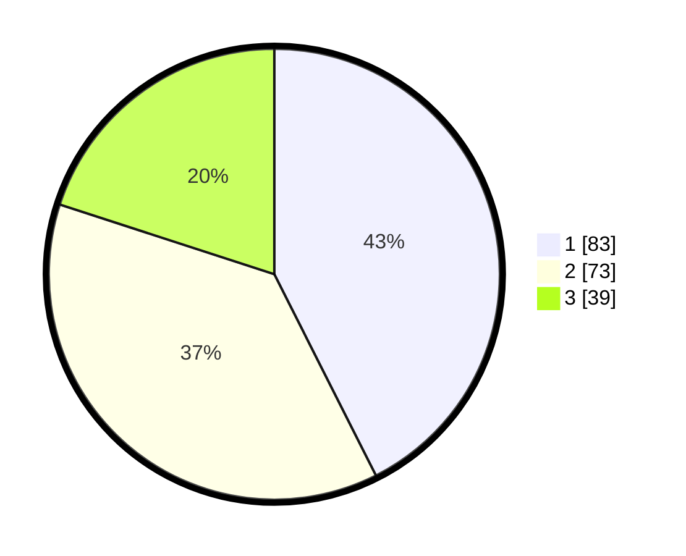

# Hasil

## Grafik

## Tabel

| No.    | Nama Paslon    | Suara | Suara (raw) | Persentase |
|:------ |:-------------- | -----:| -----------:| ----------:|
| 100025 | ANIES MUHAIMIN | 83    | [83][p-1]   | 42,56      |
| 100026 | PRABOWO GIBRAN | 73    | [73][p-2]   | 37,44      |
| 100027 | GANJAR MAHFUD  | 39    | [39][p-3]   | 20,00      |

[p-1]: https://github.com/gigit-pemilu/pemilu-2024/blob/main/pilpres/hitung-suara/sub/31-dki-jakarta/sub/73-jakarta-barat/sub/08-kembangan/sub/1004-srengseng/sub/030-tps/sub/paslon-1.txt
[p-2]: https://github.com/gigit-pemilu/pemilu-2024/blob/main/pilpres/hitung-suara/sub/31-dki-jakarta/sub/73-jakarta-barat/sub/08-kembangan/sub/1004-srengseng/sub/030-tps/sub/paslon-2.txt
[p-3]: https://github.com/gigit-pemilu/pemilu-2024/blob/main/pilpres/hitung-suara/sub/31-dki-jakarta/sub/73-jakarta-barat/sub/08-kembangan/sub/1004-srengseng/sub/030-tps/sub/paslon-3.txt

## Foto C Plano

https://sirekap-obj-formc.kpu.go.id/88bf/pemilu/ppwp/31/73/08/10/04/3173081004030-20240214-211606--c764816a-3d41-4fe6-b0bc-a99dea30a03e.jpg

https://sirekap-obj-formc.kpu.go.id/88bf/pemilu/ppwp/31/73/08/10/04/3173081004030-20240214-211915--fd17108f-8a34-49df-9576-7c2d0258d002.jpg

https://sirekap-obj-formc.kpu.go.id/88bf/pemilu/ppwp/31/73/08/10/04/3173081004030-20240214-212055--be631b5b-cc15-4368-90f3-b487843b2d4f.jpg

## Metadata

| Key        | Value               |
| ---------- | ------------------- |
| Time Stamp | 2024-02-19 06:16:00 |

