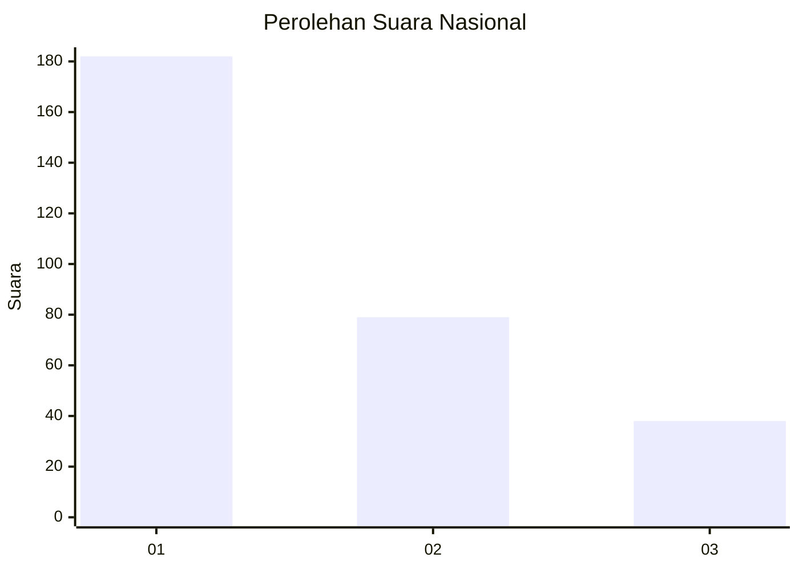
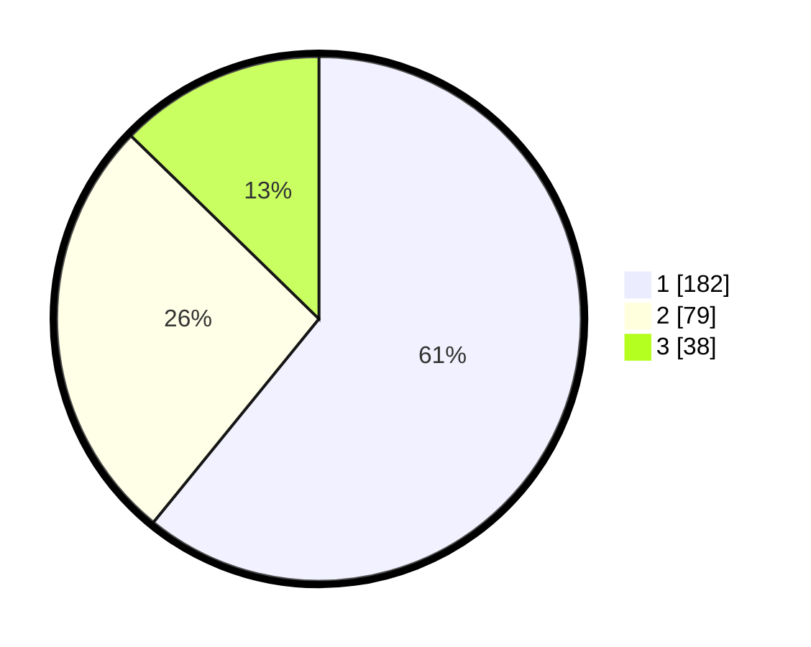

# Hasil

## Grafik

## Tabel

| No.    | Nama Paslon    | Suara | Suara (raw) | Persentase |
|:------ |:-------------- | -----:| -----------:| ----------:|
| 100025 | ANIES MUHAIMIN | 182   | [182][p-1]  | 60,87      |
| 100026 | PRABOWO GIBRAN | 79    | [79][p-2]   | 26,42      |
| 100027 | GANJAR MAHFUD  | 38    | [38][p-3]   | 12,71      |

[p-1]: https://github.com/gigit-pemilu/pemilu-2024/blob/main/pilpres/hitung-suara/sub/31-dki-jakarta/sub/73-jakarta-barat/sub/08-kembangan/sub/1004-srengseng/sub/031-tps/sub/paslon-1.txt
[p-2]: https://github.com/gigit-pemilu/pemilu-2024/blob/main/pilpres/hitung-suara/sub/31-dki-jakarta/sub/73-jakarta-barat/sub/08-kembangan/sub/1004-srengseng/sub/031-tps/sub/paslon-2.txt
[p-3]: https://github.com/gigit-pemilu/pemilu-2024/blob/main/pilpres/hitung-suara/sub/31-dki-jakarta/sub/73-jakarta-barat/sub/08-kembangan/sub/1004-srengseng/sub/031-tps/sub/paslon-3.txt

## Foto C Plano

https://sirekap-obj-formc.kpu.go.id/47da/pemilu/ppwp/31/73/08/10/04/3173081004031-20240214-204621--7bc4e1d7-8743-449a-86e3-732d370f99f7.jpg

https://sirekap-obj-formc.kpu.go.id/47da/pemilu/ppwp/31/73/08/10/04/3173081004031-20240214-210226--48bffa25-e736-45c8-a274-0f5c36bc0645.jpg

https://sirekap-obj-formc.kpu.go.id/47da/pemilu/ppwp/31/73/08/10/04/3173081004031-20240214-210535--aaac5560-759f-453f-aeca-e1b341bd7159.jpg

## Metadata

| Key        | Value               |
| ---------- | ------------------- |
| Time Stamp | 2024-02-16 02:30:27 |

