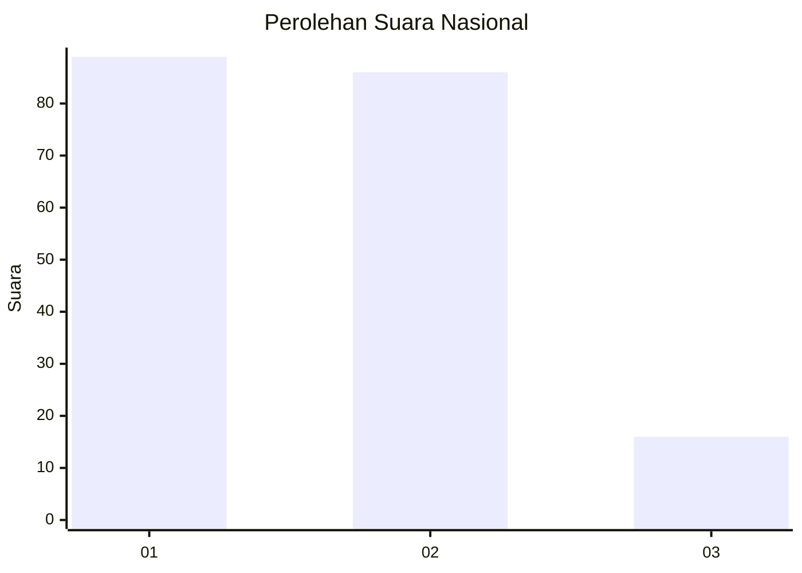
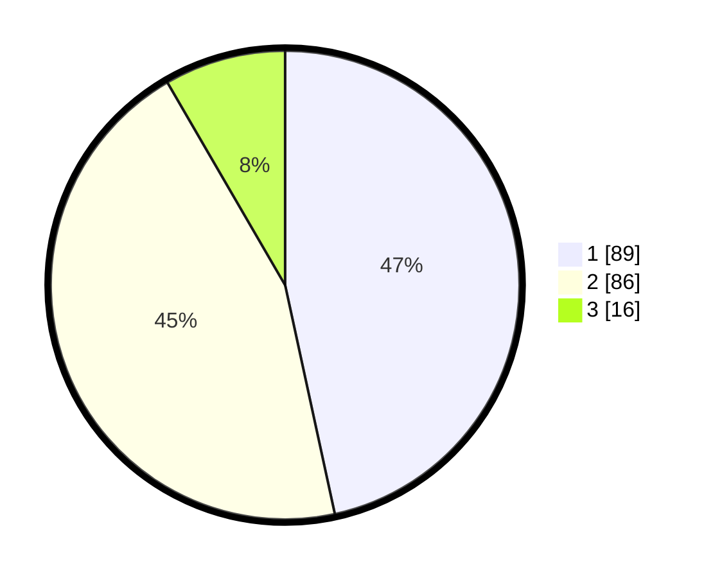

# Hasil

## Grafik

## Tabel

| No.    | Nama Paslon    | Suara | Suara (raw) | Persentase |
|:------ |:-------------- | -----:| -----------:| ----------:|
| 100025 | ANIES MUHAIMIN | 89    | [89][p-1]   | 46,60      |
| 100026 | PRABOWO GIBRAN | 86    | [86][p-2]   | 45,03      |
| 100027 | GANJAR MAHFUD  | 16    | [16][p-3]   | 8,38       |

[p-1]: https://github.com/gigit-pemilu/pemilu-2024/blob/main/pilpres/hitung-suara/sub/31-dki-jakarta/sub/73-jakarta-barat/sub/08-kembangan/sub/1004-srengseng/sub/034-tps/sub/paslon-1.txt
[p-2]: https://github.com/gigit-pemilu/pemilu-2024/blob/main/pilpres/hitung-suara/sub/31-dki-jakarta/sub/73-jakarta-barat/sub/08-kembangan/sub/1004-srengseng/sub/034-tps/sub/paslon-2.txt
[p-3]: https://github.com/gigit-pemilu/pemilu-2024/blob/main/pilpres/hitung-suara/sub/31-dki-jakarta/sub/73-jakarta-barat/sub/08-kembangan/sub/1004-srengseng/sub/034-tps/sub/paslon-3.txt

## Foto C Plano

https://sirekap-obj-formc.kpu.go.id/a819/pemilu/ppwp/31/73/08/10/04/3173081004034-20240214-230305--10b4aea1-887c-4cc6-b787-3657cc28d330.jpg

https://sirekap-obj-formc.kpu.go.id/a819/pemilu/ppwp/31/73/08/10/04/3173081004034-20240214-230347--ac4cca01-ebb4-47e1-83cf-f04b23391ad8.jpg

https://sirekap-obj-formc.kpu.go.id/a819/pemilu/ppwp/31/73/08/10/04/3173081004034-20240214-230415--2d03b18c-806e-4bd0-8972-70e4e8acda07.jpg

## Metadata

| Key        | Value               |
| ---------- | ------------------- |
| Time Stamp | 2024-02-16 02:30:27 |

