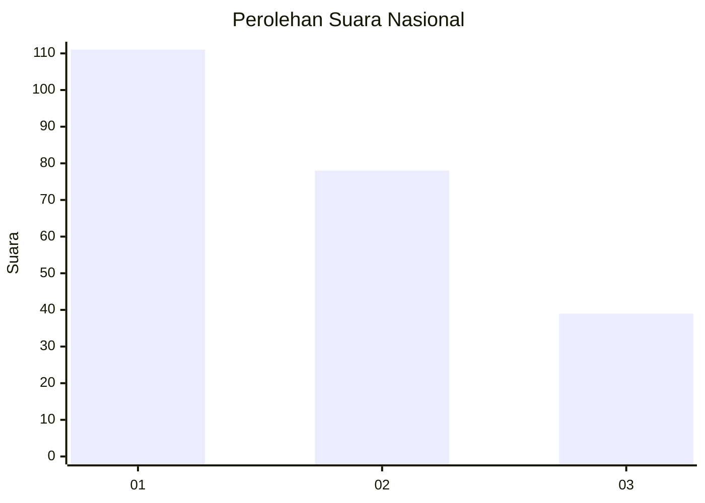
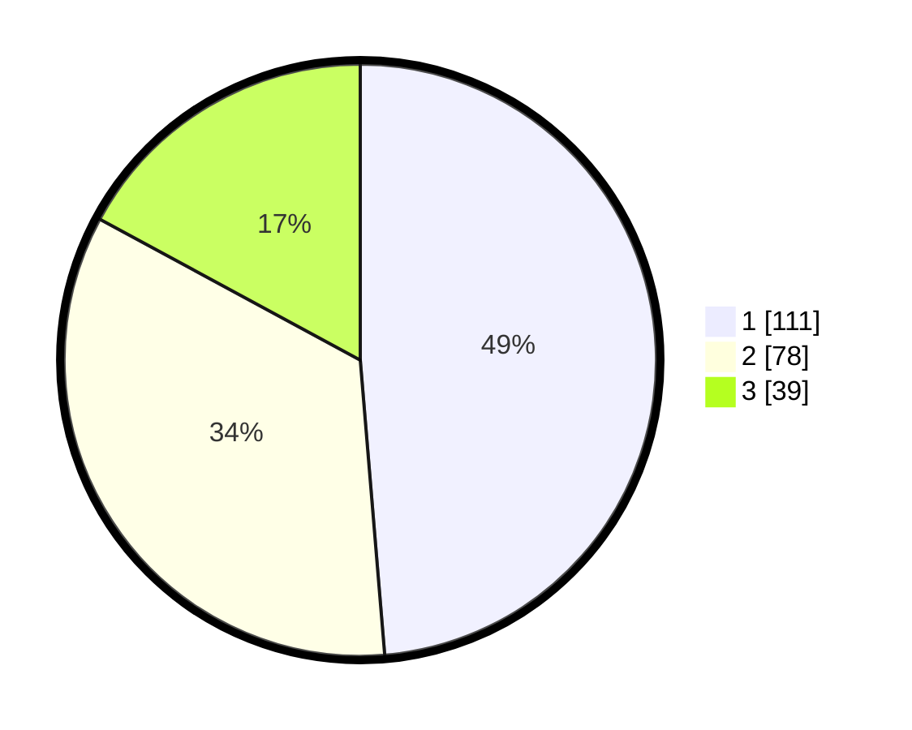

# Hasil

## Grafik

## Tabel

| No.    | Nama Paslon    | Suara | Suara (raw) | Persentase |
|:------ |:-------------- | -----:| -----------:| ----------:|
| 100025 | ANIES MUHAIMIN | 111   | [111][p-1]  | 48,68      |
| 100026 | PRABOWO GIBRAN | 78    | [78][p-2]   | 34,21      |
| 100027 | GANJAR MAHFUD  | 39    | [39][p-3]   | 17,11      |

[p-1]: https://github.com/gigit-pemilu/pemilu-2024/blob/main/pilpres/hitung-suara/sub/31-dki-jakarta/sub/73-jakarta-barat/sub/08-kembangan/sub/1004-srengseng/sub/035-tps/sub/paslon-1.txt
[p-2]: https://github.com/gigit-pemilu/pemilu-2024/blob/main/pilpres/hitung-suara/sub/31-dki-jakarta/sub/73-jakarta-barat/sub/08-kembangan/sub/1004-srengseng/sub/035-tps/sub/paslon-2.txt
[p-3]: https://github.com/gigit-pemilu/pemilu-2024/blob/main/pilpres/hitung-suara/sub/31-dki-jakarta/sub/73-jakarta-barat/sub/08-kembangan/sub/1004-srengseng/sub/035-tps/sub/paslon-3.txt

## Foto C Plano

https://sirekap-obj-formc.kpu.go.id/cdc7/pemilu/ppwp/31/73/08/10/04/3173081004035-20240215-001828--e39de296-103c-48c0-a8ab-248570748053.jpg

https://sirekap-obj-formc.kpu.go.id/cdc7/pemilu/ppwp/31/73/08/10/04/3173081004035-20240215-001928--70157bb2-b3c0-4260-a5d4-a7c396ce3723.jpg

https://sirekap-obj-formc.kpu.go.id/cdc7/pemilu/ppwp/31/73/08/10/04/3173081004035-20240215-002015--68cc4843-29ea-4b21-a4aa-d474121c17f9.jpg

## Metadata

| Key        | Value               |
| ---------- | ------------------- |
| Time Stamp | 2024-02-19 06:16:00 |

