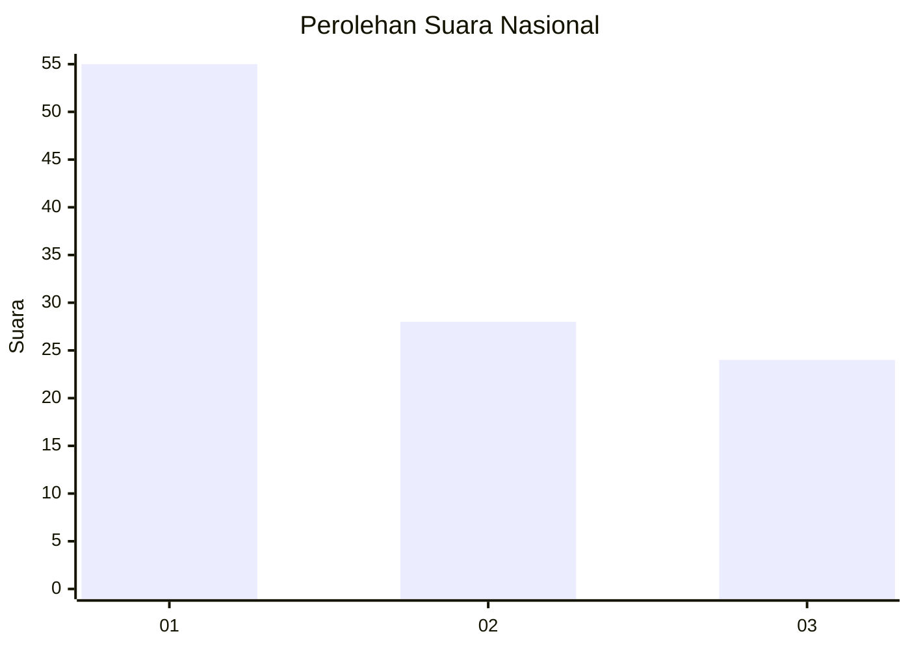
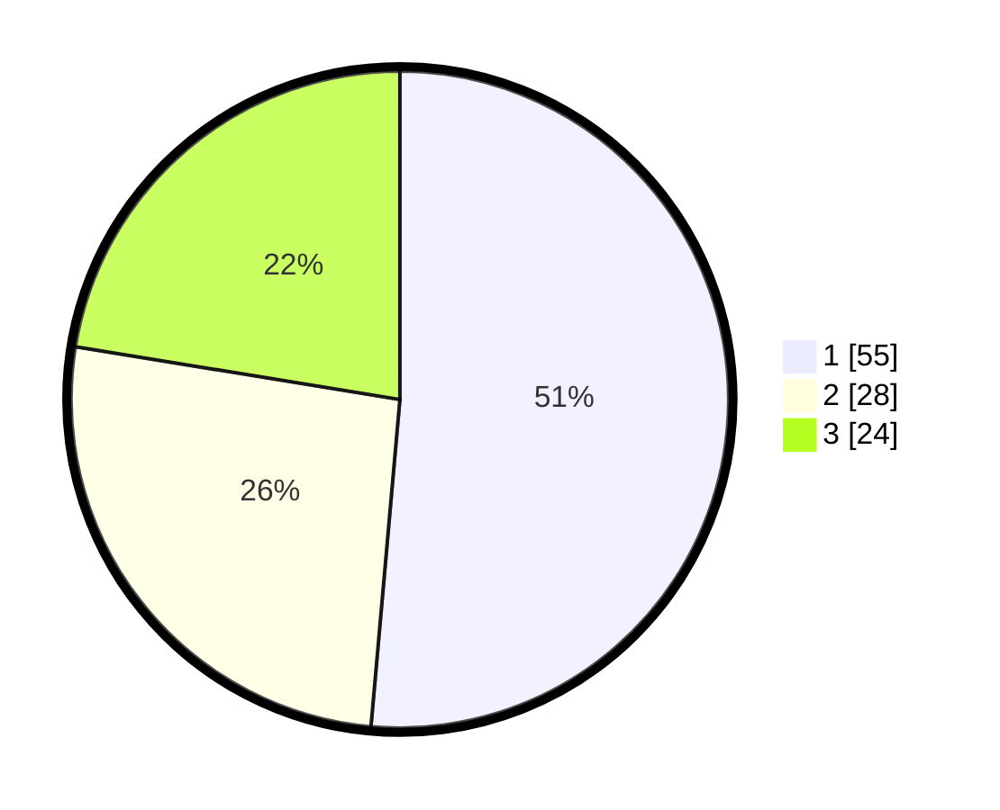

# Hasil

## Grafik

## Tabel

| No.    | Nama Paslon    | Suara | Suara (raw) | Persentase |
|:------ |:-------------- | -----:| -----------:| ----------:|
| 100025 | ANIES MUHAIMIN | 55    | [55][p-1]   | 51,40      |
| 100026 | PRABOWO GIBRAN | 28    | [28][p-2]   | 26,17      |
| 100027 | GANJAR MAHFUD  | 24    | [24][p-3]   | 22,43      |

[p-1]: https://github.com/gigit-pemilu/pemilu-2024/blob/main/pilpres/hitung-suara/sub/31-dki-jakarta/sub/73-jakarta-barat/sub/08-kembangan/sub/1004-srengseng/sub/045-tps/sub/paslon-1.txt
[p-2]: https://github.com/gigit-pemilu/pemilu-2024/blob/main/pilpres/hitung-suara/sub/31-dki-jakarta/sub/73-jakarta-barat/sub/08-kembangan/sub/1004-srengseng/sub/045-tps/sub/paslon-2.txt
[p-3]: https://github.com/gigit-pemilu/pemilu-2024/blob/main/pilpres/hitung-suara/sub/31-dki-jakarta/sub/73-jakarta-barat/sub/08-kembangan/sub/1004-srengseng/sub/045-tps/sub/paslon-3.txt

## Foto C Plano

https://sirekap-obj-formc.kpu.go.id/0349/pemilu/ppwp/31/73/08/10/04/3173081004045-20240215-172636--6cfee93a-ce04-46fe-950c-70281e21a0be.jpg

https://sirekap-obj-formc.kpu.go.id/0349/pemilu/ppwp/31/73/08/10/04/3173081004045-20240214-155133--5c8cb8ff-1d9b-4704-8ec3-9007e4687f77.jpg

https://sirekap-obj-formc.kpu.go.id/0349/pemilu/ppwp/31/73/08/10/04/3173081004045-20240214-155136--8b087c30-d3bc-4a93-9a62-defc6f8ca6bf.jpg

## Metadata

| Key        | Value               |
| ---------- | ------------------- |
| Time Stamp | 2024-02-15 20:30:46 |

