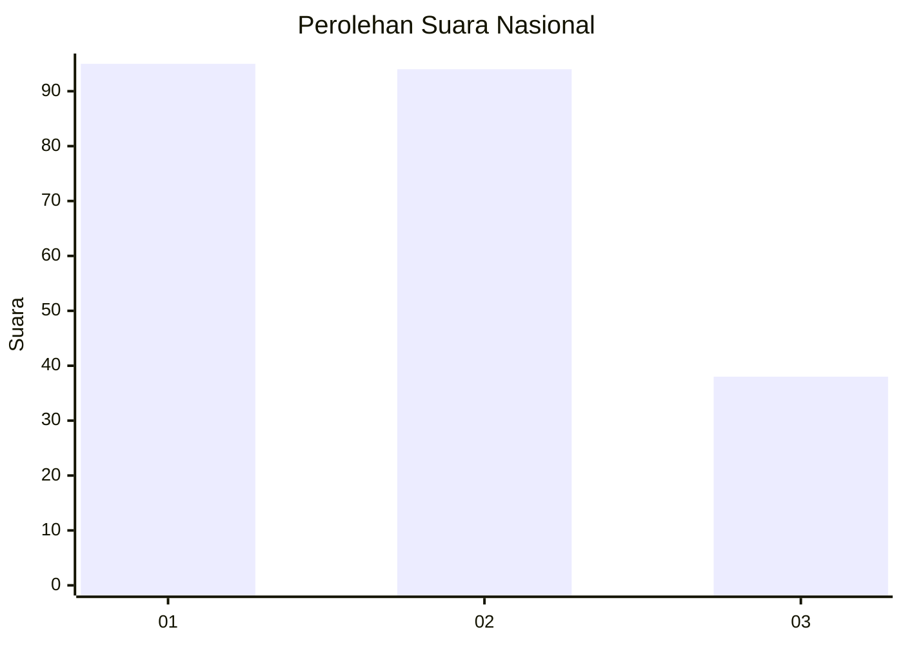
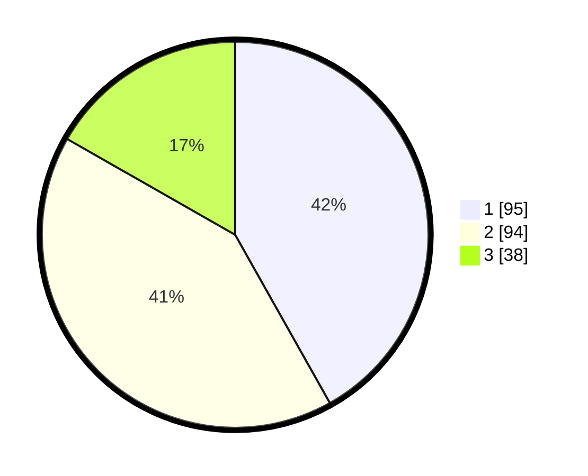

# Hasil

## Grafik

## Tabel

| No.    | Nama Paslon    | Suara | Suara (raw) | Persentase |
|:------ |:-------------- | -----:| -----------:| ----------:|
| 100025 | ANIES MUHAIMIN | 95    | [95][p-1]   | 41,85      |
| 100026 | PRABOWO GIBRAN | 94    | [94][p-2]   | 41,41      |
| 100027 | GANJAR MAHFUD  | 38    | [38][p-3]   | 16,74      |

[p-1]: https://github.com/gigit-pemilu/pemilu-2024/blob/main/pilpres/hitung-suara/sub/31-dki-jakarta/sub/73-jakarta-barat/sub/08-kembangan/sub/1004-srengseng/sub/049-tps/sub/paslon-1.txt
[p-2]: https://github.com/gigit-pemilu/pemilu-2024/blob/main/pilpres/hitung-suara/sub/31-dki-jakarta/sub/73-jakarta-barat/sub/08-kembangan/sub/1004-srengseng/sub/049-tps/sub/paslon-2.txt
[p-3]: https://github.com/gigit-pemilu/pemilu-2024/blob/main/pilpres/hitung-suara/sub/31-dki-jakarta/sub/73-jakarta-barat/sub/08-kembangan/sub/1004-srengseng/sub/049-tps/sub/paslon-3.txt

## Foto C Plano

https://sirekap-obj-formc.kpu.go.id/bef8/pemilu/ppwp/31/73/08/10/04/3173081004049-20240217-124722--759e6b6b-59cf-4bb2-a3f6-08133ecf0148.jpg

https://sirekap-obj-formc.kpu.go.id/bef8/pemilu/ppwp/31/73/08/10/04/3173081004049-20240217-124811--1340b9cc-a7fa-4059-925a-d3234fd4d281.jpg

https://sirekap-obj-formc.kpu.go.id/bef8/pemilu/ppwp/31/73/08/10/04/3173081004049-20240217-124847--110a219e-8363-4d10-bcf3-77fe99dea471.jpg

## Metadata

| Key        | Value               |
| ---------- | ------------------- |
| Time Stamp | 2024-02-19 14:00:00 |

